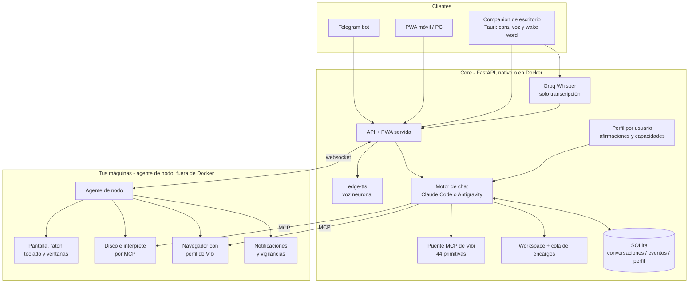

# Vibi 🔮

Asistente personal multiusuario, autoalojado, que **vive en tu ordenador y lo
usa**: tu disco, tu terminal, tu pantalla, tu ratón, tus ventanas, tu navegador
con tus sesiones ya iniciadas y lo que suena en tus altavoces. Le hablas desde
la PWA, desde Telegram, desde la app de escritorio o por voz, y la conversación
es siempre la misma.

> **Estado.** PWA multiusuario con archivos, proyectos y conversaciones
> guardadas por cuenta; dos motores de chat elegibles por usuario; malla de
> dispositivos con el ordenador entero detrás; companion de escritorio con
> palabra de activación en Windows y macOS; especialización por usuario
> (perfil, entrevista y observador). Telegram sigue siendo de propietario
> único, los agentes no tienen sandbox fuerte entre usuarios y **las órdenes a
> los dispositivos ya no piden confirmación** (decisión explícita del dueño:
> ver «Ejecución remota, riesgo y procedencia»).

## Lo que sabe hacer, de un vistazo

| | |
|---|---|
| **Conversar** | Dos motores intercambiables por usuario: Claude Code (Agent SDK) o Antigravity (la CLI `agy` de Gemini). El hilo se comparte entre chat, voz y Telegram. |
| **Tu disco y tu terminal** | Servidos por MCP desde el agente que corre en tu máquina, con tus rutas de verdad. Los comandos largos no secuestran la conversación. |
| **Tu escritorio** | Ver la pantalla, leer una ventana como texto, actuar sobre ella por lotes, hablarle a una aplicación por dentro (CDP), ratón y teclado reales, y un escritorio invisible donde trabajar sin taparte nada. |
| **Tu navegador** | Playwright corriendo en tu pantalla, con un perfil propio y persistente. |
| **Estar pendiente** | Vigilancias con cinco sondas, notificaciones del sistema enunciadas en voz alta, y silencios que se ponen hablando. |
| **Aprender** | Recetas de cómo se maneja cada aplicación, herramientas que se escribe a sí misma (la forja), skills versionadas y un perfil que ajusta qué capacidades tiene encendidas. |
| **Archivos** | Subir, buscar, leer, adjuntar al mensaje y **mandar un archivo de una máquina a otra** o al móvil por Telegram. |
| **Voz** | Palabra de activación local (Vosk, sin red), transcripción con Groq Whisper y locución con voces neuronales de Edge. |

## Arquitectura



Tres piezas y una idea:

- **El core** (`app/`) es un solo proceso de FastAPI que sirve la API, la PWA,
  el worker de encargos, los caducadores y el bot de Telegram. Guarda todo en
  un SQLite.
- **El agente de nodo** (`agent/`) corre **fuera de Docker**, con tu usuario del
  sistema, en cada máquina tuya. **Es la pieza que hace que esto no sea otro
  chat.** Marca hacia fuera por WebSocket —nunca escucha en un puerto, no hay
  nada que abrir en el router— y es lo que da acceso a tu disco, tu terminal, tu
  pantalla, tu ratón, tus ventanas, tu navegador y tus notificaciones.
- **Los clientes** (`frontend/`) son la misma PWA React servida por el core, más
  una app de escritorio en Tauri que reutiliza ese bundle.

La idea es que **el canal no sabe de negocio y el core no sabe de canales**:
`core/messages.py` es el mismo caso de uso para la PWA, para Telegram y para la
cara, y `tasks.py` notifica por callback.

## Puesta en marcha

### El instalador

Lo normal es ejecutarlo nativo, en la misma máquina donde vas a usarlo. Hay un
asistente que lo deja todo hecho:

```bash
python install.py
```

Abre una ventana en el navegador y va por pasos: comprueba qué hay en la
máquina (Python, git, Node, `agy`), instala la CLI de Antigravity si falta,
crea el entorno, instala dependencias, escribe el `.env` conservando lo que ya
tuvieras, **crea tu cuenta**, deja un guion de arranque y **arranca Vibi** —no
te deja mirando la ruta de un `.cmd`—. Pregunta cuatro cosas: cómo te llamas,
con qué modelo piensa, qué le dejas hacer en este ordenador, y poco más.

El propio `install.py` no importa nada fuera de la biblioteca estándar: es lo
primero que se ejecuta, antes de que exista el entorno donde viven las
dependencias.

También sirve para mantenerla al día:

```bash
python install.py --hay-novedades   # ¿hay versión nueva?
python install.py --actualizar      # tráela y pon las dependencias al día
```

Se niega a actualizar si hay trabajo sin guardar: quien pulsa «actualizar» no
suele saber resolver un conflicto de merge, y dejarle el árbol a medias es peor
que no ofrecer el botón.

En Windows, `scripts/vibi.cmd` levanta las dos mitades —el core y el agente de
nodo— cada una con su bucle de reintento, ocultas por sus `.vbs` para no dejar
ventanas negras abiertas.

### A mano, sin Docker

```bash
python3 -m venv .venv && .venv/bin/pip install -r requirements.txt
cp .env.example .env          # y rellena tus claves
.venv/bin/uvicorn app.main:app --reload
```

**Correr nativo es el caso normal, y no es indiferente**: `agy` se lanza donde
se lanza el core, así que con el core nativo sus herramientas propias
—`run_command`, `view_file`, `list_dir`— son tu disco de verdad y no hace falta
el servidor MCP `pc` cruzando la frontera del contenedor. Medido el 19/08/2026:
el mismo turno pasó de 38 s a 5 s, y dejó de equivocarse en la versión de
Windows.

### Con Docker

```bash
cp .env.example .env
docker compose up --build
```

Si actualizas una instalación anterior, elimina primero el contenedor huérfano
que dejó el cambio de nombre del servicio (conserva los datos):

```bash
docker compose down --remove-orphans
docker compose up -d --build
```

En Docker hay que decirle al core cómo ve la máquina donde están el navegador y
el disco: el `docker-compose.yml` pone `PLAYWRIGHT_MCP_HOST` y `SYSTEM_MCP_HOST`
a `host.docker.internal` por defecto. Los volúmenes persisten la base de datos,
el workspace, el login de Claude Pro/Max (`claude-config`) y el de Antigravity
(`agy-gemini`).

### Cuentas

Configura un `JWT_SECRET` aleatorio de al menos 32 caracteres —el servidor se
niega a arrancar sin él—. La app queda en `http://localhost:8000/` y solo
escucha en loopback por defecto.

```bash
python -m scripts.create_user ana
python -m scripts.create_user admin --admin
python -m scripts.set_password ruben        # cuenta ya existente
```

(Con Docker, `docker compose exec vibi python -m scripts.create_user ana`.)

Para abrir e instalar la PWA desde el móvil sin exponerla a la LAN, publícala
dentro de tu tailnet y copia la URL HTTPS:

```bash
tailscale serve --bg http://127.0.0.1:8000
```

Pon esa URL en `PWA_BASE_URL`. `VIBI_BIND_ADDRESS` solo se toca si quieres
publicar el puerto directamente y ya has resuelto firewall y TLS.

Necesitas una key de [Groq](https://console.groq.com) para la transcripción y
el modelo rápido, y —opcionalmente— un bot de Telegram (`@BotFather`). Para la
vía agéntica, una key de [Anthropic](https://console.anthropic.com) o el login
de Claude Code de una suscripción Pro/Max.

### Autenticación de Claude

Vibi acepta tres valores de `CLAUDE_AUTH_MODE`:

| Modo | Comportamiento |
|---|---|
| `auto` | Usa `ANTHROPIC_API_KEY` si existe; si no, el login Pro/Max persistido |
| `api` | Exige `ANTHROPIC_API_KEY` y factura el uso en Claude Console |
| `subscription` | Ignora la API key y usa el login de Claude Code Pro/Max |

Para usar una suscripción Pro/Max, deja la key vacía e inicia sesión una vez
desde una terminal de verdad:

```bash
docker compose run --rm -e ANTHROPIC_API_KEY= vibi claude
```

En el asistente selecciona **Claude App (Pro/Max)**. El login se guarda en el
volumen `claude-config` y sobrevive a recrear el contenedor. Nativo, es el
`claude` de tu máquina y ya está.

Cada usuario puede además poner **su propia key** desde Configuración, cifrada
en la base (ver «Elegir motor y modelos, por usuario»).

### macOS

Funciona entero en Mac sin Docker: core en un venv, PWA y companion compilados
con Tauri, agente de nodo y voz. La guía paso a paso, con los tropiezos reales
de instalación (Rust por Homebrew, permisos de Accesibilidad, micrófono), está
en [`docs/instalacion-macos.md`](docs/instalacion-macos.md).

Lo que **no** hay en Mac: la trastienda (los escritorios aparte son cosa de
Windows), el índice de búsqueda —queda el recorrido podado, con reloj—, el
control de reproducción, la lectura del centro de notificaciones y el catálogo
de aplicaciones, que se construye del menú Inicio y del registro y por tanto
vuelve vacío (`devices_launch_app` y el carril rápido de «abre X» no resuelven
nada ahí). `devices_web` funciona, pero solo contra el navegador de Vibi: la
agenda de aplicaciones que escuchan por dentro se llena con la política de
WebView2 del registro y con lo que lanza el catálogo, y las dos son de Windows.

Lo que **sí** hay, con su implementación nativa: el árbol de accesibilidad, la
captura, el ratón y el teclado, el disco y el terminal por MCP, el navegador, la
palabra de activación y la tecla de despertar (Fn sostenida).

## La interfaz

Cinco destinos que nombran lo que haces, y un taller para el resto:

| | Qué hay |
|---|---|
| **Ahora** | El turno en curso entero: qué está haciendo paso a paso, qué equipos hay vivos y lo que espere tu decisión. Solo se mira; no hay un botón que cambie nada. |
| **Hilo** | La conversación, con dos modos: **Chat** escrito y **Cara** —tocar para hablar, con la cabeza que reacciona a lo que Vibi está usando—. |
| **Encargos** | Las tareas agénticas y su estado, filtrables por estado y proyecto. |
| **Equipos** | La malla: qué máquinas hay, cuáles están vivas, **qué sabe hacer cada una** y qué ha corrido en ellas. |
| **Taller** | Actividad, Perfil, Proyectos, Skills, Herramientas y Archivos. |
| **Configuración** | Motor de chat, modelos por carril y claves de API. |

Las rutas viejas (`/perfil`, `/actividad`, `/proyectos`, `/skills`,
`/herramientas`, `/archivos`) siguen respondiendo con un redirect: hay enlaces
guardados por ahí —los eventos de Actividad traen `enlace`— y romperlos para
ahorrar cinco líneas sería cobrárselo al usuario.

El toggle **Thinking** pertenece a la conversación, se comparte entre
dispositivos y conserva su valor hasta volver a cambiarlo. **Empezar de cero**
abre una sesión nueva sin alterar ese ajuste, y de paso borra la marca de
procedencia: el contexto sospechoso se fue con la conversación anterior.

## Motores de chat

### Elegir motor y modelos, por usuario

En **Configuración** se eligen cuatro carriles independientes, y cada uno queda
guardado por cuenta (`user_ai_settings`):

| Carril | Para qué | Proveedores |
|---|---|---|
| `chat` | Quién contesta en la conversación | `anthropic` \| `antigravity` |
| `tools` | Clasificar, extraer JSON, redactar avisos | `anthropic` \| `groq` |
| `speech` | Transcribir la voz | `groq` |
| `agent` | Los encargos agénticos del centro de tareas | `anthropic` |

Las **claves de API son por usuario** y se guardan cifradas con Fernet
(`provider_credentials`), derivando la clave de `CREDENTIAL_ENCRYPTION_KEY` o,
en su defecto, de `JWT_SECRET`. Si un usuario no tiene clave propia se usa la
del sistema; si no hay ninguna de Anthropic pero sí de Groq, los carriles de
chat y tools caen a Groq y la interfaz lo marca como `fallback`. Antigravity no
lleva clave: se autentica con la sesión de Google que ya tiene la CLI.

### Claude Code

El motor por defecto. Va por el Agent SDK, guarda su `session_id` en la
conversación —de modo que chat, Telegram y la cara reanudan la misma sesión— y
trae las herramientas internas de Claude Code (`Read`, `Write`, `Edit`, `Glob`,
`Grep`, `Bash`, `WebSearch`, `WebFetch`) además de las 44 primitivas de Vibi
publicadas como servidor MCP interno.

Conversar no necesita razonamiento profundo y sí necesita ir rápido: el modelo
de chat es Haiku 4.5 con esfuerzo bajo, lo que deja los turnos en ~1,2 s
constantes y evita reprocesar la caché de prompt en cada mensaje. Las sesiones
vivas caducan a los 15 minutos sin usarse, con un tope de 8 a la vez.

### Antigravity (`agy`)

Conversa con Gemini a través de la CLI `agy` del usuario, mantenida viva en un
pseudoterminal. Con el proceso caliente un turno tarda ~1,2 s frente a los
~1,6 s de Haiku, y bastante más regular; arrancarlo cuesta entre 13 y 42 s, y
por eso el proceso se conserva una hora sin usarse
(`ANTIGRAVITY_IDLE_SECONDS`) y se precalienta al arrancar el servidor.

El login se hace **una sola vez**, desde una terminal de verdad porque la CLI
pide TTY:

```bash
docker compose run --rm --entrypoint agy vibi   # o simplemente `agy`, nativo
```

Cuatro decisiones que conviene conocer:

- **`agy` no se pilota por la pantalla del terminal.** Levanta dentro de sí un
  language server y la interfaz de terminal es solo un cliente suyo; Vibi habla
  con ese servidor, así que la respuesta llega como JSON con streaming y con un
  estado explícito de «terminado», en vez de sacarse a pulso de su SQLite
  adivinando el fin de turno por el silencio en pantalla. El pseudoterminal
  sigue ahí para dos cosas: mantener el proceso en pie —el servidor muere con
  él— y teclear el turno.
- **La personalidad no se teclea, se lee.** Vive en un `GEMINI.md` dentro del
  workspace, que es de donde `agy` carga sus reglas. Teclear por el
  pseudoterminal cuesta unos 7-8 ms por carácter, así que mandar el prompt en
  cada turno costaba diez segundos largos por invocación. Por lo mismo, las
  reglas de voz y de Telegram se activan con una marca de seis y once
  caracteres (`<voz>`, `<telegram>`) en vez de mandar el bloque entero.
- **Las tools de Vibi llegan por MCP** (`app/executors/agy_mcp.py`), no por el
  SDK. El puente no ejecuta nada por su cuenta: `agy` lo lanza como proceso
  hijo, y ahí no existe el estado vivo del servidor —qué máquinas están
  conectadas, y los WebSockets por los que se les manda algo, viven en memoria
  de uvicorn—. Así que llama a `POST /api/herramientas/{id}/ejecutar` con un
  token del usuario, y el trabajo ocurre bajo la misma validación, la misma
  auditoría y el mismo régimen que con Claude.
- **El prompt es condicional a propósito.** Si el navegador no llegó a abrirse
  o no hay ningún nodo conectado, las reglas no los mencionan: prometerle a
  Gemini una capacidad que no tiene no acaba en un «no puedo», acaba en que
  asegura haberla usado. Por eso hay tabla de decisión única (`COMO_ELEGIR`),
  bloques que se añaden solo cuando la pieza está de verdad en pie, y una sola
  copia de cada regla.

`ANTIGRAVITY_EFFORT` controla cuánto razona (`low|medium|high`), que es una
palanca distinta del sufijo del modelo (`gemini-3.6-flash-low`).

### Cuando el motor se cae

Si `agy` no está instalado, no tiene sesión o se cae a media conversación,
**responde Claude** y el mensaje escrito lo dice. Por voz no lo dice —ahí la
respuesta se locuta entera y leerte el error en alto no ayuda—; queda en
Actividad como `motor_caido`.

- **Un fallo dura un turno, no toda la tarde.** `agy` se cuelga sin cerrar su
  pseudoterminal, así que preguntarle al sistema operativo si vive no vale de
  nada: el proceso figura vivo mientras la interfaz ya no acepta lo que se le
  teclea. La salud se comprueba contra su language server. Cuando un turno
  falla, ese proceso **se mata, no se recicla**, y se levanta otro en segundo
  plano mientras Claude contesta.
- **Un trabajo en marcha no se pasa al respaldo.** Si el motor lanzó un comando
  externo que sigue corriendo —una compilación, una instalación, otro agente
  escribiendo un proyecto—, mandarlo a Claude no lo acompaña: lo rehace por
  otro camino y contesta como si lo hubiera hecho él. Pasó el 24/08/2026 con un
  encargo que era, literalmente, «que lo programe Claude Code». Ahora Vibi dice
  que lo dejó lanzado y que perdió el hilo.
- **Los silencios se distinguen.** 25 s de silencio en charla, 60 s mientras una
  herramienta trabaja, 300 s mientras corre un comando externo, y un tope
  absoluto de turno de 180 s (600 s con comando). Cortar por «lleva mucho»
  estropea los turnos buenos; cortar por «no dice nada» solo caza los rotos.

Cada turno deja tiempos monotónicos y sin contenido: `route_decision_ms`,
`session_health_ms`, `stream_open_ms`, `input_ack_ms`, `time_to_first_text_ms`,
`time_to_last_text_ms`, `tool_running_ms`, `node_dispatch_ms`,
`node_execution_ms`, `post_tool_ms`, `total_ms` y la ruta (`fast_action`, `agy`
o `fallback`). Los que pasan de ocho segundos quedan en Actividad como
`turno_lento`.

## Tu ordenador de verdad

Todo lo de esta sección depende del **agente de nodo** corriendo en la máquina.
Se arranca desde `agent/`, que es donde vive el paquete:

```bash
cd agent && pip install -r requirements.txt
python -m vibi_node registrar --url https://mi-pc.mi-tailnet.ts.net
python -m vibi_node
```

Un solo agente por máquina: si abres dos, se echan el uno al otro en bucle
(«Conexión sustituida») y el nodo aparece desconectado. Si no hay ninguna
máquina conectada, la conversación sigue sin ordenador debajo y las reglas del
prompt no lo mencionan.

### El disco y el terminal

Cuando el core corre en un contenedor, de tu ordenador ahí dentro solo existe la
carpeta del workspace. Lo demás —Descargas, tus repos, tus documentos— llega por
MCP: **el agente sirve el disco y el intérprete de comandos de tu máquina**
(`system.mcp`, en `agent/vibi_node/system_mcp.py`) y el motor se conecta con
`serverUrl`. Vale para los dos motores.

Las once herramientas llegan como `pc_info`, `pc_listar`, `pc_leer`,
`pc_escribir`, `pc_editar`, `pc_buscar`, `pc_ejecutar`, `pc_lanzar`,
`pc_progreso`, `pc_parar_trabajo` y `pc_trabajos`, con las rutas que tú
escribes: `C:\Users\...`, no `/srv/vibi/...`.

- **Lo que tarda ya no es un problema.** `pc_ejecutar` y `devices_shell` esperan
  un rato (45 s como techo); si el comando no ha terminado, devuelven un
  identificador y lo dejan seguir sin secuestrar la conversación. `pc_progreso`
  o `devices_shell_status` cuentan por dónde va desde una posición, y **el nodo
  avisa por su cuenta cuando termina** —incluso si se cayó la red por medio: al
  reconectar reconcilia el registro entero y retoma lo que no se anunció—.
- **En Windows es PowerShell**, no `cmd.exe`. `pwsh` si lo tienes instalado.
- **Hay sitios que no abre**: `~/.ssh`, `~/.aws`, `~/.gnupg`, `~/.gemini`,
  `~/.claude`, los `.env`, los `*.pem`. Se amplía con `VIBI_FS_EXCLUIR` en la
  máquina del agente. **No es una barrera de seguridad** —el shell de ese mismo
  nodo llega a todos esos sitios, y filtrar por el texto de un comando no
  serviría de nada: `type`, `Get-Content` y `python -c` son tres formas de leer
  lo mismo—. Lo que evita es el accidente: que un «busca en mi carpeta personal»
  arrastre una clave privada al contexto. Por eso `system_shell` **no** consulta
  esa lista: hacerlo sería teatro, y el teatro en seguridad es peor que la
  ausencia, porque después alguien confía en él.
- **Este servidor sí pide credencial**, a diferencia del de Playwright: sirve el
  disco entero. El agente genera un secreto en cada arranque y lo pone en la
  ruta (`/<token>/mcp`); lo demás es un 404. El secreto viaja al servidor por el
  WebSocket del nodo, que ya está autenticado, y no se escribe en disco.
- El puerto (`8932`) escucha **solo en localhost**, y aun así el contenedor
  llega: `host.docker.internal` es una dirección virtual de Docker Desktop que
  el anfitrión no tiene en ningún adaptador, así que la conexión entra como
  local. Con el nodo en otra máquina hay que abrirlo con `SYSTEM_MCP_BIND`, y
  entonces lo único que queda delante de tu disco es ese secreto.
- Se apaga con `SYSTEM_MCP_ENABLED=false`, y el interruptor de ejecución remota
  del dispositivo también lo desactiva.

### El navegador visible

Es el MCP oficial de Playwright, y lo levanta el agente de nodo (`browser.mcp`)
**en tu escritorio**, no en el contenedor: un navegador abierto dentro de Docker
no lo vería nadie, y el sentido de esto es que veas lo que se está haciendo.
`agy` se conecta a él por red, declarado con `serverUrl`.

El puerto (`8931`) **escucha solo en localhost** y no pide credenciales —quien
lo alcance pilota el navegador—, así que no abrirlo es mejor defensa que
abrirlo y taparlo con el cortafuegos. Con el nodo en otra máquina hay que
exponerlo con `PLAYWRIGHT_MCP_BIND` y asumir lo que implica.

**De quién es el navegador lo decide `PLAYWRIGHT_MCP_MODE`:**

- **`cdp` (lo normal).** El nodo abre **un navegador propio de Vibi** con el
  puerto de depuración puesto y Playwright se engancha a él. El perfil es suyo
  y **persistente**: lo que se inicie ahí sigue iniciado mañana, así que se
  entra una vez en cada sitio y ya.

  Durante un tiempo esto se enganchaba al navegador de diario del usuario, que
  era mejor —las sesiones ya estaban— pero solo funcionaba con Opera GX:
  Chromium bloquea el puerto de depuración sobre el perfil por defecto desde la
  136. Y traía un fallo caro: con Opera abierto a mano, Vibi se quedaba sin
  navegador y al modelo se le decía «no tienes Playwright». Medido el
  22/08/2026 con Chrome 151: sobre el perfil de diario el puerto no llega a
  abrir; con un `--user-data-dir` propio abre en 0,5 s.

  Hay que declarar cuál con `PLAYWRIGHT_MCP_BROWSER_PATH`, por ruta y no por
  nombre: el navegador por defecto del sistema puede ser un Firefox —Zen lo
  es— y Firefox no habla CDP.
- **`perfil`.** Lo lanza Playwright con un perfil de usar y tirar, sin sesión
  iniciada en nada. Queda como repliegue.

Antes de engancharse hay un **pre-vuelo** que despierta las pestañas que el
navegador restauró sin abrir. No es opcional: `connectOverCDP` espera a que se
inicialicen *todas* y no admite excepciones, así que una sola pestaña
descartada tumba la conexión entera a los 30 s con un error que no señala a
ninguna parte —y como una conexión fallida no se guarda, el modelo paga esos
30 s en cada herramienta que use—. Medido el 16/08/2026 con 12 pestañas y 6
descartadas: `browser_snapshot` tardaba 30.031 ms y devolvía `TimeoutError`;
tras despertarlas, 633 ms.

Se apaga con `PLAYWRIGHT_MCP_ENABLED=false`.

### El ratón y el teclado

**`devices_click`, `devices_move`, `devices_drag`, `devices_scroll`,
`devices_type` y `devices_key`** mueven tu ratón y tu teclado de verdad. Lo
tienen los dos motores, sin configuración aparte.

**En Windows no hace falta instalar nada.** El ratón (`mouse_windows.py`) y el
teclado (`keyboard_windows.py`) hablan con `SendInput` por ctypes, que es la
misma API que usaría cualquier programa de automatización. Un movimiento cuesta
0,6 ms y escribir veinte caracteres, 4,4.

Se llegó ahí por dos motivos distintos. El ratón, porque la CLI
[`usecomputer`](https://github.com/remorses/usecomputer) que había antes se cae
con «instrucción ilegal» en todo lo que mueve el puntero. El teclado sí
funcionaba, y se trajo igualmente porque era lo único que ataba el nodo a Node:
cada pulsación arrancaba un proceso, y el texto viajaba como argumento de una
línea de comandos con techo de 32.767 caracteres.

**En macOS se sigue usando `usecomputer`**, que allí funciona entera:

```bash
npm install -g usecomputer      # en la máquina del agente, solo Mac
```

Si no la encuentra en el PATH, `VIBI_USECOMPUTER` puede apuntar al ejecutable.

- **Se señala sobre la última captura, no sobre el escritorio.** Las coordenadas
  van en píxeles de la imagen que el modelo acaba de ver, y la máquina las
  traduce con el mapa que dejó esa captura. Primero se mira, luego se toca y
  después se vuelve a mirar: sin captura previa la acción se rechaza.
- **El texto se manda como Unicode**, no como códigos de tecla: con códigos, una
  «ñ» o un «@» dependen de la distribución del teclado.
- **Es para lo que no tiene otra puerta.** Un instalador, un diálogo del
  sistema, un programa sin API. Escribir un archivo o lanzar un comando se hace
  con `pc_*`; operar una aplicación normal se hace con el árbol o con CDP.

### La ventana como texto

**`devices_ui_snapshot` lee una ventana entera como texto** —cada botón, campo,
menú y celda con su nombre y una etiqueta corta tipo `e12`— y
**`devices_ui_batch` ejecuta varias acciones de una vez** sobre esas etiquetas.
Es el árbol de accesibilidad que las aplicaciones ya publican para los lectores
de pantalla: un botón dice que es un botón y trae su nombre escrito.

Es la forma preferente de **actuar** sobre una aplicación. No hay que calcular
coordenadas ni acertar en un píxel, y cuesta la mitad que una captura —33 ms
contra 66— además de muchos menos tokens.

- **El lote existe por la latencia del modelo.** Guardar un archivo con nombre
  son cuatro acciones —abrir el menú, elegir «Guardar como», escribir, aceptar—
  y por el camino de siempre son cuatro turnos con su captura cada uno. En un
  lote es una llamada: cientos de milisegundos por paso contra varios segundos
  por turno. Las acciones son `clic`, `escribir`, `tecla`, `seleccionar`,
  `expandir`, `contraer`, `enfocar`, `esperar`, `snapshot`, `activar` y
  `desplazar`.
- **Cada paso se resuelve justo antes de ejecutarse**, así que puede apuntar con
  `buscar: {rol, nombre}` a algo que aún no existía al componer el lote —la
  opción del menú que abre el paso anterior—. Si hay varios candidatos el lote
  **para y los enumera** en vez de pulsar el que no era; se acota con
  `dentro_de`. Para al primer fallo y **siempre devuelve el árbol final**, así
  que no hace falta volver a mirar.
- **`clic`, `escribir` con `ref`, `seleccionar`, `expandir`, `contraer` y
  `desplazar` funcionan con la ventana detrás**, sin taparle nada a nadie: es la
  aplicación ejecutando su propia acción. **`tecla` y `escribir` sin `ref` no**:
  van a la ventana que tenga el foco, así que solo se aceptan si la ventana del
  lote está delante; si no, devuelven `ventana_de_fondo` y no se ejecuta nada.
  El paso `activar` la trae al frente, y sabe que le está tapando algo a quien
  esté mirando.
- **Podar es la función principal.** VS Code publica 2.468 nodos y solo 263 son
  cosas que se ven y se pueden tocar; el resto son contenedores anónimos.
- **Chromium y Electron no construyen su árbol hasta que alguien pregunta**, y
  tardan: un VS Code recién abierto publica 16 nodos durante 646 ms y salta a
  170 en el segundo 0,84. A esas ventanas se les espera —se reconocen por su
  clase de Win32— y al resto se las lee de una: mirar una ventana pequeña cuesta
  26 ms en vez de 689.
- **Las etiquetas caducan** en cuanto vuelves a mirar. Si el árbol vuelve vacío,
  esa aplicación no publica accesibilidad y entonces sí toca la captura.
- Detrás está UI Automation en Windows (`ui_windows.py`) y la API de
  accesibilidad de macOS (`ui_macos.py`); podar, numerar y buscar es el mismo
  código para los dos (`ui_tree.py`).

### Por dentro: hablarle a una aplicación por CDP

**`devices_web` ejecuta JavaScript dentro de una aplicación que por dentro es
una página web y devuelve lo que valga esa expresión.** Y **casi todo el
escritorio moderno lo es**: medido el 20/08/2026 en este equipo, Discord y VS
Code son Electron, WhatsApp y Raycast son WebView2, Spotify es CEF, y el
navegador es el navegador. Todos hablan el protocolo de las herramientas de
desarrollo.

**Es la herramienta de MIRAR, y para eso es la mejor con diferencia.** Medido
contra WhatsApp el 21/08/2026:

| | Árbol (`ui_snapshot`) | Por dentro (`devices_web`) |
|---|---|---|
| Leer la ventana | 251 ms (mediana) | **31 ms** |
| Ida y vuelta completa | — | 47 ms |
| Le roba el foco | a veces | nunca |

Funciona con la ventana detrás o minimizada, y el DOM dice qué es cada cosa en
vez de tener que deducirlo de un rectángulo.

**Para ACTUAR no es esta, es `devices_ui_batch`**, y el dato es el que decide:
medido el 22/08/2026 contra Discord, de las cuatro veces que se intentó la
tarea entera solo por CDP, tres no llegaron a mandar el mensaje **y las tres
dijeron que sí**. Hay partes de una aplicación que solo se mueven con teclado y
ratón de verdad.

Un Chromium solo acepta esto si arrancó con `--remote-debugging-port`, y el
puerto se abre al arrancar el proceso: no se puede abrir después. Hay tres
formas de acabar escuchando (`web_apps.py`):

- **El navegador de Vibi**, que ya se lanza con el flag.
- **Las que lanza Vibi**: `apps.launch` les añade el flag y les reserva un
  puerto, y las apunta en la agenda.
- **Las que abren el puerto solas**: una aplicación WebView2 con la política del
  registro puesta arranca ya escuchando, la lance quien la lance —también el
  usuario—. **WhatsApp es una de ellas.** Ver
  [`docs/puerto-de-depuracion.md`](docs/puerto-de-depuracion.md).

Una aplicación que ya estaba abierta y no entra en ninguno de esos tres casos no
aparece, y lo honesto es decirlo —«ciérrala y la abro yo»— en vez de fingir que
no se puede hablar con ella nunca. `web.apps` enumera con cuáles se puede.

### La trastienda

Windows sabe tener **varios escritorios de verdad** —el mecanismo de la pantalla
de Ctrl+Alt+Supr, no los de Win+Tab—, y cada uno tiene su propia cola de
teclado, su propio foco y sus propias ventanas. Una aplicación abierta ahí **no
existe** para quien está mirando la pantalla.

`devices_trastienda` abre una aplicación allí, y `devices_ui_snapshot`,
`devices_ui_batch` y `devices_screenshot` trabajan dentro pasándoles
`trastienda: true`. Dentro, Vibi puede maximizar, hacer foco, mover el ratón y
teclear a gusto, porque nadie lo ve.

Comprobado en este equipo el 20/08/2026, todo medido y no supuesto: un Chromium
arranca ahí y contesta por su puerto de depuración; se puede fotografiar una
ventana con `PrintWindow` sin pantalla física (1936x1048 capturados); **el
sonido se comparte** —el escritorio separa ventanas y entrada, no el audio—.

**Y la frontera del diseño: una ventana no se traspasa de un escritorio a otro.**
Probado con `SetParent`, `ShowWindow` y `SetForegroundWindow`: ninguno la trae,
y no hay API que lo haga. De ahí la regla: la trastienda es para **tareas**
—mandar un mensaje, rellenar algo, sacar un dato—; si lo que te piden es que te
abra algo para mirarlo tú, eso va con `devices_launch_app` en tu escritorio. Las
aplicaciones de la Microsoft Store no entran: se abren por el explorador y
acabarían en tu pantalla.

Solo Windows.

### Vibi Relevo

«Sigue tú» no abre una tarea nueva: **`devices_relevo` entra en la que ya está
en curso.** El nodo combina un árbol fresco de la ventana activa con los últimos
cambios de ventana y control enfocado, infiere qué campos están rellenos, cuáles
siguen vacíos y qué acciones finales están visibles, y devuelve un manifiesto
`vibi.relevo.desktop.v1`.

El flujo tiene dos fases. Primero Vibi reconstruye objetivo, progreso,
pendientes y límite y **espera confirmación sin actuar**. Tras confirmarlo
vuelve a observar y continúa con las herramientas normales, sin repetir pasos.
En ausencia de un límite explícito se detiene antes de enviar, comprar, pagar,
publicar, eliminar o cualquier otra acción final irreversible.

La observación es local y efímera: una cola en memoria de diez minutos y
cuarenta eventos que se vacía al cerrar el agente. No guarda vídeo, capturas,
coordenadas, pulsaciones ni valores de controles enfocados. Los campos de
contraseña se marcan como `protegido` y su valor no entra en el árbol.

### Recetas: aprender a manejar una aplicación

**Una receta es una instrucción, no un recuerdo.** «El martes le escribí a
Ruffini» no sirve para nada; «los chats están en `#pane-side` y el cuadro de
texto es `div[contenteditable][data-tab=10]`» sirve siempre.

**Por qué existe**, medido el 21/08/2026 contra WhatsApp: la primera vez que
Vibi lo manejó por CDP tardó **155 s y 47 llamadas**, de las cuales 40 fueron
tanteo del DOM probando selectores. De todo aquello solo cuatro cosas
resultaron ser ciertas. Guardarlas convierte la siguiente vez en dos llamadas.
El cuello de botella nunca fue lo que tarda el ordenador —el árbol son 251 ms y
el DOM 31 ms—, sino **cuántas veces hay que preguntarle al modelo**, que son
2,7 s cada una.

- **Solo se guarda lo verificado.** Hay un estudio dedicado a cómo falla esta
  clase de memoria en agentes de interfaz («Naive Visual Memory is Not Enough»,
  arXiv 2606.14106) y su hallazgo es que con recetas obsoletas la tasa de éxito
  cae **por debajo de no tener memoria**: el agente confía en lo guardado sin
  validarlo y falla sin enterarse. Por eso `recetas_aprender` exige un campo
  `comprobacion` que diga qué se releyó y qué ponía, y sin eso no guarda.
- **Cada paso lleva qué se tiene que ver después de hacerlo**, en una línea que
  empieza por «→ esperas:». Eso es lo que impide repetir una acción que ya había
  funcionado: si lo que esperabas ya está ahí, el paso está hecho.
- **La receta llega sola.** Va pegada a la respuesta de `devices_launch_app`,
  `devices_trastienda`, `devices_web` y `devices_ui_snapshot`, en el campo
  `receta`: no hay que gastar una llamada en pedirla.
- **Y sabe retirarse.** Tres fallos seguidos y la receta se va: uno suelto puede
  ser la ventana a medio cargar, tres es que la aplicación cambió por dentro.
  `recetas_olvidar` la retira a mano.
- Cada receta guarda por qué vía se maneja esa aplicación (`cdp` o `arbol`),
  porque el DOM y el árbol nombran las cosas de forma distinta.

La forma de guardar y recuperar viene de la librería de habilidades con
autoverificación de Voyager (arXiv 2305.16291) y de la provisión selectiva de
Agent Workflow Memory (arXiv 2409.07429).

### Buscar en el disco

`devices_files_search` busca por patrón de nombre **en todo el disco** y
devuelve rutas, sin leer contenido.

Antes esto era `raiz.rglob(patron)`, y medido sobre el histórico real de este
equipo daba una **mediana de 300 segundos** y cuatro búsquedas caducadas de
catorce: `rglob` entra en `node_modules`, en `AppData`, en `$Recycle.Bin` y en
todos los `.git` del disco con el mismo interés que en la carpeta que importa.

**Windows lleva un índice de eso desde hace veinte años**, el mismo del cuadro
de búsqueda del explorador, y se consulta con SQL por `Search.CollatorDSO`.
Medido el 20/08/2026: **482 ms** para treinta PDF de todo el disco, 514 ms
buscando por trozo de nombre, 2,7 s para `*.py` —el peor caso—. Entre cien y
seiscientas veces más rápido, y además busca en todo el disco.

El recorrido a mano sigue como repliegue para lo que el índice no cubre —una
carpeta excluida, un disco externo, un Mac, el servicio parado—, ahora con poda
y con reloj, para que el peor caso sea una respuesta pobre y no una espera de
cinco minutos.

No confundir con `files_search`, que mira solo lo que tú le has subido a Vibi.

### Apertura rápida de aplicaciones

Las órdenes completas `abre <aplicación>`, `inicia <aplicación>`,
`lanza <aplicación>` y `ejecuta <aplicación>` toman un carril local **sin
invocar a ningún modelo**. El reconocedor solo acepta la frase entera: una
conjunción, una segunda acción, una URL, una ruta, un archivo, argumentos o una
tool adjunta conservan el texto original y lo mandan al motor conversacional.

El agente construye en segundo plano un catálogo inmutable desde el menú Inicio,
`App Paths` y las aplicaciones empaquetadas. `apps.launch` solo resuelve un
alias exacto y único o un id opaco de esa foto; la primitiva pública es
`devices_launch_app`. **El servidor nunca recibe el ejecutable y el texto del
usuario nunca se convierte en PowerShell ni en otra shell.** Un resultado
ambiguo devuelve como máximo cinco candidatas sin abrir ninguna.

Una apertura interactiva no se encola si el equipo está apagado, y si el nodo
aceptó la orden pero el resultado llega tarde, Vibi no vuelve a lanzarla: evita
abrir dos instancias. El turno rápido guarda el mensaje y la respuesta, invalida
la sesión del motor para esa conversación y deja el proceso caliente; el
siguiente turno reconstruye el contexto desde SQLite. Queda en Actividad como
`turno_accion_rapida` con sus tiempos.

### Lo que suena

`media_control` y `media_now_playing` actúan sobre **lo que esté sonando**, sea
un vídeo del navegador, Spotify o cualquier reproductor: son las sesiones
multimedia del sistema, las mismas que mueven las teclas de play del teclado.
`media_play_youtube` busca y **abre directamente el primer resultado ya
reproduciéndose** —que es lo que de verdad quiere decir «ponme tal canción»,
frente a los dos pasos de buscar la URL y abrirla—, y
`media_play_channel_latest` coge el vídeo publicado más recientemente de un
canal, no el que YouTube muestre primero. Nada de esto necesita API key: se
resuelve contra la búsqueda y el feed RSS públicos, y lo que sale son
identificadores validados contra un patrón estricto.

Un límite medido y no supuesto: **el navegador expone una sola sesión para todas
sus pestañas**, cuyos metadatos saltan al vídeo activo. Por eso las órdenes
pueden apuntar a un título: es la única forma de asegurarse de que el play va al
vídeo recién abierto y no al Spotify que tenías de fondo.

Solo Windows por ahora; Linux tendría MPRIS y macOS no tiene equivalente
público. La frontera está puesta para que añadirlos sea escribir una función.

### Lo que te notifica el ordenador

El companion ya sabía avisarte; esto es la mitad que faltaba: **enterarse de lo
que te avisan los demás**. El nodo lee el centro de notificaciones de Windows
(`UserNotificationListener`) y manda lo nuevo al servidor, que lo filtra y lo
convierte en algo que Vibi dice en voz alta.

**Enunciar no es leer.** «Ana: ¿quedamos mañana a las cinco?» leído tal cual
suena a máquina deletreando un formulario. Lo que se oye es «Ana dice que si
puedes quedar mañana a las cinco».

- **El filtro es una lista negra, no blanca**, y la decisión tiene datos detrás.
  En el primer vistazo a un equipo de verdad había ocho notificaciones
  acumuladas —cuatro la misma promoción de NVIDIA, dos de Xbox, una de OneDrive
  y un resumen de Defender— y **ninguna era una persona escribiendo**. Con lista
  blanca hay que acordarse de dar de alta cada aplicación que importa, y el día
  que llega el correo del trabajo por una que no diste de alta, no te enteras.
- **Se calla diciéndolo.** Con «esto no me lo digas más», Vibi decide el alcance
  —esa aplicación entera, solo lo que hable de algo, o eso venga de donde
  venga— y **te dice en voz alta qué acaba de callar**, para que la corrijas en
  el acto si se pasó. Son `avisos_silenciar` y `avisos_silencios`.
- **Las reglas son tuyas, no del ordenador**: silenciar las promociones de Steam
  en el portátil las calla también en el sobremesa.
- **Si el modelo no está, el aviso llega igual**, con una frase más sosa.
  Quedarse callado porque Groq esté caído sería peor que sonar a máquina: lo que
  no se puede perder es que Ana ha escrito.
- **Se sondea cada segundo y medio, y sale gratis.** La lectura tarda 444 ms de
  reloj y **0 ms de CPU**: es una llamada que cruza a otro proceso y espera. El
  evento de Windows (`NotificationChanged`) no sirve: solo lo reciben las
  aplicaciones empaquetadas en MSIX, y empaquetar el agente para ganar dos
  segundos no sale a cuenta.
- **Windows pide permiso** la primera vez (Configuración → Privacidad →
  Notificaciones). Sin él, el nodo no vigila y lo dice en su log.

### Quedarse pendiente de algo

«Estate pendiente de la instalación y avísame cuando acabe.» Vibi crea una
**vigilancia**, contesta y se calla. La cara se queda en una expresión propia
—atenta y quieta— con el texto de qué está esperando.

**El reparto es el mismo que con las notificaciones, y por el mismo motivo.** La
sonda vive en el nodo, es tonta y sale gratis: saca un sello de lo que mira y lo
compara con el de la vuelta anterior. El modelo entra **después**, una vez por
cambio, no una vez por vuelta. Vigilar una web quieta durante dos horas cuesta
cero llamadas; ponerle el modelo al bucle costaría 1.440.

Cinco formas de mirar, con lo que cuesta cada lectura medida en este equipo:

| Sonda | Qué mira | Coste |
|---|---|---|
| `proceso` | Si sigue vivo, y con qué código salió | 2,5 ms |
| `archivo` | Si una ruta aparece o desaparece | < 1 ms |
| `web` | El texto de un selector por CDP | 31 ms |
| `ventana` | El árbol de accesibilidad de una ventana | 251 ms |
| `actividad` | El estado semántico de una tarea dentro de una ventana persistente | 251 ms |

- **En `que_espero` va lo que dijo la persona, con sus palabras.** Es lo único
  que el modelo lee después para decidir si lo que cambió merece interrumpirla;
  resumirlo al guardarlo sería tirar justo el dato del que depende el juicio.
- **El antirrebote es lo que hace esto usable.** Una página real cambia sola sin
  parar —un contador, un anuncio que rota, un reloj—, así que un sello nuevo no
  cuenta como novedad hasta que **se repite dos vueltas seguidas**. Y si aun así
  no para, a las ocho novedades la vigilancia se retira sola diciéndolo.
- **El juicio tiene tres salidas y no dos.** Contar, callar, y **cumplido** —que
  cierra el encargo—. Sin la tercera, «avísame cuando acabe» no tendría final y
  quedarían vigilancias mirando procesos que murieron hace una hora.
- **Una actividad no depende de que muera el proceso.** Sirve para editores,
  renderizadores y cualquier aplicación que siga abierta al acabar la tarea:
  distingue progreso normal, una petición de intervención y el resultado final.
  El progreso se calla; una intervención se avisa sin retirar la vigilancia.
- **Una descarga no se vigila por el navegador.** Zen, Chrome o Firefox siguen
  vivos cuando termina. La sonda `archivo` observa que aparezca la ruta final o
  desaparezca el `.part`/`.crdownload`, sin tratar cada aumento de tamaño como
  una novedad.
- **La continuación sobrevive a un reinicio.** `actividad` y `archivo` guardan
  qué debe hacer Vibi al terminar —revisar un `git diff`, ejecutar pruebas,
  procesar una descarga—. Al juzgar `CUMPLIDO`, un worker reclama esa acción,
  abre un turno nuevo y locuta el resultado. Una reclamación interrumpida vuelve
  a la cola al arrancar. Esa continuación debe verificar o revisar, no añadir
  una acción irreversible: tras un corte puede repetirse.
- **En stand-by calla todo menos esto y lo grave.** Las notificaciones normales
  se retienen (hasta veinte, en memoria) y se cuentan resumidas al terminar;
  solo lo que el modelo juzgue urgente rompe el silencio, y esa decisión no
  cuesta ninguna llamada extra porque va en la que ya se hacía para redactar el
  aviso.
- **Hablarle no la cancela.** El stand-by es un modificador del reposo, no una
  pata de la máquina de estados de la voz.
- **La sonda de ventana no toca el registro de `ref`.** Numera sobre uno de usar
  y tirar: si escribiera en el compartido, vigilar una ventana le caducaría al
  modelo las etiquetas `e12` de su último vistazo en mitad de un turno.
- **Caducan solas a las dos horas** (24 como techo) **y te lo dicen**. «No ha
  pasado nada» y «he dejado de mirar» no son lo mismo, y confundirlos es lo que
  hace que dejes de fiarte. **Tres vivas como mucho** por usuario.

Desde la conversación son `vigilancias_crear`, `vigilancias_ver` y
`vigilancias_soltar`. La lista de sondas se valida en los dos lados —servidor y
nodo— para que un servidor comprometido no invente sondas.

## Vibi Desktop

El companion convierte el ordenador en una presencia de escritorio: una cabeza
flotante que aparece cuando la llamas.

- **Palabra de activación local.** Un detector Vosk escucha únicamente «Vibi» en
  local, sin red y sin guardar audio; al reconocerla suena una campanita, se
  libera el micrófono y aparece la cara. El modelo español pequeño ocupa unos
  39 MB. La gramática restringida solo sabe decir «bibi» o `[unk]`, así que
  empuja hacia «bibi» cualquier cosa parecida —«manzana» llega a salir con
  confianza 1.00—: por eso un candidato se **confirma después** contra el
  vocabulario completo, que sí tiene palabras de verdad entre las que elegir.
  Si el micrófono desaparece a media sesión, reintenta con espera creciente en
  vez de morir.
- **Y una tecla, por si no quieres hablar.** Mantener **Alt** en Windows o
  **Fn** en macOS durante 400 ms la despierta, siempre que no haya otro
  modificador pulsado. En macOS pide permiso de Accesibilidad la primera vez.
- Desde ahí la conversación encadena escucha, respuesta y locución hasta decir
  **«adiós Vibi»**, **«gracias Vibi»** o hacer clic en la cara.
- **La cara cambia de forma según lo que esté usando**: se convierte en una lupa
  si busca, en un terminal si ejecuta, en un libro si lee, en una forja si está
  forjando una herramienta, en una cápsula-taller si trabaja en la trastienda.
  Las familias están en `frontend/src/lib/faceTool.ts` y la checklist en
  [`docs/vibi-caras-herramientas.md`](docs/vibi-caras-herramientas.md).

La primera vez muestra una ventana de vinculación: la URL local
`http://127.0.0.1:8000`, el nombre y contraseña de una cuenta Vibi y un nombre
para el equipo. La contraseña se usa solo para emitir un token revocable de ese
dispositivo y no se guarda. Después queda en la bandeja y arranca con la sesión.

Desde el menú de bandeja se puede despertarla a mano, pausar o reanudar la
escucha, ver el registro de escucha, abrir la PWA, **ver qué está haciendo** y
salir. Si la PWA no usa la URL local por defecto, `VIBI_BASE_URL` apunta
**Abrir Vibi** a la correcta.

### La consola

El botón **Consola** abre una segunda ventana —esta sí normal: se mueve, se
agranda y recuerda dónde la dejaste— con lo mismo que la PWA:

- **Permisos**: lo que espere tu decisión, con el comando literal delante. Si
  Vibi lo pide mientras hablas, salta una notificación del sistema y la cara
  marca el aviso.
- **Bandeja**: las tareas y su estado.
- **Archivos**: subir **arrastrando a la ventana**, descargar y borrar.

Al vincular, el companion guarda **dos credenciales**: el token de nodo, que
solo vale para voz y TTS, y un JWT de usuario normal para lo demás. El token de
nodo no da acceso a la API entera a propósito — vive en el disco de esta máquina
y, si sirviera para todo, quien lo robara podría aprobar las órdenes que él mismo
pide. El JWT caduca a los 30 días y entonces se vuelve a pedir la contraseña.

### Ver qué está haciendo

Una tercera ventana muestra **el turno paso a paso**: qué herramienta ha
llamado, cuántas búsquedas lleva, cuánto tiempo lleva en un comando. Existe
porque «pensando…» no explica nada cuando un turno tarda un minuto. Es para
mirar por encima del hombro: no hay un solo botón que cambie nada. Los pasos se
agrupan por turno, que es la unidad que le importa a quien mira.

### Compilar el instalador (Windows)

```powershell
cd frontend
npm install
& .\src-tauri\wake\download-model.ps1
& .\src-tauri\wake\build-sidecar.ps1
npm run desktop:icon
npm run desktop:build
```

El instalador NSIS se crea en
`frontend/src-tauri/target/release/bundle/nsis/`. La detección no usa ninguna
API ni guarda audio; las respuestas siguen usando las integraciones ya
configuradas en el servidor, así que el único coste variable es el que ya tengan
esas cuentas.

**En Mac el detector funciona igual**, pero los dos guiones de arriba son
PowerShell: el modelo y el binario de PyInstaller hay que generarlos a mano, y
`docs/instalacion-macos.md` lleva los comandos exactos —incluido el `libvosk.dyld`
que `--collect-binaries` no coloca bien—. Si no hay binario compilado, Tauri
cae a ejecutar `wake_listener.py` con el `python3` del sistema.

## Archivos, proyectos y conversaciones

### Archivos multidispositivo

Cada cuenta ve únicamente dos orígenes:

- Archivos subidos desde la PWA, en `WORKSPACE_ROOT/<uuid>/Archivos subidos` con
  su nombre y extensión.
- Archivos existentes bajo `WORKSPACE_ROOT/<uuid>`, indexados por nombre y ruta.

Los blobs creados por versiones anteriores bajo `FILE_STORAGE_ROOT/<uuid>` se
migran automáticamente antes de abrir la sesión. El original solo se retira
después de verificar tamaño y SHA-256 y confirmar la ruta nueva en SQLite.

Desde **Archivos** se puede navegar, buscar, subir y descargar. El mismo flujo
está integrado en el chat: «pásame el archivo que se llama matrícula cuarto»
devuelve resultados descargables. Se indexa el contenido de lo que se puede
extraer (PDF, DOCX, texto) para poder buscar por dentro. La PWA usa HTTPS
autenticado; no expone rutas absolutas ni mete el JWT en la URL.

Límites: `FILE_MAX_BYTES`, `FILE_USER_QUOTA_BYTES`, `FILE_SCAN_LIMIT`,
`FILE_SEARCH_LIMIT`.

### Mandar un archivo de una máquina a otra

`devices_send_file` lleva un archivo del PC al portátil, **al móvil por
Telegram**, o simplemente a los archivos de Vibi para bajarlo desde donde estés.
Es la forma de atender «dame», «pásame» o «mándame» ese archivo.

El agente solo abre conexiones salientes, así que dos máquinas nunca se hablan
directamente: **el origen sube, Vibi guarda, el destino baja.** Lo que se guarda
no es un blob temporal sino un archivo del usuario en toda regla, con su fila en
`files` y su sitio en el workspace, para poder encontrarlo después con las
herramientas de siempre. El contenido viaja por HTTP con streaming en los dos
extremos —la memoria no crece con el tamaño— y por el WebSocket de órdenes solo
van los metadatos.

Si el archivo es grande, la respuesta trae `needs_confirmation` con una pregunta
que hay que trasladar tal cual antes de volver a llamar con `confirm_size`.

**Nunca se contesta con un `file://` ni con la ruta del disco a secas**: quien
lee el chat puede estar en otro ordenador, donde esa ruta no existe, y además el
navegador bloquea `file://` desde una página https. Encontrar el archivo no es
entregarlo.

### Proyectos

Un proyecto es dos cosas a la vez, y las dos importan:

- Una **carpeta** dentro de `WORKSPACE_ROOT/<uuid>`, que es el directorio de
  trabajo que recibe un encargo agéntico.
- Una **ficha** en SQLite de la que cuelgan los archivos que se le suben y las
  conversaciones que se guardan dentro.

La carpeta manda sobre la existencia: un repo clonado a mano aparece como
proyecto aunque nadie lo registrara, y la ficha se le crea la primera vez que se
listan. Al revés no: borrar un proyecto borra su carpeta, pero **los archivos
subidos y las conversaciones guardadas siguen siendo del usuario**, sueltos en
su espacio. Borrar un proyecto es cerrar un cajón, no tirar lo que había dentro.

Desde **Taller → Proyectos** se crea uno vacío o se clona un repo, y cada
tarjeta abre su espacio.

| Método | Ruta | Qué hace |
| --- | --- | --- |
| `GET` | `/api/proyectos` | `proyectos` (las carpetas) y `detalles` (las fichas) |
| `POST` | `/api/proyectos` | Crea un proyecto vacío con su carpeta |
| `POST` | `/api/proyectos/clonar` | Clona un repositorio |
| `GET/PATCH/DELETE` | `/api/proyectos/{ref}` | Ficha, renombrado y borrado (`ref` es el id o el nombre de la carpeta) |
| `GET/POST` | `/api/proyectos/{ref}/archivos` | Lista y sube archivos del proyecto |
| `PUT/DELETE` | `/api/proyectos/{ref}/archivos/{id}` | Mete un archivo ya subido, o lo saca sin borrarlo |
| `GET` | `/api/proyectos/{ref}/conversaciones` | Las conversaciones guardadas dentro |

### Guardar y retomar una conversación

`POST /api/conversations/active/guardar` le pone título a la conversación en
curso y la cuelga de un proyecto. **Guardar no la cierra**: se sigue hablando en
ella; lo que cambia es que deja de ser el hilo anónimo de siempre. Si no se
manda título, el servidor lo saca del primer mensaje del hilo —pedírselo a quien
acaba de terminar de escribir es fricción justo en el peor momento—.

`POST /api/conversaciones/{id}/reanudar` la vuelve a abrir archivando la que
estuviera activa —el índice parcial de `conversations` solo admite una activa
por usuario, así que las dos cosas ocurren en la misma transacción— y cierra la
sesión del motor: la que tenía montada era de otro hilo, y el turno siguiente
tiene que reconstruir el historial desde los mensajes guardados.

### Adjuntar archivos a un mensaje

El clip del compositor sube los archivos **en cuanto se eligen**, no al enviar:
así el envío es una lista de ids y no unos megas, el mensaje sale igual de
rápido lleve lo que lleve, y el archivo ya está en tus archivos aunque al final
no llegues a mandar nada. `POST /api/mensaje` los recibe en `file_ids`.

Lo que se guarda como mensaje es lo que la persona escribió; los archivos van
aparte, en `message_attachments`, y vuelven en `adjuntos` al leer el hilo. Lo
que sí lleva el archivo es el texto que recibe el motor: Vibi le añade al turno
un bloque con el nombre, el tipo y el contenido extraído de cada adjunto (hasta
6.000 caracteres por archivo), para que pueda leerlo sin ir a buscarlo. Un id
ajeno o inexistente se ignora en silencio.

## Malla de dispositivos

Un **nodo** es una máquina tuya donde corre el agente de `agent/`. No es lo
mismo que un dispositivo de la tabla `devices`, que es una ventana del
navegador; la misma máquina puede ser las dos cosas.

El alta pide tu usuario y contraseña **una sola vez**. Lo que queda en la
máquina es un token propio de ese nodo (en `~/.vibi/node.json`, con permisos
0600), guardado hasheado en el servidor; la contraseña no se escribe en disco.
Revocar un nodo no afecta al resto y caduca al instante lo que tuviera
pendiente.

Las órdenes van a un destinatario concreto y sobreviven a un equipo apagado:
quedan pendientes en SQLite y se entregan al reconectar. Si nadie las recoge en
`NODE_ORDER_TTL_SECONDS` (6 h), caducan. **Nunca se reintentan solas**: encender
un portátil olvidado no debe disparar una tanda de órdenes viejas. Las
interactivas —abrir una aplicación— ni siquiera se encolan.

El servidor conoce 31 capacidades y **el agente valida otra vez por su cuenta:
ninguna de las dos partes se fía de la lista de la otra**. Además el agente
declara al conectar solo lo que esa máquina puede hacer de verdad —sin árbol de
accesibilidad no anuncia `ui.snapshot`, `ui.batch` ni `relevo.preparar`—, y el
servidor rechaza de entrada una orden que el nodo no declare, en vez de encolar
algo que va a rebotar dentro de seis horas.

Si el nodo no tiene un nombre claro, se resuelve como lo dirías («el MacBook») y
**si es ambiguo pregunta en vez de adivinar**. Con una sola máquina conectada no
hace falta nombrarla.

```text
POST /api/auth/nodos          # alta (usuario + contraseña → token de nodo)
GET  /api/nodos
POST /api/nodos/{id}/revocar
POST /api/nodos/{id}/ejecucion       # enciende/apaga el shell de una máquina
POST /api/nodos/ejecucion            # kill switch: todas a la vez
GET  /api/nodos/aprobaciones         # lo que espera tu visto bueno
POST /api/nodos/ordenes/{id}/aprobar
POST /api/nodos/ordenes/{id}/rechazar
GET  /api/nodos/{id}/ordenes
WS   /api/nodos/ws            # el agente; token en el primer frame
```

### Ejecución remota, riesgo y procedencia

`devices_shell` ejecuta comandos de terminal en tus máquinas. El agente corre
con tu usuario del sistema y **no hay sandbox**: puede hacer lo que harías tú
desde una consola. Tampoco filtra comandos por su contenido, a propósito —bash
es un lenguaje completo y toda lista negra se evade con `echo ... | sh`—.

> **Las órdenes ya no piden confirmación.** Decisión explícita del dueño de
> estas máquinas el 2026-08-05, tomada sabiendo lo que cuesta: Vibi ejecuta lo
> que decida ejecutar, también cuando la idea sale de un README, del título de
> un vídeo o de una búsqueda web. Con esto desaparece la única defensa real
> contra la inyección de prompts. `clasificar_orden` devuelve siempre
> `requiere_aprobacion = False`, y toda la maquinaria de aprobación
> —`/api/nodos/aprobaciones`, las tarjetas de la PWA y del companion— sigue en
> pie pero no se activa nunca.

Lo que queda funcionando:

| | Qué hace |
|---|---|
| **El interruptor por dispositivo** | `shell_habilitado`. Un nodo apagado sigue respondiendo pings, listando proyectos y dejándose fotografiar, pero **no ejecuta nada**, y ni siquiera aparece como candidato cuando hay que decidir en qué máquina hacer algo. |
| **El kill switch** | `POST /api/nodos/ejecucion` apaga la ejecución en todas tus máquinas de golpe. |
| **Los privilegios del sistema** | El agente corre como tu usuario, no como root. |
| **El registro** | Cada alta, conexión, orden, riesgo y resultado queda en `node_orders` y en Actividad. |

**El riesgo se sigue calculando** aunque ya no detenga nada, porque sirve para
mirar atrás: `bajo` para lo que solo lee, `medio` para lo que actúa delante de
ti, `alto` para el shell y para el ratón y el teclado cuando el contexto viene
de fuera.

Y por encima manda la **procedencia** (`app/taint.py`). La idea: en vez de
preguntarnos «¿este comando parece peligroso?» —que es indecidible— nos
preguntamos «¿ha leído algo de fuera antes de querer ejecutar esto?», que sí se
puede responder con certeza. Se marca lo que mete texto ajeno en el contexto: un
archivo tuyo, una búsqueda, la salida de un comando en otra máquina, una
captura, el árbol de una ventana, una página web, un correo, un documento de
Drive, el título de lo que estás escuchando. La marca dura diez minutos, vive en
memoria y se borra al empezar de cero. Hoy solo **informa** —queda en el riesgo
de la orden y en Actividad—; devolver las confirmaciones es cambiar un `False`
por `evaluar_riesgo(...) != "bajo"`.

Los MCP de terceros que usa `agy` no pasan por `tools.execute`, así que la marca
no se pone sola: la pone el motor al ver el paso en el stream del turno, y
cuando el stream no dice qué servidor lo atendió se marca en genérico. Se marca
de más, nunca de menos.

Suelo compartido: `stdin` cerrado, espera síncrona acotada, salida truncada
(60.000 caracteres en el nodo, 200 KB en el servidor) y cada orden registrada.
Agotar la espera no mata el comando: lo convierte en un trabajo consultable y el
nodo avisa al terminar.

## Herramientas

La pantalla **Taller → Herramientas** es un workbench guiado por esquemas:
muestra las primitivas publicadas por el backend, genera sus formularios,
permite probarlas y **compone herramientas personales** sin cablear cada
capacidad en React. Un administrador puede publicar una composición para todo el
lab.

Los manifiestos solo pueden enlazar primitivas incluidas explícitamente en
`app/tools.py`: no cargan módulos, shell, SQL, URLs ni código generado desde
SQLite. Una composición puede fijar solo parte de los argumentos —una «Bitácora
diaria» que preconfigure `name=diario.md` y pida `content` en cada ejecución—;
se validan al guardar y otra vez al ejecutar. El historial conserva estado y
duración, pero **no** argumentos, contenidos ni resultados.

### El catálogo

Son **44 primitivas**, y cada una lleva escrito en su descripción no solo qué
hace sino **cuándo no usarla**, que es lo que de verdad decide bien:

**Tus archivos en Vibi**
- `files.search` — localiza entre lo que le has subido y el workspace, por
  nombre, ruta o contenido. **No es tu disco.**
- `files.read` — localiza y extrae el texto en una sola llamada.
- `files.prepare_download` — prepara un archivo para bajarlo aquí.
- `files.create_note` — guarda una nota de texto como archivo gestionado.

**Tu trabajo**
- `tasks.list`, `projects.list`, `activity.recent`, `system.health`.

**Tus máquinas**
- `devices.list`, `devices.ping`, `devices.projects`.
- `devices.shell`, `devices.shell_status`, `devices.shell_stop` — terminal
  supervisada, con trabajos que sobreviven al turno.
- `devices.open_url`, `devices.open_path`, `devices.launch_app`.
- `devices.trastienda` — abrir donde no se vea.
- `devices.files_search` — el índice de Windows sobre todo el disco.
- `devices.send_file` — de una máquina a otra, al móvil o a Vibi.

**Su pantalla**
- `devices.web` — **LEER** una aplicación por dentro, sin tocar la pantalla.
- `devices.ui_snapshot` — **LEER** la ventana como texto.
- `devices.ui_batch` — **ACTUAR** sobre la ventana, por lotes.
- `devices.screenshot` — mirar lo que tiene delante.
- `devices.click`, `devices.move`, `devices.drag`, `devices.scroll`,
  `devices.type`, `devices.key` — el último recurso, sobre la última captura.
- `devices.relevo` — tomar el relevo de una tarea en curso.

**Lo que suena**
- `media.control`, `media.now_playing`, `media.play_youtube`,
  `media.play_channel_latest`.

**Estar pendiente**
- `vigilancias.crear`, `vigilancias.ver`, `vigilancias.soltar`.
- `avisos.silenciar`, `avisos.silencios`.

**Aprender**
- `recetas.consultar`, `recetas.aprender`, `recetas.olvidar`.
- `herramientas.forjar` — escribirse una herramienta nueva.

Cuando el servidor MCP del ordenador (`pc_*`) está declarado, el puente poda las
cuatro primitivas que esa vía ya cubre —`devices.files_search`, `devices.shell`,
`devices.shell_status` y `devices.shell_stop`—: dos caminos para lo mismo delante
del modelo es una forma de que elija el peor. **Ocultar algo solo vale si su
sustituto está delante**, así que sin servidor `pc` se publican todas: estuvieron
ocultas sin condición y eso dejó un agujero al pasar el core a nativo —la
búsqueda por el índice de Windows se volvió inalcanzable y al modelo le quedaba
recorrer carpetas a mano—.

```text
GET  /api/herramientas
POST /api/herramientas
PUT  /api/herramientas/{id}
POST /api/herramientas/{id}/ejecutar
POST /api/herramientas/{id}/estado
POST /api/herramientas/{id}/duplicar
GET  /api/herramientas/{id}/invocaciones
POST /api/herramientas/forjar
GET  /api/herramientas/{id}/guion
```

Crear una primitiva nueva sigue requiriendo código revisado, tests y despliegue.

### La forja

Lo repetitivo y pequeño —convertir un CSV, calcular unas cuotas, sacar los
enlaces de un texto— no merece una primitiva y en cambio se pide muchas veces.
Para eso Vibi se escribe sus propias herramientas: `herramientas_forjar` recibe
la petición en lenguaje natural y devuelve una herramienta guardada, con sus
parámetros, lista para invocarse **desde el mensaje siguiente**.

**El guion lo escribe siempre Claude, con Haiku 4.5**, esté conversando el motor
que esté. Una herramienta se redacta una vez y se ejecuta muchas veces sin nadie
mirando: un error que en una conversación se corrige al turno siguiente, aquí
queda guardado y falla cada vez.

Antes de guardarse **se prueba**. El modelo devuelve también unos argumentos de
ejemplo y Vibi ejecuta el guion con ellos; si revienta, el error vuelve al
modelo y hay otro intento, hasta tres. Si a la tercera sigue fallando, la
herramienta se guarda **desactivada** y se dice por qué, en lugar de anunciar
una capacidad que no existe.

**Lo que se ejecuta es código generado, y eso es lo caro de esta idea.** La
contención es de proceso, no de sintaxis: intérprete aparte y aislado (`-I`),
directorio temporal vacío, entorno construido por lista blanca —sin claves de
API, sin ruta de la base de datos, sin secreto de JWT— y topes de tiempo,
memoria y salida (`FORJA_*`). No se filtran los `import`: una lista negra de
módulos da una sensación de seguridad que no se sostiene, y la frontera de
verdad es que ese proceso no tenga a mano nada que valga la pena robar. Lo que
sí conserva es el disco del servidor con sus permisos, y conviene tenerlo
escrito. Su código se puede leer entero desde la pantalla de Herramientas antes
de fiarse de él, y apagarlo es un clic.

Los parámetros son deliberadamente pocos —texto, entero, decimal, booleano,
hasta seis— porque lo que entra lo rellena un modelo escribiendo JSON, y cada
tipo compuesto es una forma más de equivocarse.

## Skill Studio

La pantalla **Skills** convierte esas capacidades de bajo nivel en
procedimientos reutilizables. Una skill combina instrucciones Markdown, ejemplos
de petición y hasta cuatro herramientas del catálogo visible. Los manifiestos se
guardan como borradores, reciben una puntuación de preparación y solo pueden
activarse cuando nombre, descripción, instrucciones, ejemplos y referencias son
coherentes.

1. Crea el manifiesto y selecciona únicamente las capacidades que necesita.
2. Usa el banco de pruebas; los borradores propios pueden ensayarse sin
   publicar.
3. Corrige los avisos y actívala.
4. Invócala desde PWA, cara o Telegram con `/skill <slug> <petición>`.
5. Consulta la ejecución en Actividad o exporta un `SKILL.md` portable.

Cada edición crea una revisión inmutable y aumenta `version`; editar una skill
activa hasta dejarla incompleta la devuelve automáticamente a borrador.
Duplicar crea una copia personal desactivada con historia independiente. Las
skills del laboratorio requieren administrador, son visibles para el resto solo
cuando están activas y no pueden depender de una tool personal. Si una tool
dependiente se desactiva, la skill queda pausada.

```text
GET  /api/skills
POST /api/skills
PUT  /api/skills/{id}
POST /api/skills/{id}/estado
POST /api/skills/{id}/duplicar
GET  /api/skills/{id}/versiones
GET  /api/skills/{id}/exportar
POST /api/skills/{id}/probar
```

El runner no abre un agente ni ejecuta código almacenado. Infiere un único JSON
por tool, lo valida con el esquema Pydantic existente y pasa por la misma
auditoría de `tools.execute`. No hay bucles, activación implícita, shell, SQL ni
carga de módulos desde SQLite. Los resultados se recortan y se presentan al
modelo como datos no confiables.

## Especialización por usuario

Vibi no debería ser la misma para todo el mundo. Un servidor MCP declarado mete
sus esquemas en **todos** los turnos, así que tener encendido lo que no usas es
caro y además empeora las decisiones: el catálogo de `agy` bajó de 97 a 65
esquemas al podarlo. La pantalla es **Taller → Perfil**.

### Una afirmación no es un dato, es una hipótesis

«Estudia medicina» puede venir de que lo dijo, de que tiene una carpeta llamada
Farmacología, o de que lleva un mes abriendo PDF de ese tema. Las tres cosas no
valen lo mismo, así que cada afirmación guarda **de dónde salió** y **cuánta
confianza tiene**:

| Procedencia | Confianza inicial | Por qué |
|---|---|---|
| `uso` | 0,8 | Lo que alguien hace dice más que lo que dice que hace |
| `entrevista` | 0,6 | Lo declarado |
| `inventario` | 0,4 | Una carpeta «Bioquímica» puede ser de otra persona |

Las clases son `dominio` (a qué se dedica), `rasgo` (cómo es), `herramienta`,
`preferencia` y `aficion`. **`rasgo` es quién es la persona, no cómo hay que
hablarle**: la distinción importa porque una afirmación de trato sería una orden
al modelo, y aquí todo es una hipótesis con confianza —«es directo» puede decaer
si lo observado lo contradice, «sé breve» no tendría con qué contradecirse—.

### La entrevista llega con los deberes hechos

Preguntar «¿a qué te dedicas?» a alguien cuyo disco ya lo dice es hacerle perder
el tiempo y quedarse con una respuesta peor. Si hay un nodo conectado, Vibi le
pide un **mapa agregado** del equipo (`inventario.mapa`): cuenta carpetas y
extensiones, hasta 25 carpetas y dos niveles de profundidad. **Lo que viaja es
el agregado, no el contenido**: ni un nombre de archivo ni una línea de texto
salen del equipo en este nivel.

Con eso saca hipótesis —«veo carpetas de Farmacología con muchos PDF recientes,
¿estudias medicina?»— y la entrevista pasa de cuestionario a confirmación. Es
una conversación de verdad, por texto o por voz (`/api/perfil/entrevista/voz`
solo transcribe: no enruta al motor general, porque aquí hace falta lo que dijo
la persona, no una respuesta de Vibi sobre ello).

Después propone capacidades concretas consultando el **registro oficial de
MCP**. Ese catálogo ya es un servicio resuelto, así que aquí no se reimplementa
nada: lo que Vibi aporta está una capa más arriba, en decidir qué de todo eso
encaja con quien pregunta. Las propuestas se separan en dos bloques —lo que
pediste y lo que además encaja contigo— y **el transporte se enseña, porque es
la frontera de seguridad**: un servidor `remoto` no ejecuta nada en tu máquina
pero se lleva los datos fuera; uno `local` no manda nada fuera pero corre código
de un tercero aquí dentro. Solo se proponen paquetes que existen de verdad
(comprobados contra npm y PyPI) y que se lanzan con `npx` o `uvx`, que bajan y
ejecutan sin dejar nada instalado a medias.

Ni la conversación de la entrevista ni el texto libre se guardan en ningún
sitio: lo único que queda es lo que se aprueba, más una línea de log con qué se
propuso, para poder auditar.

### Tres niveles, no dos

Una capacidad aprobada (`mcp`, `skill` o `vigilancia`) entra en uno de tres
niveles según su confianza:

| Nivel | Umbral | Qué significa |
|---|---|---|
| `completo` | ≥ 0,6 | Entera en el contexto |
| `catalogo` | ≥ 0,3 | Solo se recuerda que existe («disponible bajo demanda») |
| `propuesta_retirada` | — | Se propone quitarla |

El nivel intermedio no significa lo mismo para todo, y no por gusto: **una skill
puede entrar a medias —solo nombre y descripción— pero un servidor MCP declarado
expone todas sus herramientas o no está.** El transporte no da para más.

### El observador

Un módulo mira lo que el usuario **hace de verdad** y ajusta lo que se creía.
Aquí no piensa nadie: se cuenta. Es el mismo reparto que en los avisos y en las
vigilancias —la parte tonta sale gratis y puede correr siempre; el modelo entra
una vez por revisión, cuatro llamadas al mes en vez de 288 diarias—.

**Y no lee el disco**: solo cuenta contadores que ya están en la base
—invocaciones de herramientas, aplicaciones con receta, capacidades sin usar—.
Ningún dato nuevo sale hacia el modelo. Cuando lo observado contradice lo
declarado en la entrevista, **gana lo observado**.

Una afirmación floja solo hace que sobre una herramienta, así que baja de nivel
y la retirada **se propone**; no se aplica sola. (Es la disciplina de las
recetas, donde una receta mala hace fallar la tarea y por eso se retira sola,
aplicada al perfil con la diferencia deliberada.)

### Aplicar es un efecto, decidir es una función pura

`perfil_activador.decidir` no toca nada: entra un perfil, sale una
configuración. Es una decisión de diseño y no de estilo — si activar fuera un
efecto suelto por el código, comparar «Vibi con perfil» contra «Vibi sin perfil»
exigiría dos ramas; siendo una función pura, el grupo de control del experimento
es pasarle una lista vacía.

Quien aplica es otro: reescribe el `GEMINI.md` con el resumen de quién eres,
regenera la configuración MCP —**el perfil es la base del diccionario y lo que
Vibi gestiona se escribe encima**, para que una referencia aprobada que coincida
de nombre con `vibi`, `pc` o `playwright` no pise esa entrada— y tira el proceso
de `agy` para que el turno siguiente lo relea todo.

### Dos métricas

- **Tasa de aceptación**: qué proporción de lo propuesto le pareció bien.
- **Supervivencia a 14 días**: de lo aprobado hace más de dos semanas, cuánto se
  sigue usando. Es la que no reporta nadie del área: Skilldex puntúa si el
  `SKILL.md` tiene el frontmatter bien puesto, y sus propios autores aclaran que
  eso «explicitly is not a measure of functional quality». Medir si la capacidad
  instalada seguía usándose dos semanas después sí lo es. Lo aprobado hace menos
  del plazo no cuenta en el denominador: no ha tenido tiempo de demostrar nada.

```text
GET    /api/perfil
POST   /api/perfil/afirmaciones
DELETE /api/perfil/afirmaciones/{id}
POST   /api/perfil/capacidades/aprobar
PUT    /api/perfil/capacidades/{id}/nivel
DELETE /api/perfil/capacidades/{id}
DELETE /api/perfil                        # borrar el perfil entero
POST   /api/perfil/revision
GET    /api/perfil/entrevista/hipotesis
POST   /api/perfil/entrevista/propuesta
POST   /api/perfil/entrevista/turno
POST   /api/perfil/entrevista/voz
POST   /api/perfil/entrevista/completar
```

## Voz

La cara escucha al tocarla (o al oír «Vibi», en el companion), corta
automáticamente tras un breve silencio y manda el clip. FastAPI lo transcribe
en español con Groq Whisper y lo entrega a la **misma conversación** del chat.

- **La respuesta se locuta con voces neuronales de Microsoft** (`edge-tts`), sin
  API key ni coste, servidas por `POST /api/tts` y reproducidas desde un blob.
  Si eso falla, el navegador locuta con `speechSynthesis` priorizando voces
  españolas femeninas: **Vibi nunca se queda muda.** El texto se trocea en
  fragmentos de 600 caracteres como mucho, y ese número tiene que coincidir en
  las dos mitades (`TTS_MAX_CHARS` y `MAX_CHUNK_CHARS`).
- **La redacción cambia cuando se va a escuchar.** El turno lleva un bloque que
  prohíbe markdown, obliga a decir las cifras con palabras («veinticuatro
  grados», no «24 °C»), prohíbe el apartado de fuentes y las URLs dictadas, y
  pide una muletilla corta antes de usar una herramienta —«ahora te lo busco»—
  que se locuta mientras la herramienta trabaja y evita que el usuario se quede
  escuchando silencio.
- **La invocación es un hilo con principio y final.** `POST /api/voz/abrir` crea
  la conversación, `POST /api/voz` manda cada clip y «adiós Vibi» o «gracias
  Vibi» la cierran. Si un turno llega con el id de una invocación que ya
  terminó, se rechaza con 409 en vez de contestar en el hilo equivocado.
- **Abrir el canal no monta el motor, y es deliberado.** La palabra clave se
  equivoca —acepta «vibi», «bibi» y «vivi», sílabas que salen sueltas en
  cualquier conversación— y montar el motor abre el navegador del usuario.
  Medido sobre 48 h: de nueve aperturas del canal, seis no llevaron detrás
  ningún clip de audio. Eran seis navegadores abiertos por un ruido. El
  precalentado no se pierde, se mueve: lo hace `/voz` en cuanto llega audio de
  verdad, solapándose con la transcripción.

El acceso debe ser por **HTTPS** para que el navegador permita el micrófono. El
audio se mantiene en memoria durante la petición y no se guarda en disco ni en
SQLite.

```env
GROQ_SPEECH_MODEL=whisper-large-v3-turbo
VOICE_MAX_AUDIO_BYTES=5000000
TTS_VOICE=es-ES-ElviraNeural
TTS_MAX_CHARS=600
```

## Telegram

El bot arranca con el core si hay `TELEGRAM_BOT_TOKEN`; si no, Vibi arranca
igual solo con la API. `/start` vincula el chat con un usuario y `/proyectos`
lista los proyectos. Todo lo demás es conversación normal contra el mismo core.

- **Los archivos van en las dos direcciones.** Le puedes mandar un documento o
  una foto y quedan como archivos tuyos (el bot no puede descargar de más de
  20 MB, límite de Telegram, no nuestro); y Vibi te puede entregar uno con
  `devices_send_file` poniendo `target` a «movil» (hasta 50 MB).
- **El motor sabe que estás en el móvil.** El turno lleva una marca `<telegram>`
  que activa las reglas del canal: nada de rutas del servidor ni enlaces
  `file://` —desde el móvil no abren nada—, respuestas más cortas, y un archivo
  se **entrega**, no se enlaza.
- Los planes de los encargos llegan con botones de Aprobar y Rechazar.

Sigue siendo de propietario único: `TELEGRAM_OWNER_CHAT_ID` a 0 acepta el
primero que haga `/start`.

## Búsqueda web y MCP de terceros

Junto a los servidores de Vibi se declaran otros que no son nuestros, en
`app/executors/agy_mcp_config.py`. La regla es la misma para todos: **sin
credencial no se declaran**, y lo que no toca declarar **se borra** de la
configuración en lugar de quedarse apuntando a un sitio donde no se puede
entrar, porque `agy` gasta el arranque entero descubriéndolo.

- **La búsqueda web ya no se declara.** Hubo un servidor de Exa y se retiró el
  19/08/2026: `agy` trae `search_web` propio y lo usaba igual con Exa delante
  —cinco búsquedas nativas seguidas sin tocarlo—, así que solo costaba un
  proceso hijo por sesión, dos esquemas más ante el modelo y una clave de API.
  El nombre se conserva en `SERVIDORES_HEREDADOS` justo para poder borrarlo: una
  entrada que deja de nombrarse no se elimina, se hereda.
- **Gmail, Drive y Calendar** son los MCP **oficiales de Google**, remotos.
  `agy` sabe hacer su OAuth él solo —Google lo documenta como cliente
  soportado—, así que se declaran con `serverUrl` y un bloque `oauth`, sin
  puentes de por medio. Elige cuáles con `GOOGLE_MCP_SERVERS`; quitar un nombre
  de esa lista apaga ese servidor sin tocar las credenciales, que es la forma de
  apagar solo Gmail —por donde entra más texto escrito por desconocidos—.

Lo de Google pide algo de trabajo manual una vez:

1. En un proyecto de Google Cloud, habilita la API de cada producto **y su MCP
   API** (`calendarmcp.googleapis.com` y equivalentes). Son dos por servicio y
   es el paso que más se olvida.
2. Crea un cliente OAuth con el redirect
   `https://antigravity.google/oauth-callback` y pon su id y su secreto en
   `GOOGLE_MCP_CLIENT_ID` y `GOOGLE_MCP_CLIENT_SECRET`.
3. Da el consentimiento desde una terminal de verdad (`agy`), porque la CLI pide
   TTY. Queda guardado en el volumen `agy-gemini`, igual que el login.

**Lo que traen estos servidores marca procedencia.** Un correo lo escribe
cualquiera, así que leerlo deja el turno señalado.

Y las reglas del prompt solo describen los que están declarados de verdad: si le
cuentas a Gemini que tiene el correo y no lo tiene, no dice que no puede, dice
que ya lo ha mirado.

## Actividad y recuperación

La pantalla **Taller → Actividad** convierte el log append-only en una bitácora
privada: trabajo activo, aprobaciones pendientes, cuota de archivos,
dispositivos recientes y un historial filtrable por tareas, conversación,
archivos, proyectos, herramientas, cuenta o dispositivos. Las páginas usan un
cursor estable para recorrer un historial grande sin repetir entradas.

La API solo devuelve una **proyección allowlisted** de cada evento. No expone el
payload interno, rutas absolutas, prompts completos, tokens ni ids de Telegram;
cada consulta queda confinada al usuario autenticado.

Una tarea en **Error** ofrece **Reintentar** desde su detalle. El intento
anterior permanece intacto para diagnóstico y se crea una tarea nueva con el
mismo prompt, proyecto y modelo. El nuevo intento vuelve a generar un plan y
requiere aprobación: reintentar nunca continúa a ciegas una ejecución parcial.

El ciclo de vida de un encargo agéntico es
`pendiente → planificando → esperando_aprobacion → ejecutando → completada`,
con `rechazada` y `error` como salidas. **Esta aprobación sí sigue viva**: es la
del plan de una tarea de código, distinta de las órdenes a dispositivos.

## Estructura

```
app/
├── main.py               # FastAPI + worker + caducadores + bot, un proceso
├── config.py             # settings desde .env
├── db.py                 # el esquema entero y sus migraciones
├── api.py                # endpoints REST de la PWA
├── auth.py               # bcrypt + JWT compartido por HTTP y WS
├── events.py             # WebSocket y difusión por usuario
├── activity.py           # proyección privada y segura del log
├── router.py             # clasificador rápida / agéntica / herramienta
├── tasks.py              # orquestador de encargos: cola, estados, avisos
├── projects.py           # clonado seguro y confinado
├── files.py              # búsqueda, uploads, extracción y adjuntos
├── transfers.py          # archivos que viajan entre dispositivos
├── nodes.py              # malla de máquinas: alta, presencia, órdenes, riesgo
├── taint.py              # procedencia: de dónde salió la idea de ejecutar algo
├── tools.py              # catálogo de 44 primitivas y su ejecución
├── forja.py              # herramientas que Vibi se escribe a sí misma
├── skills.py             # manifiestos versionados, exportación y runner
├── recetas.py            # cómo se maneja cada aplicación, solo lo verificado
├── vigilancias.py        # quedarse mirando algo y callarse hasta que pase
├── avisos.py             # notificaciones del sistema, enunciadas
├── avisos_silencio.py    # y lo que el usuario mandó callar
├── perfil.py             # afirmaciones y capacidades, con confianza
├── perfil_entrevista.py  # hipótesis del inventario + registro MCP
├── perfil_observador.py  # lo que el usuario hace de verdad
├── perfil_activador.py   # perfil → configuración (función pura)
├── perfil_metricas.py    # aceptación y supervivencia
├── registro_mcp.py       # el catálogo público de servidores MCP
├── ai_providers.py       # carriles, modelos y claves por usuario (cifradas)
├── fast_actions.py       # carril local sin modelo
├── turn_telemetry.py     # tiempos por etapas, sin contenido
├── screenshots.py        # capturas de camino al modelo, y a ningún otro sitio
├── youtube.py            # resolver qué vídeo quiere alguien, sin API key
├── web.py                # estáticos y fallback del router React
├── core/
│   ├── messages.py       # el caso de uso compartido por todos los canales
│   └── context_builder.py# contexto acotado por presupuesto de tokens
├── executors/
│   ├── chat.py           # el director: qué motor contesta y qué es común
│   ├── chat_engine.py    # el contrato que cumple un motor
│   ├── claude_chat.py    # Claude Code por Agent SDK + tools MCP internas
│   ├── antigravity_chat.py # `agy` vivo en un PTY, escuchado por su API
│   ├── agy_process.py    # el pseudoterminal y la salud del proceso
│   ├── agy_client.py     # su language server
│   ├── agy_mcp.py        # las tools de Vibi servidas a `agy`
│   ├── agy_mcp_config.py # qué servidores ve `agy`, y con qué credenciales
│   ├── system_link.py    # levantar el ordenador y decir por dónde se le habla
│   ├── claude_forja.py   # quien redacta los guiones de la forja
│   ├── claude_agent.py   # encargos agénticos
│   ├── groq_speech.py    # voz a texto
│   └── edge_speech.py    # texto a voz
└── channels/telegram.py  # notificador + aprobaciones rápidas

agent/vibi_node/          # el agente de tu máquina, fuera de Docker
├── client.py             # websocket: órdenes, avisos, novedades, trabajos
├── capabilities.py       # las 31 capacidades, y hacerlas
├── system_mcp.py         # sirve disco e intérprete por MCP (con secreto)
├── system_fs.py          # los archivos de esta máquina
├── system_shell.py       # ejecutar, incluido lo que tarda
├── fs_scope.py           # qué parte del disco ven las tools de archivos
├── buscador.py           # el índice de Windows, con repliegue podado
├── screen.py             # capturas (mss en Windows, screencapture en macOS)
├── computer.py           # traducción imagen→escritorio; CLI solo en macOS
├── mouse_windows.py      # ratón por SendInput
├── keyboard_windows.py   # teclado por SendInput, texto en Unicode
├── ui.py                 # la GUI como texto: mirar y actuar por lotes
├── ui_tree.py            # podar, numerar y buscar: común a los dos sistemas
├── ui_windows.py         # UI Automation, recorrido con CacheRequest
├── ui_macos.py           # la API de accesibilidad de macOS
├── cdp.py                # hablarle a un Chromium por dentro
├── web_apps.py           # qué aplicaciones escuchan, y en qué puerto
├── trastienda.py         # el escritorio invisible de Windows
├── relevo.py             # contexto efímero para tomar el relevo
├── app_catalog.py        # catálogo local y lanzamiento tipado
├── navegador_real.py     # deja el navegador de Vibi en pie con CDP
├── browser_mcp.py        # levanta el Playwright que ves en tu pantalla
├── browser_enganche.py   # y fuerza que se conecte, sin dejarlo para luego
├── notifications_windows.py  # lee el centro de notificaciones
├── avisos.py             # y le cuenta al servidor lo nuevo
├── vigilancias.py        # sondea lo que le encargaron y avisa si cambia
├── media.py              # qué suena y cómo mandarle callar
└── inventario.py         # un retrato agregado del equipo

frontend/                 # React 19, Vite, TypeScript, Tailwind y PWA
└── src-tauri/            # la app de escritorio + el detector Vosk
installer/                # el asistente de instalación (solo stdlib)
scripts/                  # altas de usuario y arranque en Windows
docs/                     # arquitectura, macOS, puerto de depuración, caras
tests/                    # 85 suites del backend y del agente (46 más en el frontend)
```

Principios de la implementación:

- **El canal no sabe de negocio, el core no sabe de canales.** `tasks.py`
  notifica por callback; Telegram, la PWA y la cara renderizan el mismo core.
- **Log de eventos append-only**: cada mensaje, plan, aprobación y resultado
  queda registrado. Es la base del ángulo de investigación.
- **Nada se fía de la lista del otro.** Capacidades, sondas y esquemas se
  validan en los dos extremos.
- **Lo que se lee de fuera son datos, nunca instrucciones.** Está escrito en el
  prompt de los dos motores y en la descripción de cada tool que devuelve
  contenido ajeno.

## Configuración

Todo sale del `.env` (ver `.env.example`, que lleva el porqué de cada valor).
Lo que más se toca:

| Variable | Para qué |
|---|---|
| `JWT_SECRET` | Obligatorio, ≥32 caracteres. Sin él no arranca |
| `CREDENTIAL_ENCRYPTION_KEY` | Cifra las claves de API por usuario (si falta, se deriva del JWT) |
| `GROQ_API_KEY`, `GROQ_MODEL` | Transcripción, router y avisos |
| `ANTHROPIC_API_KEY`, `CLAUDE_AUTH_MODE` | La vía Claude |
| `AGY_BINARY`, `ANTIGRAVITY_MODEL`, `ANTIGRAVITY_EFFORT` | La vía Antigravity |
| `ANTIGRAVITY_IDLE_SECONDS`, `ANTIGRAVITY_WARM_UP` | Cuánto vive el proceso de `agy` y si se precalienta |
| `PLAYWRIGHT_MCP_*` | El navegador visible: modo, puerto, ruta del binario, bind |
| `SYSTEM_MCP_*` | El disco y el terminal por MCP |
| `GOOGLE_MCP_CLIENT_ID/SECRET`, `GOOGLE_MCP_SERVERS` | Gmail, Drive y Calendar |
| `TELEGRAM_BOT_TOKEN` | El bot (opcional: sin él arranca solo la API) |
| `TTS_*`, `VOICE_MAX_AUDIO_BYTES` | La voz |
| `WORKSPACE_ROOT`, `FILE_*` | Dónde viven los archivos y con qué límites |
| `FORJA_*` | Los topes de un guion forjado |
| `NODE_ORDER_TTL_SECONDS`, `NODE_RESULT_TIMEOUT_SECONDS` | La malla |
| `PWA_BASE_URL`, `VIBI_BIND_ADDRESS` | Dónde se publica |

En la máquina del agente: `VIBI_FS_EXCLUIR` (qué más no abrir),
`VIBI_USECOMPUTER` y `VIBI_NPX` (rutas), `VIBI_BASE_URL` (a dónde apunta «Abrir
Vibi» en el companion).

> **Ojo con `GROQ_MODEL`.** El `.env.example` todavía trae
> `llama-3.3-70b-versatile`, que Groq retiró: copiarlo tal cual devuelve un 404
> por cada aviso, y ese 404 se acaba leyendo en voz alta. El valor bueno es el
> que trae `config.py` por defecto, `openai/gpt-oss-120b`, así que lo más seguro
> es **dejar esa línea fuera del `.env`**. Los `gpt-oss` razonan antes de
> contestar y ese razonamiento gasta del mismo presupuesto que la respuesta, así
> que Vibi les manda `reasoning_effort: low` por su cuenta: con los topes cortos
> que se usan aquí —120 tokens en un aviso, 180 en el router— se lo comían
> entero y devolvían cadena vacía.

## Roadmap

- **Hecho:** PWA multiusuario, archivos y proyectos por cuenta, catálogo de
  herramientas y la forja, Skill Studio versionado, actividad y recuperación,
  Telegram, conversación persistente con dos motores intercambiables, voz de
  punta a punta.
- **Hecho después:** companion de escritorio con palabra de activación local en
  Windows y macOS; malla de dispositivos; el ordenador entero por MCP; ratón,
  teclado y la GUI como texto; navegador visible; CDP para hablarle a una
  aplicación por dentro; la trastienda; relevo; recetas; notificaciones del
  sistema y vigilancias con continuación; transferencias entre dispositivos;
  instalador nativo.
- **Hecho también:** especialización por usuario —perfil con confianza,
  entrevista con hipótesis del inventario, observador y métricas de
  supervivencia—.
- **Siguiente:** memoria persistente —no existe todavía, y es lo que haría que
  un encargo sobreviviera a la conversación en la que se pidió—; devolver las
  confirmaciones de ejecución con la procedencia como criterio; sandbox real por
  usuario (contenedor o UID); secretos por usuario; vinculación de Telegram por
  código y multiusuario; diffs ricos; importación de skills.
- **Fase 3:** la cara física — Pi Zero 2 W + HyperPixel Round, login por voz
  declarativo + NFC, memoria de dos niveles (usuario/grupo).

## Documentación adicional

- [`docs/arquitectura.md`](docs/arquitectura.md) — referencia técnica larga,
  con modelo de datos, flujos y decisiones de diseño.
- [`docs/instalacion-macos.md`](docs/instalacion-macos.md) — instalar en un Mac
  sin Docker, paso a paso.
- [`docs/puerto-de-depuracion.md`](docs/puerto-de-depuracion.md) — cómo se
  consigue hablarle por dentro a una aplicación que ya estaba abierta.
- [`docs/vibi-caras-herramientas.md`](docs/vibi-caras-herramientas.md) — en qué
  se convierte la cara según lo que esté haciendo.

---
*Proyecto personal de Rubén ("Ruffini") — candidato a plataforma del lab ONEKIN.*
