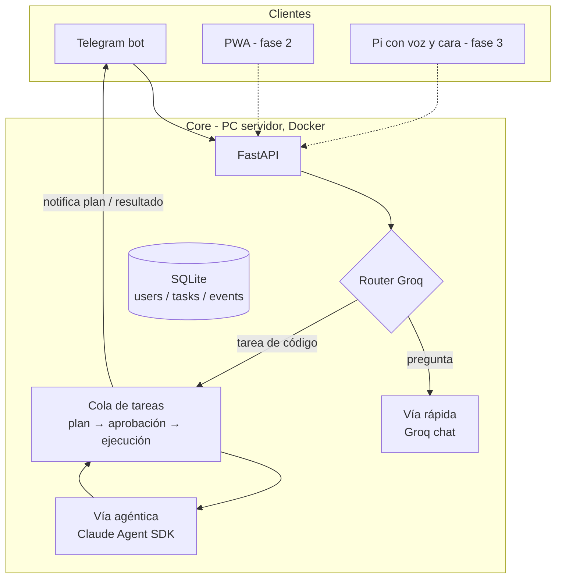

# Morgana 🔮

Asistente personal multi-usuario con agentes de código, autoalojado.
Delega tareas desde cualquier sitio (Telegram, PWA, voz en el lab),
revisa el plan desde el móvil, aprueba, y Morgana trabaja sobre tu código.

> Fase 1 (este repo): un usuario, Telegram, dos vías de ejecución.
> El diseño ya es multi-usuario en datos y arquitectura; ver Roadmap.

## Arquitectura



**Las dos vías** (decisión de diseño central):

| | Vía rápida | Vía agéntica |
|---|---|---|
| Para qué | preguntas, resúmenes, chat | tareas sobre código/repos |
| Motor | Groq (latencia mínima) | Claude Agent SDK |
| Coste | céntimos | BYOK del usuario |
| Seguridad | n/a | **plan → aprobación humana → ejecución. Push jamás automático.** |

El **router** clasifica cada mensaje con el propio modelo de Groq
(rápido y barato). Ante la duda, vía rápida: fallar hacia el lado
barato y reversible.

**Flujo de una tarea agéntica:**

1. Le escribes a Morgana: *"en mi proyecto X, hazme un plan para la feature Y"*
2. Router → vía agéntica → se encola la tarea
3. El agente analiza el workspace en **modo plan** (solo lectura) y produce un plan
4. Te llega el plan a Telegram con botones **Aprobar / Rechazar**
5. Si apruebas: el agente aplica el plan (`acceptEdits`) en una rama nueva. **Nunca hace push** — eso es siempre tuyo.
6. Te llega el resumen de lo hecho

## Setup

```bash
cp .env.example .env   # y rellena tus claves
docker compose up --build
```

Sin Docker (desarrollo):

```bash
python3 -m venv .venv && .venv/bin/pip install -r requirements.txt
.venv/bin/uvicorn app.main:app --reload
```

Necesitas una key de [Groq](https://console.groq.com) y un bot de
Telegram (créalo hablando con `@BotFather`, copia el token). Para la
vía agéntica puedes elegir entre una key de
[Anthropic](https://console.anthropic.com) o el login de Claude Code
incluido en una suscripción Claude Pro/Max.

### Autenticación de Claude

Morgana acepta tres valores de `CLAUDE_AUTH_MODE`:

| Modo | Comportamiento |
|---|---|
| `auto` | Usa `ANTHROPIC_API_KEY` si existe; si no, el login Pro/Max persistido |
| `api` | Exige `ANTHROPIC_API_KEY` y factura el uso en Claude Console |
| `subscription` | Ignora la API key y usa el login de Claude Code Pro/Max |

Para usar una API key:

```env
CLAUDE_AUTH_MODE=api
ANTHROPIC_API_KEY=sk-ant-...
```

Para usar una suscripción Pro/Max, deja la key vacía, construye la
imagen e inicia sesión una vez:

```env
CLAUDE_AUTH_MODE=subscription
ANTHROPIC_API_KEY=
```

```bash
docker compose build
docker compose run --rm -e ANTHROPIC_API_KEY= morgana claude
```

En el asistente selecciona **Claude App (Pro/Max)**. El login se guarda
en el volumen Docker `claude-config`, así que no hace falta repetirlo
en cada reinicio. Después arranca Morgana normalmente:

```bash
docker compose up -d
```

Abre tu bot, envía `/start` y empieza a hablar.

Pon los proyectos sobre los que quieras que trabaje el agente dentro
de `workspace/<tu_nombre>/` (o clónalos ahí).

## Estructura

```
app/
├── main.py               # FastAPI + worker + bot en un proceso
├── config.py             # settings desde .env
├── db.py                 # users, tasks, events (log append-only)
├── router.py             # clasificador rápida/agéntica
├── tasks.py              # orquestador: cola + estados + notificaciones
├── executors/
│   ├── groq_chat.py      # vía rápida
│   └── claude_agent.py   # vía agéntica (plan/ejecutar)
└── channels/
    └── telegram.py       # primer cliente; la PWA usará el mismo core
```

Principios que ya están cableados aunque la fase 1 sea pequeña:

- **El canal no sabe de negocio, el core no sabe de canales.** `tasks.py`
  notifica por callback; Telegram es un renderizador. La PWA y la Pi
  se enchufan sin tocar el core.
- **Log de eventos append-only** (`events`): cada mensaje, plan,
  aprobación y resultado queda registrado. Es la base del ángulo de
  investigación (estudio de uso multi-usuario).
- **Tabla `users` desde el día 1**, con hueco para `linux_user`:
  la fase 2 mapea cada usuario a un user de Linux y lanza sus agentes
  con `sudo -u`, aislando workspaces y credenciales por sistema operativo.

## Roadmap

- **Fase 1 (esto):** 1 usuario, Telegram, Groq + Claude, aprobación humana
- **Fase 2:** multi-usuario real (users de Linux, secretos por usuario,
  registro), PWA (interfaz rica para revisar diffs/planes), skills MCP
  activables por usuario, executor CLI (Claude Code / Codex / Gemini
  headless con suscripciones BYO)
- **Fase 3:** la cara — Pi Zero 2 W + HyperPixel Round en el lab,
  wake word, STT Groq Whisper, TTS, login por voz declarativo + NFC,
  memoria de dos niveles (usuario/grupo)

---
*Proyecto personal de Rubén ("Ruffini") — candidato a plataforma del lab ONEKIN.*


## Búsqueda web en la vía rápida

La vía rápida usa `groq/compound` por defecto. Groq decide automáticamente
si una pregunta necesita información actual, noticias, precios, versiones,
normas, horarios o datos poco conocidos y, cuando corresponde, consulta la
web y devuelve citas junto con la respuesta.

Se puede desactivar sin cambiar código:

```env
GROQ_WEB_SEARCH_ENABLED=false
```

