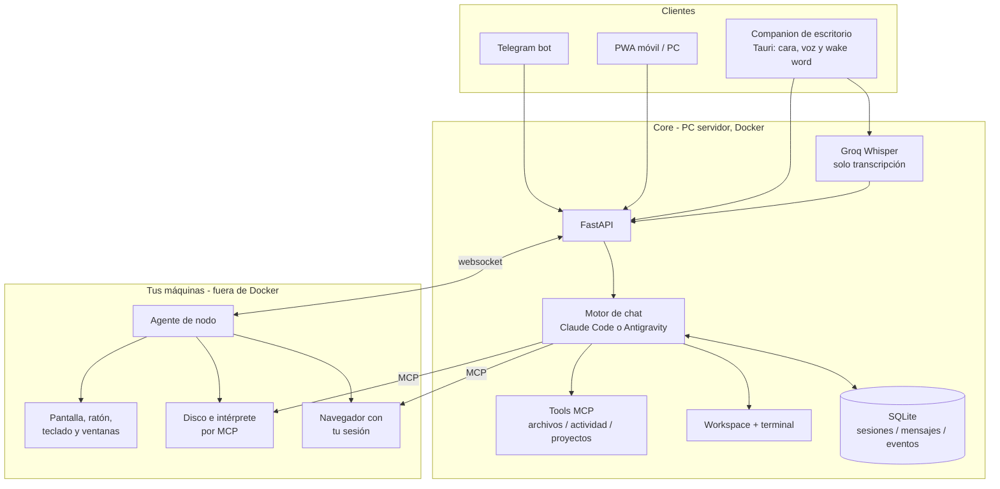

# Vibi 🔮

Asistente personal multi-usuario sobre Claude Code, autoalojado.
Habla desde Telegram, PWA o voz y trabaja directamente sobre tu propio
ordenador, archivos y terminal conservando el contexto de la conversación.

> Fase actual: PWA multiusuario con espacio de archivos por usuario, companion
> de escritorio para Windows con voz y palabra de activación, y malla de
> dispositivos. Telegram sigue siendo de propietario único y los agentes no
> tienen sandbox fuerte entre usuarios.

## Arquitectura



Hay **dos motores de chat** y se eligen por usuario: Claude Code —que guarda su
session id en la conversación, de modo que chat, Telegram y la cara reanudan la
misma sesión— y Antigravity, la CLI `agy` de Gemini pilotada en vivo. Los dos
tienen lectura, escritura, edición, búsqueda de archivos, terminal y búsqueda
web, y los dos llegan a tu ordenador de verdad por los servidores MCP que
levanta el agente de nodo.

**El agente de nodo es la pieza que hace que esto no sea otro chat.** Corre
fuera de Docker, en tu máquina, marca hacia fuera —nunca escucha en un puerto— y
es lo que da acceso a tu disco, tu terminal, tu pantalla, tu ratón, tus ventanas
y tu navegador con tus sesiones ya iniciadas.

Las herramientas publicadas en Vibi se registran como un servidor MCP
interno. Claude puede escogerlas por contexto —por ejemplo, buscar y leer una
matrícula— o el usuario puede adjuntarlas al mensaje desde el chat. Sus
argumentos JSON son un contrato interno entre Claude y la tool, nunca una
interfaz que tenga que rellenar el usuario.

El toggle **Thinking** pertenece a la conversación, se comparte entre
dispositivos y conserva su valor hasta volver a cambiarlo. **Empezar de cero**
abre una sesión Claude nueva sin alterar ese ajuste.

## Setup

```bash
cp .env.example .env   # y rellena tus claves
docker compose up --build
```

Si actualizas una instalación anterior, elimina primero el contenedor huérfano
que dejó el cambio de nombre del servicio. Este comando conserva los datos:

```bash
docker compose down --remove-orphans
docker compose up -d --build
```

Para cada miembro del laboratorio crea una cuenta desde el servidor:

```bash
docker compose exec vibi python -m scripts.create_user ana
docker compose exec vibi python -m scripts.create_user admin --admin
```

También puedes vincular un usuario existente con `/start` en Telegram y fijar
su contraseña (el nombre es exacto):

```bash
docker compose exec vibi python -m scripts.set_password ruben
```

Configura un `JWT_SECRET` aleatorio de al menos 32 caracteres. La app queda en
`http://localhost:8000/` y Docker solo la publica en loopback por defecto.

Para abrir e instalar la PWA desde el móvil sin exponerla a la LAN, publica el
servicio dentro de tu tailnet y copia la URL HTTPS que muestre el comando:

```bash
tailscale serve --bg http://127.0.0.1:8000
```

Pon esa URL (por ejemplo, `https://mi-pc.mi-tailnet.ts.net`) en
`PWA_BASE_URL` y recrea el contenedor. `VIBI_BIND_ADDRESS` solo debe cambiarse
si quieres publicar directamente el puerto y ya has resuelto firewall y TLS.

Sin Docker (desarrollo):

```bash
python3 -m venv .venv && .venv/bin/pip install -r requirements.txt
.venv/bin/uvicorn app.main:app --reload
```

## Vibi Desktop para Windows

El companion convierte el mismo PC servidor en una presencia de escritorio. El
detector Vosk escucha únicamente la palabra **“Vibi”** en local; al
reconocerla suena una campanita, se libera el micrófono y aparece la cabeza
flotante. Desde ahí la conversación encadena escucha, respuesta y locución hasta
decir **“adiós Vibi”**, **“gracias Vibi”** o hacer clic en la cara.

La primera vez muestra una ventana de vinculación. Usa la URL local
`http://127.0.0.1:8000`, el nombre y contraseña de una cuenta Vibi y un
nombre para el PC. La contraseña se usa solo para emitir un token revocable de
ese dispositivo y no se guarda. Después la aplicación queda en la bandeja y se
activa automáticamente al iniciar Windows.

Para generar el instalador desde Windows:

```powershell
cd frontend
npm install
& .\src-tauri\wake\download-model.ps1
& .\src-tauri\wake\build-sidecar.ps1
npm run desktop:icon
npm run desktop:build
```

El instalador NSIS se crea en
`frontend/src-tauri/target/release/bundle/nsis/`. El modelo español pequeño
ocupa unos 39 MB y la detección no usa ninguna API ni guarda audio. Las
respuestas siguen usando las integraciones Groq/Claude y TTS configuradas en el
servidor; por tanto, el único coste variable es el que ya tengan esas cuentas.

### La consola del companion

El botón **Consola** de la cara abre una segunda ventana —esta sí normal: se
mueve, se agranda y recuerda dónde la dejaste— con lo mismo que la PWA:

- **Permisos**: las órdenes que esperan tu visto bueno, con el comando literal
  delante. Si Vibi pide permiso mientras hablas, salta una notificación de
  Windows y la cara marca el aviso, así que no hace falta tener nada abierto.
- **Bandeja**: las tareas y su estado.
- **Archivos**: subir **arrastrando a la ventana**, descargar y borrar.

Al vincular, el companion guarda **dos credenciales**: el token de nodo, que
solo vale para voz y TTS, y un JWT de usuario normal para lo demás. El token de
nodo no da acceso a la API entera a propósito — vive en el disco de esta máquina
y, si sirviera para todo, quien lo robara podría aprobar las órdenes que él mismo
pide, y el permiso dejaría de significar nada. El JWT caduca a los 30 días y
entonces se vuelve a pedir la contraseña.

Un companion vinculado antes de esta versión sigue hablando por voz, pero la
consola aparecerá vacía hasta que lo vuelvas a vincular.

Desde el menú de bandeja se puede despertar a Vibi manualmente, pausar o
reanudar la escucha, abrir la PWA y salir por completo. Si la PWA no usa la URL
local predeterminada, se puede definir `VIBI_BASE_URL` como variable de
entorno de Windows para que **Abrir Vibi** apunte a la URL correcta; la URL
de voz se guarda por separado al vincular el companion.

Necesitas una key de [Groq](https://console.groq.com) y un bot de
Telegram (créalo hablando con `@BotFather`, copia el token). Para la
vía agéntica puedes elegir entre una key de
[Anthropic](https://console.anthropic.com) o el login de Claude Code
incluido en una suscripción Claude Pro/Max.

### Autenticación de Claude

Vibi acepta tres valores de `CLAUDE_AUTH_MODE`:

| Modo | Comportamiento |
|---|---|
| `auto` | Usa `ANTHROPIC_API_KEY` si existe; si no, el login Pro/Max persistido |
| `api` | Exige `ANTHROPIC_API_KEY` y factura el uso en Claude Console |
| `subscription` | Ignora la API key y usa el login de Claude Code Pro/Max |

Para usar una API key:

```env
CLAUDE_AUTH_MODE=api
ANTHROPIC_API_KEY=sk-ant-...
```

Para usar una suscripción Pro/Max, deja la key vacía, construye la
imagen e inicia sesión una vez:

```env
CLAUDE_AUTH_MODE=subscription
ANTHROPIC_API_KEY=
```

```bash
docker compose build
docker compose run --rm -e ANTHROPIC_API_KEY= vibi claude
```

En el asistente selecciona **Claude App (Pro/Max)**. El login se guarda
en el volumen Docker `claude-config`, así que no hace falta repetirlo
en cada reinicio. Después arranca Vibi normalmente:

```bash
docker compose up -d
```

Abre tu bot, envía `/start` y empieza a hablar.

## Motor de chat: Claude Code o Antigravity

En **Ajustes → Runtime** se elige quién contesta en el chat. Claude Code es el
de siempre. **Antigravity** conversa con Gemini a través de la CLI `agy`, que
la imagen ya instala y que se mantiene viva entre turnos.

El login se hace **una sola vez**, desde una terminal de verdad porque la CLI
pide TTY:

```bash
docker compose run --rm --entrypoint agy vibi
```

Queda guardado en el volumen `agy-gemini` y sobrevive a recrear el contenedor.
Si la CLI intenta abrir un navegador en lugar de darte una URL para copiar,
añade `-e SSH_CONNECTION="1.1.1.1 22 2.2.2.2 22"` y usará el flujo de pegar un
código.

Medido con el proceso caliente y `gemini-3.6-flash-low`: **1,2 s por turno**
frente a 1,6 s de Haiku 4.5, y bastante más regular. `ANTIGRAVITY_EFFORT`
controla cuánto razona (`low|medium|high`), que es una palanca distinta del
sufijo del modelo.

Dos decisiones que conviene conocer:

- **La personalidad no se teclea, se lee.** Vive en un `GEMINI.md` dentro del
  workspace, que es de donde `agy` carga sus reglas. Teclear por el
  pseudoterminal cuesta unos 7 ms por carácter, así que mandar el prompt en
  cada turno costaba diez segundos largos por invocación.
- **Las tools de Vibi llegan por MCP** (`app/executors/agy_mcp.py`), no por
  el SDK. El puente no ejecuta nada por su cuenta: `agy` lo lanza como proceso
  hijo, y ahí no existe el estado vivo del servidor —qué máquinas están
  conectadas, y los WebSockets por los que se les manda algo, viven en memoria
  de uvicorn—. Así que llama a `POST /api/herramientas/{id}/ejecutar` con un
  token del usuario, y el trabajo ocurre donde tiene que ocurrir: bajo la misma
  validación, la misma auditoría y el mismo régimen de aprobaciones que Claude.
  La configuración MCP de `agy` es global, así que hoy el servidor se declara
  con un único usuario dentro: con más de una cuenta hablando a la vez habría
  que revisarlo.
- **El navegador corre en tu PC, no en el contenedor.** Es el MCP oficial de
  Playwright, y lo levanta el agente de nodo (`browser.mcp`) en tu escritorio
  cuando Vibi monta una sesión de `agy`: un navegador abierto dentro de
  Docker no lo vería nadie, y el sentido de esto es que veas lo que se está
  haciendo. `agy` se conecta a él por red, declarado con `serverUrl` en vez de
  con `command`. Si el nodo está apagado o falla, la conversación sigue sin
  navegador y las reglas no lo mencionan —prometerle una capacidad que no
  tiene solo consigue que asegure haberla usado—.

  El puerto (`8931`) **escucha solo en localhost**, y aun así el contenedor
  llega: `host.docker.internal` es una dirección virtual de Docker Desktop que
  el anfitrión no tiene en ningún adaptador, así que la conexión entra como
  local. Importa porque ese puerto no pide credenciales —quien lo alcance
  pilota el navegador con tus sesiones iniciadas—, y no abrirlo es mejor
  defensa que abrirlo y taparlo con el cortafuegos. Con el nodo en otra máquina
  hay que exponerlo con `PLAYWRIGHT_MCP_BIND` y asumir lo que eso implica.

  **De quién es el navegador lo decide `PLAYWRIGHT_MCP_MODE`.** Con `cdp` —lo
  normal— Playwright no abre ninguno: se engancha por el puerto de depuración
  al que ya tienes abierto, con tu perfil y tus sesiones iniciadas, y trabaja
  en una pestaña al lado de las tuyas sin cerrar nada al terminar. Hace falta
  declarar cuál en `PLAYWRIGHT_MCP_BROWSER_PATH`, porque el navegador por
  defecto del sistema puede ser un Firefox y esos no hablan CDP. Aquí es Opera
  GX, y no es indiferente: Chromium bloquea el puerto de depuración sobre el
  perfil por defecto desde la versión 136, y Opera no aplica esa restricción.
  Con Chrome o Edge este modo no funcionaría.

  Con `perfil` lanza y posee un navegador propio, con el perfil en
  `%LOCALAPPDATA%\vibi-playwright` y ninguna sesión iniciada. Queda como
  repliegue: si un día el puerto de depuración deja de estar disponible, se
  cambia la variable y se sigue navegando.

  Antes de engancharse hay un pre-vuelo que carga las pestañas que el navegador
  restauró sin abrir. No es opcional: `connectOverCDP` espera a que se
  inicialicen **todas** y no admite excepciones, así que una sola pestaña sin
  renderizador deja la conversación sin navegador con un error que no señala a
  ninguna parte. Se despiertan navegándolas a la dirección que ya tenían;
  traerlas al frente no las despierta, aunque lo parezca.

  Se apaga entero con `PLAYWRIGHT_MCP_ENABLED=false`, y el interruptor de
  ejecución remota del dispositivo también lo desactiva.

### El ordenador entero

Vibi vive en un contenedor, y de tu ordenador ahí dentro solo existe la
carpeta del workspace. Lo demás —Descargas, tus repos, tus documentos, tus
programas— llega por el mismo camino que el navegador: **el agente de nodo
sirve el disco y el intérprete de comandos de tu máquina por MCP**
(`system.mcp`, en `agent/vibi_node/system_mcp.py`), y el motor se conecta a
él con `serverUrl`. Vale para los dos motores, `agy` y Claude.

Las tools llegan como `pc_leer`, `pc_editar`, `pc_ejecutar` y compañía, con las
rutas que tú escribes: `C:\Users\...`, no `/srv/vibi/...`.

- **Lo que tarda ya no es un problema.** Toda ejecución nace como un trabajo
  supervisado. `pc_ejecutar` y `shell.run` esperan un rato; si el comando no ha
  terminado, devuelven su identificador y lo dejan seguir sin secuestrar la
  conversación. `pc_progreso` o `devices_shell_status` cuentan por dónde va, y
  el nodo avisa por su cuenta cuando termina.
- **En Windows es PowerShell**, no `cmd.exe`. `pwsh` si lo tienes instalado.
- **Hay sitios que no abre**: `~/.ssh`, `~/.aws`, `~/.gnupg`, `~/.gemini`,
  `~/.claude`, los `.env`, los `*.pem`. Se amplía con `VIBI_FS_EXCLUIR` en la
  máquina del agente. **No es una barrera de seguridad**: el shell de ese mismo
  nodo llega a todos esos sitios desde que existe `shell.run`, y filtrar por el
  texto de un comando no serviría de nada. Lo que evita es el accidente, que un
  «busca en mi carpeta personal» arrastre una clave privada al contexto.
- **Este servidor sí pide credencial**, a diferencia del de Playwright: sirve el
  disco entero. El agente genera un secreto en cada arranque y lo pone en la
  ruta (`/<token>/mcp`); lo demás es un 404. El secreto viaja al servidor por el
  WebSocket del nodo, que ya está autenticado, y no se escribe en disco: si
  reinicias el agente, el anterior deja de valer.
- El puerto (`8932`) escucha **solo en localhost** por el mismo motivo que el
  del navegador, y el contenedor llega igual. Con el nodo en otra máquina hay
  que abrirlo con `SYSTEM_MCP_BIND`, y entonces lo único que queda delante de tu
  disco es ese secreto.
- Se apaga entero con `SYSTEM_MCP_ENABLED=false`, y el interruptor de ejecución
  remota del dispositivo también lo desactiva.

Como con el navegador: si no hay ninguna máquina conectada, la conversación
sigue sin ordenador debajo y las reglas del prompt no lo mencionan.

### El ratón y el teclado

Mirar tu pantalla ya se podía (`devices_screenshot`). Ahora también se puede
usar: **`devices_click`, `devices_move`, `devices_drag`, `devices_scroll`,
`devices_type` y `devices_key`** mueven tu ratón y tu teclado de verdad. Lo
tienen los dos motores, `agy` y Claude, sin configuración aparte.

**En Windows no hace falta instalar nada.** El ratón (`mouse_windows.py`) y el
teclado (`keyboard_windows.py`) hablan con `SendInput` por ctypes, que es la
misma API que usaría cualquier programa de automatización. Un movimiento cuesta
0,6 ms y escribir veinte caracteres, 4,4.

Se llegó ahí por dos motivos distintos. El ratón, porque la CLI
[`usecomputer`](https://github.com/remorses/usecomputer) que había antes se cae
con «instrucción ilegal» en todo lo que mueve el puntero, y su 0.1.11 —del 7 de
abril de 2026— es la última publicada. El teclado sí funcionaba, y se trajo
igualmente porque era lo único que ataba el nodo a Node: cada pulsación
arrancaba un proceso, y el texto viajaba como argumento de una línea de comandos
con techo de 32.767 caracteres.

**En macOS se sigue usando `usecomputer`**, que allí funciona entera:

```bash
npm install -g usecomputer      # solo en un Mac, y en la máquina del agente
```

Si no la encuentra en el PATH, `VIBI_USECOMPUTER` puede apuntar al ejecutable.

- **Se señala sobre la última captura, no sobre el escritorio.** Las coordenadas
  van en píxeles de la imagen que el modelo acaba de ver, y la máquina las
  traduce con el mapa que dejó esa captura. Así que primero se mira, luego se
  toca y después se vuelve a mirar: sin captura previa la acción se rechaza,
  porque adivinar sería pinchar a ciegas en una pantalla desconocida.
- **El texto se manda como Unicode**, no como códigos de tecla. Con códigos, lo
  que sale depende de la distribución del teclado —una «ñ» o un «@» no están en
  el mismo sitio en un teclado español que en uno inglés— y Vibi escribe lo que
  le ha dicho una persona en español.
- **Es para lo que no tiene otra puerta.** Un instalador, un diálogo del
  sistema, un programa sin API. Escribir un archivo o lanzar un comando se hace
  con `pc_*`, que es directo y no falla. Y para operar una aplicación normal, lo
  primero que hay que probar es el árbol de accesibilidad (abajo), que no
  necesita acertar en un píxel.
- **Riesgo**: mover el puntero es `bajo`; pinchar y teclear, `medio`, y `alto`
  con el contexto contaminado. Informa, no interrumpe, igual que el resto.

### La ventana como texto

Antes de pinchar coordenadas hay algo mejor: **`devices_ui_snapshot` lee una
ventana entera como texto** —cada botón, campo, menú y celda con su nombre y una
etiqueta corta tipo `e12`— y **`devices_ui_batch` ejecuta varias acciones de
una vez** sobre esas etiquetas. Es el árbol de accesibilidad que las
aplicaciones ya publican para los lectores de pantalla: un botón dice que es un
botón y trae su nombre escrito.

Es la forma preferente de operar una aplicación. No hay que calcular
coordenadas ni acertar en un píxel, y cuesta la mitad que una captura —33 ms
contra 66— además de muchos menos tokens.

- **El lote existe por la latencia del modelo.** Guardar un archivo con nombre
  son cuatro acciones —abrir el menú, elegir «Guardar como», escribir, aceptar—
  y por el camino de siempre son cuatro turnos con su captura cada uno. En un
  lote es una llamada: cientos de milisegundos por paso contra varios segundos
  por turno.
- **Cada paso se resuelve justo antes de ejecutarse**, así que un paso puede
  apuntar a algo que aún no existía al componer el lote —la opción del menú que
  todavía no se había abierto—. El lote para al primer fallo y devuelve el
  estado real: nunca sigue a ciegas.
- **Podar es la función principal.** VS Code publica 2.468 nodos y solo 263 son
  cosas que se ven y se pueden tocar; el resto son contenedores anónimos. Sin la
  poda, un vistazo cuesta decenas de miles de tokens de estructura vacía.
- **Chromium y Electron no construyen su árbol hasta que alguien pregunta**, y
  tardan: un VS Code recién abierto publica 16 nodos durante 646 ms y salta a
  170 en el segundo 0,84. A esas ventanas se les espera —se reconocen por su
  clase de Win32— y al resto se las lee de una, que es lo que hace que mirar una
  ventana pequeña cueste 26 ms en vez de 689.
- **Si el árbol vuelve vacío**, esa aplicación no publica accesibilidad y
  entonces sí toca `devices_screenshot`.
- Detrás está UI Automation en Windows (`ui_windows.py`) y la API de
  accesibilidad de macOS (`ui_macos.py`); podar, numerar y buscar es el mismo
  código para los dos (`ui_tree.py`).

### Enseñar en vez de hacer

Las dos cosas de arriba —mirar y tocar— dejan fuera la pregunta más común que
recibe cualquiera que sepa de ordenadores: **«¿dónde está esto?»**. Hacérselo
deja el ajuste cambiado y a quien preguntó igual de perdido que antes; contarlo
por escrito es describir de memoria una interfaz que tiene delante el otro.

**`devices_ui_guide` señala.** Le llega a tu pantalla una foto de lo que tienes
delante con un recuadro numerado sobre cada elemento del que Vibi está
hablando, y el texto va numerado igual: «el 1 es el menú Editar; ábrelo y
dentro verás Preferencias». Quien pulsa eres tú.

- **Las marcas salen del árbol, no de mirar la foto.** El sistema ya publica el
  rectángulo exacto de cada botón y la captura ya devuelve el mapa que traduce
  escritorio a imagen: marcar es una multiplicación, con la precisión del
  sistema operativo y no la del ojo de un modelo sobre un JPEG reducido.
- **Y por eso el modelo no mira la imagen.** Ya sabe lo que hay en la ventana
  porque leyó el árbol; para señalar solo dice cuáles. Una guía cuesta una
  captura y **cero tokens de imagen**.
- **Señalar es leer.** La capacidad no mueve el ratón, no escribe y no roba el
  foco: mira el árbol, hace una foto y devuelve rectángulos.
- **La guía caduca a los diez minutos y no se guarda en ninguna parte.** Vive
  en memoria del servidor, se sirve por una URL autenticada que solo abre su
  dueño y no entra en el historial del chat: es una foto de tu pantalla, no un
  documento tuyo. Recargar la conversación de ayer no vuelve a enseñarla.
- **Llega a todas tus ventanas abiertas**, por el canal de eventos. Puedes
  preguntar desde el móvil por lo que tienes en el ordenador.
- Seis marcas como máximo, y solo de lo que se ve ahora: la opción de un menú
  cerrado no se señala —se señala el menú— y lo de dentro va en la guía
  siguiente, cuando ya lo hayas abierto.

### Lo que te notifica el ordenador

El companion ya sabía avisarte; esto es la mitad que faltaba: **enterarse de lo
que te avisan los demás**. El nodo lee el centro de notificaciones de Windows
(`UserNotificationListener`) y manda lo nuevo al servidor, que lo filtra y lo
convierte en algo que Vibi dice en voz alta.

**Enunciar no es leer.** «Ana: ¿quedamos mañana a las cinco?» leído tal cual
suena a máquina deletreando un formulario. Lo que se oye es «Ana dice que si
puedes quedar mañana a las cinco»: la misma información contada por alguien.

- **El filtro es una lista negra, no blanca**, y la decisión tiene datos detrás.
  En el primer vistazo a un equipo de verdad había ocho notificaciones
  acumuladas —cuatro la misma promoción de NVIDIA, dos de Xbox, una de OneDrive
  y un resumen de Defender— y **ninguna era una persona escribiendo**. Con lista
  blanca hay que acordarse de dar de alta cada aplicación que importa, y el día
  que llega el correo del trabajo por una que no diste de alta, no te enteras.
- **Se calla diciéndolo.** Con «esto no me lo digas más», Vibi decide el alcance
  —esa aplicación entera, solo lo que hable de algo, o eso venga de donde
  venga— y **te dice en voz alta qué acaba de callar**, para que la corrijas en
  el acto si se pasó. Son `avisos_silenciar` y `avisos_silencios`.
- **Las reglas son tuyas, no del ordenador**: silenciar las promociones de Steam
  en el portátil las calla también en el sobremesa.
- **Si el modelo no está, el aviso llega igual**, con una frase más sosa.
  Quedarse callado porque el motor rápido esté caído sería peor que sonar a
  máquina: lo que no se puede perder es que Ana ha escrito.
- **Se sondea cada segundo y medio, y sale gratis.** La lectura tarda medio
  segundo de reloj y **0 ms de CPU**: es una llamada que cruza a otro proceso y
  espera. El evento de Windows no sirve — solo lo reciben las aplicaciones
  empaquetadas en MSIX.
- **Windows pide permiso** la primera vez (Configuración → Privacidad →
  Notificaciones). Sin él, el nodo no vigila y lo dice en su log en vez de
  fallar por sorpresa.

> **Estado**: funciona de punta a punta, locución incluida. Lo que lo tenía
> parado no era Private Network Access ni la ventana escondida: era el CSP del
> propio companion, que no declaraba `ws:` y tumbaba su canal de eventos sin
> decir nada.

### Quedarse pendiente de algo

«Estate pendiente de la instalación y avísame cuando acabe.» Vibi crea una
**vigilancia**, contesta, y se calla. La cara se queda en una expresión propia
—atenta y quieta— con el texto de qué está esperando, y no vuelve a hablar
hasta que hay algo.

**El reparto es el mismo que con las notificaciones, y por el mismo motivo.**
La sonda vive en el nodo, es tonta y sale gratis: saca un sello de lo que mira
y lo compara con el de la vuelta anterior. El modelo entra **después**, una vez
por cambio, no una vez por vuelta. Vigilar una web quieta durante dos horas
cuesta cero llamadas; ponerle el modelo al bucle costaría 1.440.

Tres formas de mirar, con lo que cuesta cada lectura medida en este equipo:

| Sonda | Qué mira | Coste |
|---|---|---|
| `proceso` | Si sigue vivo, y con qué código salió | 2,5 ms |
| `web` | El texto de un selector por CDP | 31 ms |
| `ventana` | El árbol de accesibilidad de una ventana | 251 ms |

- **El antirrebote es lo que hace esto usable.** Una página real cambia sola sin
  parar —un contador, un anuncio que rota, un reloj—, así que un sello nuevo no
  cuenta como novedad hasta que **se repite dos vueltas seguidas**. Y si aun así
  no para, la vigilancia se retira sola diciéndolo: avisar cien veces es peor
  que reconocer que no se sabe vigilar eso.
- **El juicio tiene tres salidas y no dos.** Contar, callar, y **cumplido** —que
  cierra el encargo—. Sin la tercera, «avísame cuando acabe» no tendría final y
  quedarían vigilancias mirando procesos que murieron hace una hora.
- **En stand-by calla todo menos esto y lo grave.** Las notificaciones normales
  se retienen y se cuentan resumidas al terminar; solo lo que el modelo juzgue
  urgente rompe el silencio, y esa decisión no cuesta ninguna llamada extra
  porque va en la que ya se hacía para redactar el aviso.
- **Hablarle no la cancela.** El stand-by es un modificador del reposo, no una
  pata de la máquina de estados de la voz: le hablas, te atiende, y al terminar
  vuelve a quedarse mirando. Si cierras el companion, el nodo sigue sondeando.
- **La sonda de ventana no toca el registro de `ref`.** Numera sobre uno de usar
  y tirar: si escribiera en el compartido, vigilar una ventana le caducaría al
  modelo las etiquetas `e12` de su último vistazo en mitad de un turno.
- **Caducan solas a las dos horas** (24 como techo) **y te lo dicen**. «No ha
  pasado nada» y «he dejado de mirar» no son lo mismo, y confundirlos es lo que
  hace que dejes de fiarte: te quedarías esperando un aviso que ya nadie iba a
  dar. Tres vigilancias vivas como mucho.

Desde la conversación son `vigilancias_crear`, `vigilancias_ver` y
`vigilancias_soltar`. Para vigilar una web, Vibi consulta antes la **receta** de
esa aplicación, que es donde ya está apuntado y verificado qué selector es cada
cosa.

### Apertura rápida de aplicaciones

Las órdenes completas `abre <aplicación>`, `inicia <aplicación>`,
`lanza <aplicación>` y `ejecuta <aplicación>` pueden tomar un carril local sin
invocar Claude ni Gemini. El reconocedor solo acepta la frase entera. Una
conjunción, una segunda acción, una URL, una ruta, un archivo, argumentos o una
tool adjunta conservan el texto original y lo mandan al motor conversacional.

El agente Windows construye en segundo plano un catálogo inmutable desde el
menú Inicio, `App Paths` y las aplicaciones empaquetadas. `apps.launch` solo
resuelve un alias exacto y único o un id opaco de esa foto; la primitiva pública
es `devices.launch_app`. El servidor nunca recibe el ejecutable y el texto del
usuario nunca se convierte en PowerShell, `cmd.exe` ni otra shell. Un resultado
ambiguo devuelve como máximo cinco candidatas sin abrir ninguna. El
interruptor de ejecución remota, el riesgo, `tools.execute`, `nodes.dispatch`,
`tool_invocations` y Actividad siguen en el recorrido normal.

Una apertura interactiva no se encola si el equipo está apagado. Si el nodo
aceptó la orden pero el resultado llega tarde, Vibi no vuelve a lanzarla:
evita abrir dos instancias. El turno rápido guarda tanto el mensaje del usuario
como la respuesta y descarta solo la conversación interna del motor; el proceso
AGY permanece caliente y el siguiente turno reconstruye contexto desde SQLite.

Cada turno registra tiempos monotónicos sin texto: `route_decision_ms`,
`session_health_ms`, `stream_open_ms`, `input_ack_ms`,
`time_to_first_text_ms`, `tool_running_ms`, `node_dispatch_ms`,
`node_execution_ms`, `post_tool_ms`, `total_ms` y la ruta (`fast_action`, `agy`
o `fallback`). Las acciones rápidas se guardan como `turno_accion_rapida`; los
turnos AGY solo llegan a Actividad cuando superan el umbral lento.

Para la validación real, reinicia el companion con esta versión y ejecuta
treinta aperturas calientes de una app ligera y otra pesada. Exporta esos
eventos desde SQLite o Actividad y calcula p50, p95 y máximo de
`route_decision_ms`, `node_dispatch_ms`, `node_execution_ms` y `total_ms`. Los
objetivos son reconocimiento p95 menor de 2 ms y aceptación del nodo p50 menor
de 300 ms / p95 menor de 750 ms; el tiempo hasta que la ventana termina de
cargar se mide aparte.

### Búsqueda web y Google

Junto a los servidores de Vibi se declaran otros que no son nuestros, en
`app/executors/agy_mcp_config.py`. La regla es la misma para todos: **sin
credencial no se declaran**, y lo que no toca declarar se borra de la
configuración en lugar de quedarse apuntando a un sitio donde no se puede
entrar.

- **La búsqueda web ya no se declara.** Hubo un servidor de Exa y se retiró el
  19/08/2026: `agy` trae `search_web` propio y lo usaba igual con Exa delante
  —cinco búsquedas nativas seguidas sin tocarlo—, así que solo costaba un
  proceso hijo por sesión, dos esquemas más ante el modelo y una clave de API.
- **Gmail, Drive y Calendar** son los MCP **oficiales de Google**, remotos.
  `agy` sabe hacer su OAuth él solo —Google documenta Antigravity como cliente
  soportado—, así que se declaran con `serverUrl` y un bloque `oauth`, sin
  puentes de por medio. Elige cuáles con `GOOGLE_MCP_SERVERS`; quitar un nombre
  de esa lista apaga ese servidor sin tocar las credenciales.

Lo de Google pide algo de trabajo manual una vez:

1. En un proyecto de Google Cloud, habilita la API de cada producto **y su MCP
   API** (`calendarmcp.googleapis.com` y equivalentes). Son dos por servicio y
   es el paso que más se olvida.
2. Crea un cliente OAuth con el redirect
   `https://antigravity.google/oauth-callback`, y pon su id y su secreto en
   `GOOGLE_MCP_CLIENT_ID` y `GOOGLE_MCP_CLIENT_SECRET`.
3. Da el consentimiento desde una terminal de verdad, porque la CLI pide TTY:

   ```bash
   docker compose run --rm --entrypoint agy vibi
   ```

   Dentro, gestiona los servidores MCP y autentica cada uno. Queda guardado en
   el volumen `agy-gemini` y sobrevive a recrear el contenedor, igual que el
   login.

**Lo que traen estos servidores marca procedencia.** Un correo lo escribe
cualquiera, así que leerlo deja el turno señalado y **cualquier** orden
posterior pasa por tu confirmación, exactamente igual que si Vibi hubiera
leído un archivo (ver «Ejecución remota y consentimiento»). Como estos MCP no
pasan por `tools.execute`, la marca no se pone sola: la pone el motor al ver el
paso en el stream del turno. Cuando el stream no dice qué servidor lo atendió,
se marca igualmente en genérico — se pregunta de más, nunca de menos.

Para que Vibi abra webs, controle la reproducción o toque archivos **en tu
ordenador**, el agente de nodo tiene que estar corriendo ahí, fuera de Docker
(ver «Malla de dispositivos»). Se arranca **desde `agent/`**, que es donde vive
el paquete: `cd agent && python -m vibi_node`. Un solo agente por máquina —
si abres dos, se echan el uno al otro en bucle («Conexión sustituida») y el
nodo aparece desconectado.

Si `agy` no está instalado, no tiene sesión o se cae a media conversación,
responde Claude y el mensaje lo dice. Por voz no lo dice: ahí la respuesta se
locuta entera, y leerte el error en alto no ayuda; queda en **Actividad**.

**Un fallo dura un turno, no toda la tarde.** `agy` se cuelga sin cerrar su
pseudoterminal, así que preguntarle al sistema operativo si vive no vale de
nada: el proceso figura vivo mientras la interfaz ya no acepta lo que se le
teclea. La salud se comprueba contra su language server, que es quien sabe la
verdad. Cuando un turno falla, ese proceso se mata —no se recicla— y se levanta
otro en segundo plano mientras Claude contesta, así que el mensaje siguiente ya
lo encuentra sano. Antes se reutilizaba el proceso enfermo turno tras turno y
la conversación se quedaba en Claude hasta reiniciar el servidor.

Levantar `agy` cuesta entre 13 y 42 s, así que el proceso se conserva una hora
sin usarse (`ANTIGRAVITY_IDLE_SECONDS`) en lugar de los quince minutos que
valen para las sesiones de Claude, que abren en un segundo. Cada turno deja en
el log lo que tardó en montarse y lo que tardó en responder, por separado; los
que pasan de ocho segundos quedan además en Actividad como `turno_lento`.

## Archivos multidispositivo

Cada cuenta ve únicamente dos orígenes:

- Archivos subidos desde la PWA, almacenados bajo
  `WORKSPACE_ROOT/<uuid>/Archivos subidos` con su nombre y extensión.
- Archivos existentes bajo `WORKSPACE_ROOT/<uuid>`, indexados por nombre y ruta.

Los blobs creados por versiones anteriores bajo `FILE_STORAGE_ROOT/<uuid>` se
migran automáticamente antes de abrir la sesión de Vibi. El original solo se
retira después de verificar tamaño y SHA-256 y confirmar la ruta nueva en SQLite.
`FILE_STORAGE_ROOT` se mantiene como fallback mientras queden blobs históricos.

Desde **Archivos** se puede buscar, subir y descargar. El mismo flujo está
integrado en el chat: "pásame el archivo que se llama matrícula cuarto" devuelve
resultados descargables en el dispositivo actual. La PWA usa HTTPS autenticado,
no FTP; no expone rutas absolutas ni incluye el JWT en URLs.

Los límites se configuran con `FILE_MAX_BYTES`, `FILE_USER_QUOTA_BYTES`,
`FILE_SCAN_LIMIT` y `FILE_SEARCH_LIMIT`.

## Malla de dispositivos

Un **nodo** es una máquina tuya donde corre el agente de `agent/`: el PC main,
el MacBook. No es lo mismo que un dispositivo de la tabla `devices`, que es una
ventana del navegador; la misma máquina puede ser las dos cosas.

El agente se ejecuta **fuera de Docker**, con tu usuario del sistema, y abre la
conexión hacia Vibi por WebSocket. No escucha en ningún puerto: no hay nada
que abrir en el router ni que exponer a la red. Si publicas Vibi en tu
tailnet, los nodos entran por ahí.

```bash
cd agent && pip install -r requirements.txt
python -m vibi_node registrar --url https://mi-pc.mi-tailnet.ts.net
python -m vibi_node
```

El alta pide tu usuario y contraseña **una sola vez**. Lo que queda en la
máquina es un token propio de ese nodo, guardado hasheado en el servidor; la
contraseña no se escribe en disco. Revocar un nodo desde
`POST /api/nodos/{id}/revocar` no afecta al resto de tus dispositivos y caduca
al instante lo que tuviera pendiente.

Las órdenes van a un destinatario concreto y sobreviven a un equipo apagado:
quedan pendientes en SQLite y se entregan al reconectar. Si nadie las recoge en
`NODE_ORDER_TTL_SECONDS`, caducan. Nunca se reintentan solas: encender un
portátil olvidado no debe disparar una tanda de órdenes viejas.

Desde la conversación —chat, voz o Telegram— Claude dispone de `devices.list`,
`devices.ping`, `devices.projects`, `devices.files_search`, `devices.open_url`,
`devices.open_path` y `devices.shell`. Resuelven el nombre tal como lo dirías
("en el MacBook") y, si es ambiguo, preguntan en vez de adivinar. Cada alta,
conexión, orden y resultado queda en **Actividad**, bajo Dispositivos.

### Ejecución remota y consentimiento

`devices.shell` ejecuta comandos de terminal en tus máquinas. El agente corre
con tu usuario del sistema y **no hay sandbox**: puede hacer lo que harías tú
desde una consola. Tampoco filtra comandos por su contenido, a propósito —bash
es un lenguaje completo y toda lista negra se evade con `echo ... | sh`, así que
filtrar solo daría una sensación de seguridad falsa.

La frontera está en otro sitio: **tu confirmación**, que es lo único que un
texto malicioso no puede falsificar. Tres niveles, en `nodes.clasificar_orden`:

| | Qué pasa |
|---|---|
| **Automático** | Comandos de solo lectura (`ls`, `git status`, `cat`) sin tuberías ni sustituciones, y abrir webs o archivos. |
| **Te pregunta** | Todo lo que escribe, borra o sale a la red. La orden se queda parada y aparece una tarjeta en la PWA con el comando literal. |
| **Bloqueado** | Nodos con la ejecución apagada: siguen respondiendo pings y listando proyectos, pero no ejecutan nada. |

Por encima de todo eso manda la **procedencia** (`app/taint.py`). Si en ese
turno Vibi ha leído un archivo, un resultado web o la salida de otra máquina,
**cualquier** comando pasa por ti, aunque sea un `ls`. Ahí es justo donde entra
una inyección de prompt: preguntar "¿de dónde salió esta idea?" sí tiene
respuesta, mientras que "¿este comando es peligroso?" no la tiene.

Suelo compartido: `stdin` cerrado, espera síncrona acotada, salida truncada y
cada orden registrada en `node_orders` con su comando, su riesgo y si la
aprobaste. Agotar la espera ya no mata el comando: lo convierte en un trabajo
consultable y el nodo avisa al terminar. Si una máquina te da respeto, déjale la
ejecución apagada o usa el kill switch.

API autenticada:

```text
POST /api/auth/nodos          # alta (usuario + contraseña → token de nodo)
GET  /api/nodos
POST /api/nodos/{id}/revocar
POST /api/nodos/{id}/ejecucion       # enciende/apaga el shell de una máquina
POST /api/nodos/ejecucion            # kill switch: todas a la vez
GET  /api/nodos/aprobaciones         # lo que espera tu visto bueno
POST /api/nodos/ordenes/{id}/aprobar
POST /api/nodos/ordenes/{id}/rechazar
GET  /api/nodos/{id}/ordenes
WS   /api/nodos/ws            # el agente; token en el primer frame
```

## Herramientas

La pantalla **Herramientas** es un workbench guiado por esquemas: muestra todas
las primitivas publicadas por el backend, genera sus formularios, permite
probarlas y compone herramientas personales sin cablear cada capacidad en React.
Un administrador puede publicar una composición para todo el lab. Los
manifiestos solo pueden enlazar primitivas incluidas explícitamente en
`app/tools.py`: no cargan módulos, shell, SQL, URLs ni código generado desde
SQLite.

Capacidades incluidas:

- `files.search`: busca exclusivamente en archivos propios por nombre o contenido.
- `files.read`: localiza un archivo propio y extrae texto compatible.
- `files.prepare_download`: valida y prepara un archivo propio.
- `files.create_note`: crea una nota UTF-8 gestionada, sujeta a límite y cuota.
- `tasks.list`: lista metadatos seguros de tareas propias con filtros.
- `projects.list`: lista proyectos confinados al workspace personal.
- `activity.recent`: consulta la proyección segura de actividad propia.
- `devices.list`: enumera las máquinas propias y cuáles están encendidas.
- `devices.ping`: comprueba si una máquina propia responde ahora mismo.
- `devices.projects`: pide a una máquina propia sus proyectos locales.
- `system.health`: comprueba el servicio.
- `devices.shell`: ejecuta un comando en una máquina propia. En Windows va por
  PowerShell, no por `cmd.exe`, así que los cmdlets funcionan.
- `devices.open_url`, `devices.open_path`, `devices.launch_app`: abre una web,
  un archivo o un programa en la máquina que tú miras.
- `devices.screenshot`: fotografía una pantalla concreta y la sube.
- `devices.ui_snapshot`, `devices.ui_batch`: lee una ventana como texto y actúa
  sobre ella por etiquetas, sin coordenadas. Ver «La ventana como texto».
- `devices.click`, `devices.move`, `devices.drag`, `devices.scroll`,
  `devices.type`, `devices.key`: ratón y teclado de verdad.
- `devices.files_search`, `devices.send_file`: busca en el disco de una máquina
  y manda archivos entre ellas.
- `media.control`, `media.now_playing`, `media.play_youtube`,
  `media.play_channel_latest`: lo que suena y cómo mandarle callar.
- `avisos.silenciar`, `avisos.silencios`: calla un tipo de notificación del
  ordenador y consulta lo que está callado. Ver «Lo que te notifica el
  ordenador».
- `herramientas.forjar`: escribe una herramienta nueva. Ver «La forja».

Una composición puede fijar solo parte de los argumentos. Por ejemplo,
"Bitácora diaria" puede preconfigurar `name=diario.md` y solicitar `content`
en cada ejecución. Los argumentos se validan al guardar y de nuevo al ejecutar;
los valores runtime pueden sustituir un preset. Desde el mismo workbench se
puede editar, duplicar como personal, activar/desactivar, revisar métricas y
consultar el historial propio. El historial conserva estado y duración, pero no
argumentos, contenidos ni resultados.

API autenticada:

```text
GET  /api/herramientas
POST /api/herramientas
PUT  /api/herramientas/{id}
POST /api/herramientas/{id}/ejecutar
POST /api/herramientas/{id}/estado
POST /api/herramientas/{id}/duplicar
GET  /api/herramientas/{id}/invocaciones
POST /api/herramientas/forjar
GET  /api/herramientas/{id}/guion
```

Crear una primitiva nueva sigue requiriendo código revisado, tests y despliegue.
Esto permite que un agente prepare la implementación sin instalar código
arbitrario automáticamente en el servidor del laboratorio.

Estas tools amplían también Skill Studio. Una skill puede, por ejemplo, usar
`tasks.list` y `activity.recent` para preparar un briefing, o enlazar una
"Bitácora diaria" basada en `files.create_note` para guardar texto dictado como
artefacto descargable. La skill coordina capacidades existentes; añadir una
primitiva totalmente nueva sigue siendo un cambio de código revisado.

### La forja

Lo repetitivo y pequeño —convertir un CSV, calcular unas cuotas, sacar los
enlaces de un texto— no merece una primitiva y en cambio se pide muchas veces.
Para eso Vibi se escribe sus propias herramientas: `herramientas.forjar` recibe
la petición en lenguaje natural y devuelve una herramienta guardada, con sus
parámetros, lista para invocarse desde el mensaje siguiente.

**El guion lo escribe siempre Claude, con Haiku 4.5**, esté conversando el
motor que esté. Una herramienta se redacta una vez y se ejecuta muchas veces sin
nadie mirando: un error que en una conversación se corrige al turno siguiente,
aquí queda guardado y falla cada vez.

Antes de guardarse **se prueba**. El modelo devuelve también unos argumentos de
ejemplo y Vibi ejecuta el guion con ellos; si revienta, el error vuelve al
modelo y hay otro intento, hasta tres. Si a la tercera sigue fallando, la
herramienta se guarda desactivada y se dice por qué, en lugar de anunciar una
capacidad que no existe.

Un guion forjado corre en un intérprete aparte y aislado, en un directorio
temporal vacío, con el entorno construido por lista blanca —no ve las claves de
API, ni el secreto de JWT, ni la ruta de la base de datos— y con tope de tiempo,
de memoria y de salida (`FORJA_*` en el `.env`). Su código se puede leer entero
desde la pantalla de Herramientas antes de fiarse de él, y apagarlo es un clic.

## Skill Studio

La pantalla **Skills** convierte esas capacidades de bajo nivel en procedimientos
reutilizables. Una skill combina instrucciones Markdown, ejemplos de petición y
hasta cuatro herramientas del catálogo visible. Los manifiestos se guardan como
borradores, reciben una puntuación de preparación y solo pueden activarse cuando
nombre, descripción, instrucciones, ejemplos y referencias son coherentes.

Flujo recomendado:

1. Crea el manifiesto en `/skills` y selecciona únicamente las capacidades que
   necesita.
2. Usa el banco de pruebas; los borradores propios pueden ensayarse sin publicar.
3. Corrige los avisos y activa la skill.
4. Invócala desde PWA, Cara o Telegram con
   `/skill <slug> <petición>`; por ejemplo,
   `/skill resumir-expediente resume mi matrícula`.
5. Consulta la ejecución en **Actividad** o exporta un `SKILL.md` portable.

Cada edición crea una revisión inmutable y aumenta `version`; editar una skill
activa hasta dejarla incompleta la devuelve automáticamente a borrador. Duplicar
crea una copia personal desactivada con historia independiente. Las skills del
laboratorio requieren administrador, son visibles para el resto solo cuando
están activas y no pueden depender de una tool personal. Si una tool dependiente
se desactiva, la skill queda pausada y deja de resolverse por `/skill` hasta que
la capacidad vuelva a estar disponible.

API autenticada:

```text
GET  /api/skills
POST /api/skills
PUT  /api/skills/{id}
POST /api/skills/{id}/estado
POST /api/skills/{id}/duplicar
GET  /api/skills/{id}/versiones
GET  /api/skills/{id}/exportar
POST /api/skills/{id}/probar
```

El runner no abre un agente ni ejecuta código almacenado. Infiere un único JSON
por tool, lo valida con el esquema Pydantic existente y pasa por la misma
auditoría de `tools.execute`. No hay bucles, activación implícita, shell, SQL ni
carga de módulos desde SQLite. Los resultados se recortan y se presentan al
modelo como datos no confiables.

## Actividad y recuperación

La pantalla **Actividad** convierte el log append-only en una bitácora privada:
muestra trabajo activo, aprobaciones pendientes, cuota de archivos, dispositivos
recientes y un historial filtrable por tareas, conversación, archivos, proyectos,
herramientas o cuenta. Las páginas usan un cursor estable para poder recorrer un
historial grande sin repetir entradas.

La API solo devuelve una proyección allowlisted de cada evento. No expone el
payload interno, rutas absolutas, prompts completos, tokens ni ids de Telegram;
cada consulta queda confinada al usuario autenticado.

Una tarea en estado **Error** ofrece **Reintentar tarea** desde su detalle. El
intento anterior permanece intacto para diagnóstico y se crea una tarea nueva con
el mismo prompt, proyecto y modelo. El nuevo intento vuelve a generar un plan y
requiere aprobación: reintentar nunca continúa a ciegas una ejecución parcial.

La opción recomendada es clonar proyectos desde la pantalla **Proyectos** de
la PWA: Vibi los coloca en `workspace/<uuid-del-usuario>/`. Si vas a copiar
uno a mano, consulta primero tu `id` con `GET /api/yo` usando el Bearer JWT y
usa exactamente ese UUID como nombre de carpeta. El nombre visible de Telegram
no se utiliza como ruta.

## Estructura

```
app/
├── main.py               # FastAPI + worker + bot en un proceso
├── config.py             # settings desde .env
├── db.py                 # users, tasks, events (log append-only)
├── activity.py           # proyección privada y segura del log de actividad
├── auth.py               # bcrypt + JWT compartido por HTTP y WS
├── api.py                # endpoints REST de la PWA
├── events.py             # WebSocket y conexiones por usuario
├── projects.py           # clonado seguro y confinado
├── files.py              # búsqueda, uploads y descarga confinada por usuario
├── nodes.py              # malla de máquinas ejecutoras: alta, presencia, órdenes
├── tools.py              # catálogo y ejecución de primitivas permitidas
├── fast_actions.py       # reconocedor estricto del carril local sin modelo
├── turn_telemetry.py     # tiempos monotónicos por etapas, sin contenido
├── guias.py              # la pantalla señalada: en memoria, con dueño y caducidad
├── skills.py             # manifiestos versionados, exportación y runner seguro
├── web.py                # estáticos y fallback del router React
├── tasks.py              # orquestador: cola + estados + notificaciones
├── core/
│   └── messages.py       # caso de uso compartido por Telegram y PWA
├── executors/
│   ├── claude_chat.py    # sesión Claude Code persistente + tools MCP
│   ├── groq_speech.py    # voz a texto con Groq Whisper
│   └── claude_agent.py   # tareas históricas del centro de tareas
└── channels/
    └── telegram.py       # notificador + aprobaciones rápidas

agent/vibi_node/          # el agente de tu máquina, fuera de Docker
├── client.py             # websocket con el servidor: órdenes y avisos
├── capabilities.py       # qué sabe hacer este equipo, y hacerlo
├── screen.py             # capturas (mss en Windows, screencapture en macOS)
├── ui.py                 # la GUI como texto: mirar y actuar por lotes
├── guia.py               # señalar sin tocar: del árbol a marcas sobre la foto
├── ui_tree.py            # podar, numerar y buscar: común a los dos sistemas
├── ui_windows.py         # UI Automation, recorrido con CacheRequest
├── ui_macos.py           # la API de accesibilidad de macOS
├── mouse_windows.py      # ratón por SendInput
├── keyboard_windows.py   # teclado por SendInput, texto en Unicode
├── computer.py           # traducción imagen→escritorio; CLI solo en macOS
├── notifications_windows.py  # lee el centro de notificaciones
├── avisos.py             # y le cuenta al servidor lo nuevo
├── vigilancias.py        # sondea lo que le encargaron y avisa si cambia
├── system_mcp.py         # sirve disco e intérprete por MCP
├── browser_mcp.py        # levanta el Playwright que ves en tu pantalla
└── app_catalog.py        # catálogo local de aplicaciones
frontend/                 # React, Vite, TypeScript, Tailwind y PWA
scripts/set_password.py   # contraseña de un usuario existente
scripts/create_user.py    # alta administrativa de usuarios
```

Principios de la implementación:

- **El canal no sabe de negocio, el core no sabe de canales.** `tasks.py`
  notifica por callback; Telegram y la PWA renderizan el mismo core.
- **Log de eventos append-only** (`events`): cada mensaje, plan,
  aprobación y resultado queda registrado. Es la base del ángulo de
  investigación (estudio de uso multi-usuario).
- **Tabla `users` desde el día 1**, con hueco para `linux_user`:
  la fase 2 mapea cada usuario a un user de Linux y lanza sus agentes
  con `sudo -u`, aislando workspaces y credenciales por sistema operativo.

## Roadmap

- **Completado:** PWA multiusuario lógica, archivos multidispositivo, catálogo
  de herramientas, Skill Studio versionado, actividad y recuperación de fallos,
  Telegram, conversación persistente con Claude Code y voz con Groq Whisper
- **Fase PWA (esto):** auth JWT, REST + WebSocket, bandeja, detalle, chat,
  proyectos, deep-links, instalación móvil/PC y conversación táctil en `/cara`
- **Completado después:** companion de escritorio para Windows con palabra de
  activación local (Vosk), STT por Groq Whisper y TTS; malla de dispositivos con
  ejecución remota; el ordenador entero por MCP; ratón, teclado y la GUI como
  texto; navegador visible con tu sesión
- **Completado también:** notificaciones del sistema de punta a punta —el nodo
  las lee, el servidor las filtra y las enuncia y el companion las dice—; y el
  stand-by, que es «avísame cuando…» sin memoria persistente de por medio
- **Completado el 01/09:** enseñar en vez de hacer —una foto de tu pantalla con
  recuadros numerados sobre lo que se te está explicando, sacados del árbol de
  accesibilidad y sin que el modelo mire la imagen—
- **Siguiente:** memoria persistente —no existe todavía, y es lo que haría que
  un encargo sobreviviera a la conversación en la que se pidió—, sandbox real
  por usuario (contenedor o UID), secretos por usuario, vinculación Telegram
  por código, diffs ricos, importación y catálogo remoto de skills MCP
- **Fase 3:** la cara — Pi Zero 2 W + HyperPixel Round en el lab, login por voz
  declarativo + NFC, memoria de dos niveles (usuario/grupo)

---
*Proyecto personal de Rubén ("Ruffini") — candidato a plataforma del lab ONEKIN.*


## Conversación por voz en `/cara`

La PWA instalada en un móvil o tablet escucha al tocar la cara completa de
Vibi, corta automáticamente tras un breve silencio y envía el clip al
contenedor. FastAPI lo transcribe en español con Groq Whisper y entrega el
texto a la misma sesión Claude Code del chat. La respuesta se dicta mediante una voz
española del propio dispositivo, priorizando voces femeninas conocidas.

El acceso debe hacerse por **HTTPS** para que Chrome permita usar el micrófono.
El audio se mantiene en memoria durante la petición y no se guarda en disco ni
en SQLite. Estos valores son configurables en `.env`:

```env
GROQ_SPEECH_MODEL=whisper-large-v3-turbo
VOICE_MAX_AUDIO_BYTES=5000000
```
