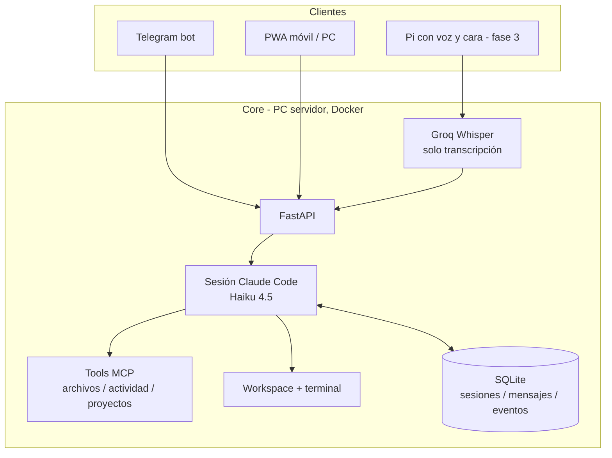

# Morgana 🔮

Asistente personal multi-usuario sobre Claude Code, autoalojado.
Habla desde Telegram, PWA o voz y trabaja directamente sobre tu propio
ordenador, archivos y terminal conservando el contexto de la conversación.

> Fase actual: PWA multiusuario con espacio de archivos por usuario, Telegram
> todavía de propietario único y agentes sin sandbox fuerte entre usuarios.

## Arquitectura



Cada conversación activa guarda el session id de Claude Code. Chat, Telegram
y la cara reanudan esa misma sesión, de modo que Haiku recuerda los turnos y
las tools que ya utilizó. Claude dispone directamente de lectura, escritura,
edición, búsqueda de archivos, terminal y búsqueda web.

Las herramientas publicadas en Morgana se registran como un servidor MCP
interno. Claude puede escogerlas por contexto —por ejemplo, buscar y leer una
matrícula— o el usuario puede adjuntarlas al mensaje desde el chat. Sus
argumentos JSON son un contrato interno entre Claude y la tool, nunca una
interfaz que tenga que rellenar el usuario.

El toggle **Thinking** pertenece a la conversación, se comparte entre
dispositivos y conserva su valor hasta volver a cambiarlo. **Empezar de cero**
abre una sesión Claude nueva sin alterar ese ajuste.

## Setup

```bash
cp .env.example .env   # y rellena tus claves
docker compose up --build
```

Para cada miembro del laboratorio crea una cuenta desde el servidor:

```bash
docker compose exec morgana python -m scripts.create_user ana
docker compose exec morgana python -m scripts.create_user admin --admin
```

También puedes vincular un usuario existente con `/start` en Telegram y fijar
su contraseña (el nombre es exacto):

```bash
docker compose exec morgana python -m scripts.set_password ruben
```

Configura un `JWT_SECRET` aleatorio de al menos 32 caracteres. La app queda en
`http://localhost:8000/` y Docker solo la publica en loopback por defecto.

Para abrir e instalar la PWA desde el móvil sin exponerla a la LAN, publica el
servicio dentro de tu tailnet y copia la URL HTTPS que muestre el comando:

```bash
tailscale serve --bg http://127.0.0.1:8000
```

Pon esa URL (por ejemplo, `https://mi-pc.mi-tailnet.ts.net`) en
`PWA_BASE_URL` y recrea el contenedor. `MORGANA_BIND_ADDRESS` solo debe cambiarse
si quieres publicar directamente el puerto y ya has resuelto firewall y TLS.

Sin Docker (desarrollo):

```bash
python3 -m venv .venv && .venv/bin/pip install -r requirements.txt
.venv/bin/uvicorn app.main:app --reload
```

## Morgana Desktop para Windows

El companion convierte el mismo PC servidor en una presencia de escritorio. El
detector Vosk escucha únicamente la palabra **“Morgana”** en local; al
reconocerla suena una campanita, se libera el micrófono y aparece la cabeza
flotante. Desde ahí la conversación encadena escucha, respuesta y locución hasta
decir **“adiós Morgana”**, **“gracias Morgana”** o hacer clic en la cara.

La primera vez muestra una ventana de vinculación. Usa la URL local
`http://127.0.0.1:8000`, el nombre y contraseña de una cuenta Morgana y un
nombre para el PC. La contraseña se usa solo para emitir un token revocable de
ese dispositivo y no se guarda. Después la aplicación queda en la bandeja y se
activa automáticamente al iniciar Windows.

Para generar el instalador desde Windows:

```powershell
cd frontend
npm install
& .\src-tauri\wake\download-model.ps1
& .\src-tauri\wake\build-sidecar.ps1
npm run desktop:icon
npm run desktop:build
```

El instalador NSIS se crea en
`frontend/src-tauri/target/release/bundle/nsis/`. El modelo español pequeño
ocupa unos 39 MB y la detección no usa ninguna API ni guarda audio. Las
respuestas siguen usando las integraciones Groq/Claude y TTS configuradas en el
servidor; por tanto, el único coste variable es el que ya tengan esas cuentas.

Desde el menú de bandeja se puede despertar a Morgana manualmente, pausar o
reanudar la escucha, abrir la PWA y salir por completo. Si la PWA no usa la URL
local predeterminada, se puede definir `MORGANA_BASE_URL` como variable de
entorno de Windows para que **Abrir Morgana** apunte a la URL correcta; la URL
de voz se guarda por separado al vincular el companion.

Necesitas una key de [Groq](https://console.groq.com) y un bot de
Telegram (créalo hablando con `@BotFather`, copia el token). Para la
vía agéntica puedes elegir entre una key de
[Anthropic](https://console.anthropic.com) o el login de Claude Code
incluido en una suscripción Claude Pro/Max.

### Autenticación de Claude

Morgana acepta tres valores de `CLAUDE_AUTH_MODE`:

| Modo | Comportamiento |
|---|---|
| `auto` | Usa `ANTHROPIC_API_KEY` si existe; si no, el login Pro/Max persistido |
| `api` | Exige `ANTHROPIC_API_KEY` y factura el uso en Claude Console |
| `subscription` | Ignora la API key y usa el login de Claude Code Pro/Max |

Para usar una API key:

```env
CLAUDE_AUTH_MODE=api
ANTHROPIC_API_KEY=sk-ant-...
```

Para usar una suscripción Pro/Max, deja la key vacía, construye la
imagen e inicia sesión una vez:

```env
CLAUDE_AUTH_MODE=subscription
ANTHROPIC_API_KEY=
```

```bash
docker compose build
docker compose run --rm -e ANTHROPIC_API_KEY= morgana claude
```

En el asistente selecciona **Claude App (Pro/Max)**. El login se guarda
en el volumen Docker `claude-config`, así que no hace falta repetirlo
en cada reinicio. Después arranca Morgana normalmente:

```bash
docker compose up -d
```

Abre tu bot, envía `/start` y empieza a hablar.

## Archivos multidispositivo

Cada cuenta ve únicamente dos orígenes:

- Archivos subidos desde la PWA, almacenados bajo `FILE_STORAGE_ROOT/<uuid>`.
- Archivos existentes bajo `WORKSPACE_ROOT/<uuid>`, indexados por nombre y ruta.

Desde **Archivos** se puede buscar, subir y descargar. El mismo flujo está
integrado en el chat: "pásame el archivo que se llama matrícula cuarto" devuelve
resultados descargables en el dispositivo actual. La PWA usa HTTPS autenticado,
no FTP; no expone rutas absolutas ni incluye el JWT en URLs.

Los límites se configuran con `FILE_MAX_BYTES`, `FILE_USER_QUOTA_BYTES`,
`FILE_SCAN_LIMIT` y `FILE_SEARCH_LIMIT`.

## Malla de dispositivos

Un **nodo** es una máquina tuya donde corre el agente de `agent/`: el PC main,
el MacBook. No es lo mismo que un dispositivo de la tabla `devices`, que es una
ventana del navegador; la misma máquina puede ser las dos cosas.

El agente se ejecuta **fuera de Docker**, con tu usuario del sistema, y abre la
conexión hacia Morgana por WebSocket. No escucha en ningún puerto: no hay nada
que abrir en el router ni que exponer a la red. Si publicas Morgana en tu
tailnet, los nodos entran por ahí.

```bash
cd agent && pip install -r requirements.txt
python -m morgana_node registrar --url https://mi-pc.mi-tailnet.ts.net
python -m morgana_node
```

El alta pide tu usuario y contraseña **una sola vez**. Lo que queda en la
máquina es un token propio de ese nodo, guardado hasheado en el servidor; la
contraseña no se escribe en disco. Revocar un nodo desde
`POST /api/nodos/{id}/revocar` no afecta al resto de tus dispositivos y caduca
al instante lo que tuviera pendiente.

Las órdenes van a un destinatario concreto y sobreviven a un equipo apagado:
quedan pendientes en SQLite y se entregan al reconectar. Si nadie las recoge en
`NODE_ORDER_TTL_SECONDS`, caducan. Nunca se reintentan solas: encender un
portátil olvidado no debe disparar una tanda de órdenes viejas.

Desde la conversación —chat, voz o Telegram— Claude dispone de tres
capacidades: `devices.list`, `devices.ping` y `devices.projects`. Resuelven el
nombre tal como lo dirías ("en el MacBook") y, si es ambiguo, preguntan en vez
de adivinar. Cada alta, conexión, orden y resultado queda en **Actividad**,
bajo la categoría Dispositivos.

Un nodo solo sabe hacer lo que hay escrito a mano en `capabilities.py`: de
momento responder al ping y enumerar los proyectos de una carpeta. **No hay
ejecución de comandos**; el servidor también rechaza cualquier capacidad fuera
de su lista, así que las dos partes validan por separado.

API autenticada:

```text
POST /api/auth/nodos          # alta (usuario + contraseña → token de nodo)
GET  /api/nodos
POST /api/nodos/{id}/revocar
GET  /api/nodos/{id}/ordenes
WS   /api/nodos/ws            # el agente; token en el primer frame
```

## Herramientas

La pantalla **Herramientas** es un workbench guiado por esquemas: muestra todas
las primitivas publicadas por el backend, genera sus formularios, permite
probarlas y compone herramientas personales sin cablear cada capacidad en React.
Un administrador puede publicar una composición para todo el lab. Los
manifiestos solo pueden enlazar primitivas incluidas explícitamente en
`app/tools.py`: no cargan módulos, shell, SQL, URLs ni código generado desde
SQLite.

Capacidades incluidas:

- `files.search`: busca exclusivamente en archivos propios por nombre o contenido.
- `files.read`: localiza un archivo propio y extrae texto compatible.
- `files.prepare_download`: valida y prepara un archivo propio.
- `files.create_note`: crea una nota UTF-8 gestionada, sujeta a límite y cuota.
- `tasks.list`: lista metadatos seguros de tareas propias con filtros.
- `projects.list`: lista proyectos confinados al workspace personal.
- `activity.recent`: consulta la proyección segura de actividad propia.
- `devices.list`: enumera las máquinas propias y cuáles están encendidas.
- `devices.ping`: comprueba si una máquina propia responde ahora mismo.
- `devices.projects`: pide a una máquina propia sus proyectos locales.
- `system.health`: comprueba el servicio.

Una composición puede fijar solo parte de los argumentos. Por ejemplo,
"Bitácora diaria" puede preconfigurar `name=diario.md` y solicitar `content`
en cada ejecución. Los argumentos se validan al guardar y de nuevo al ejecutar;
los valores runtime pueden sustituir un preset. Desde el mismo workbench se
puede editar, duplicar como personal, activar/desactivar, revisar métricas y
consultar el historial propio. El historial conserva estado y duración, pero no
argumentos, contenidos ni resultados.

API autenticada:

```text
GET  /api/herramientas
POST /api/herramientas
PUT  /api/herramientas/{id}
POST /api/herramientas/{id}/ejecutar
POST /api/herramientas/{id}/estado
POST /api/herramientas/{id}/duplicar
GET  /api/herramientas/{id}/invocaciones
```

Crear una primitiva nueva sigue requiriendo código revisado, tests y despliegue.
Esto permite que un agente prepare la implementación sin instalar código
arbitrario automáticamente en el servidor del laboratorio.

Estas tools amplían también Skill Studio. Una skill puede, por ejemplo, usar
`tasks.list` y `activity.recent` para preparar un briefing, o enlazar una
"Bitácora diaria" basada en `files.create_note` para guardar texto dictado como
artefacto descargable. La skill coordina capacidades existentes; añadir una
primitiva totalmente nueva sigue siendo un cambio de código revisado.

## Skill Studio

La pantalla **Skills** convierte esas capacidades de bajo nivel en procedimientos
reutilizables. Una skill combina instrucciones Markdown, ejemplos de petición y
hasta cuatro herramientas del catálogo visible. Los manifiestos se guardan como
borradores, reciben una puntuación de preparación y solo pueden activarse cuando
nombre, descripción, instrucciones, ejemplos y referencias son coherentes.

Flujo recomendado:

1. Crea el manifiesto en `/skills` y selecciona únicamente las capacidades que
   necesita.
2. Usa el banco de pruebas; los borradores propios pueden ensayarse sin publicar.
3. Corrige los avisos y activa la skill.
4. Invócala desde PWA, Cara o Telegram con
   `/skill <slug> <petición>`; por ejemplo,
   `/skill resumir-expediente resume mi matrícula`.
5. Consulta la ejecución en **Actividad** o exporta un `SKILL.md` portable.

Cada edición crea una revisión inmutable y aumenta `version`; editar una skill
activa hasta dejarla incompleta la devuelve automáticamente a borrador. Duplicar
crea una copia personal desactivada con historia independiente. Las skills del
laboratorio requieren administrador, son visibles para el resto solo cuando
están activas y no pueden depender de una tool personal. Si una tool dependiente
se desactiva, la skill queda pausada y deja de resolverse por `/skill` hasta que
la capacidad vuelva a estar disponible.

API autenticada:

```text
GET  /api/skills
POST /api/skills
PUT  /api/skills/{id}
POST /api/skills/{id}/estado
POST /api/skills/{id}/duplicar
GET  /api/skills/{id}/versiones
GET  /api/skills/{id}/exportar
POST /api/skills/{id}/probar
```

El runner no abre un agente ni ejecuta código almacenado. Infiere un único JSON
por tool, lo valida con el esquema Pydantic existente y pasa por la misma
auditoría de `tools.execute`. No hay bucles, activación implícita, shell, SQL ni
carga de módulos desde SQLite. Los resultados se recortan y se presentan al
modelo como datos no confiables.

## Actividad y recuperación

La pantalla **Actividad** convierte el log append-only en una bitácora privada:
muestra trabajo activo, aprobaciones pendientes, cuota de archivos, dispositivos
recientes y un historial filtrable por tareas, conversación, archivos, proyectos,
herramientas o cuenta. Las páginas usan un cursor estable para poder recorrer un
historial grande sin repetir entradas.

La API solo devuelve una proyección allowlisted de cada evento. No expone el
payload interno, rutas absolutas, prompts completos, tokens ni ids de Telegram;
cada consulta queda confinada al usuario autenticado.

Una tarea en estado **Error** ofrece **Reintentar tarea** desde su detalle. El
intento anterior permanece intacto para diagnóstico y se crea una tarea nueva con
el mismo prompt, proyecto y modelo. El nuevo intento vuelve a generar un plan y
requiere aprobación: reintentar nunca continúa a ciegas una ejecución parcial.

La opción recomendada es clonar proyectos desde la pantalla **Proyectos** de
la PWA: Morgana los coloca en `workspace/<uuid-del-usuario>/`. Si vas a copiar
uno a mano, consulta primero tu `id` con `GET /api/yo` usando el Bearer JWT y
usa exactamente ese UUID como nombre de carpeta. El nombre visible de Telegram
no se utiliza como ruta.

## Estructura

```
app/
├── main.py               # FastAPI + worker + bot en un proceso
├── config.py             # settings desde .env
├── db.py                 # users, tasks, events (log append-only)
├── activity.py           # proyección privada y segura del log de actividad
├── auth.py               # bcrypt + JWT compartido por HTTP y WS
├── api.py                # endpoints REST de la PWA
├── events.py             # WebSocket y conexiones por usuario
├── projects.py           # clonado seguro y confinado
├── files.py              # búsqueda, uploads y descarga confinada por usuario
├── nodes.py              # malla de máquinas ejecutoras: alta, presencia, órdenes
├── tools.py              # catálogo y ejecución de primitivas permitidas
├── skills.py             # manifiestos versionados, exportación y runner seguro
├── web.py                # estáticos y fallback del router React
├── tasks.py              # orquestador: cola + estados + notificaciones
├── core/
│   └── messages.py       # caso de uso compartido por Telegram y PWA
├── executors/
│   ├── claude_chat.py    # sesión Claude Code persistente + tools MCP
│   ├── groq_speech.py    # voz a texto con Groq Whisper
│   └── claude_agent.py   # tareas históricas del centro de tareas
└── channels/
    └── telegram.py       # notificador + aprobaciones rápidas

agent/morgana_node/       # daemon que corre en tus máquinas, fuera de Docker
frontend/                 # React, Vite, TypeScript, Tailwind y PWA
scripts/set_password.py   # contraseña de un usuario existente
scripts/create_user.py    # alta administrativa de usuarios
```

Principios de la implementación:

- **El canal no sabe de negocio, el core no sabe de canales.** `tasks.py`
  notifica por callback; Telegram y la PWA renderizan el mismo core.
- **Log de eventos append-only** (`events`): cada mensaje, plan,
  aprobación y resultado queda registrado. Es la base del ángulo de
  investigación (estudio de uso multi-usuario).
- **Tabla `users` desde el día 1**, con hueco para `linux_user`:
  la fase 2 mapea cada usuario a un user de Linux y lanza sus agentes
  con `sudo -u`, aislando workspaces y credenciales por sistema operativo.

## Roadmap

- **Completado:** PWA multiusuario lógica, archivos multidispositivo, catálogo
  de herramientas, Skill Studio versionado, actividad y recuperación de fallos,
  Telegram, conversación persistente con Claude Code y voz con Groq Whisper
- **Fase PWA (esto):** auth JWT, REST + WebSocket, bandeja, detalle, chat,
  proyectos, deep-links, instalación móvil/PC y conversación táctil en `/cara`
- **Siguiente:** sandbox real por usuario (contenedor o UID), secretos por
  usuario, vinculación Telegram por código, diffs ricos, importación y catálogo
  remoto de skills MCP, executor CLI (Claude Code / Codex / Gemini
  headless con suscripciones BYO)
- **Fase 3:** la cara — Pi Zero 2 W + HyperPixel Round en el lab,
  wake word, STT Groq Whisper, TTS, login por voz declarativo + NFC,
  memoria de dos niveles (usuario/grupo)

---
*Proyecto personal de Rubén ("Ruffini") — candidato a plataforma del lab ONEKIN.*


## Conversación por voz en `/cara`

La PWA instalada en un móvil o tablet escucha al tocar la cara completa de
Morgana, corta automáticamente tras un breve silencio y envía el clip al
contenedor. FastAPI lo transcribe en español con Groq Whisper y entrega el
texto a la misma sesión Claude Code del chat. La respuesta se dicta mediante una voz
española del propio dispositivo, priorizando voces femeninas conocidas.

El acceso debe hacerse por **HTTPS** para que Chrome permita usar el micrófono.
El audio se mantiene en memoria durante la petición y no se guarda en disco ni
en SQLite. Estos valores son configurables en `.env`:

```env
GROQ_SPEECH_MODEL=whisper-large-v3-turbo
VOICE_MAX_AUDIO_BYTES=5000000
```
