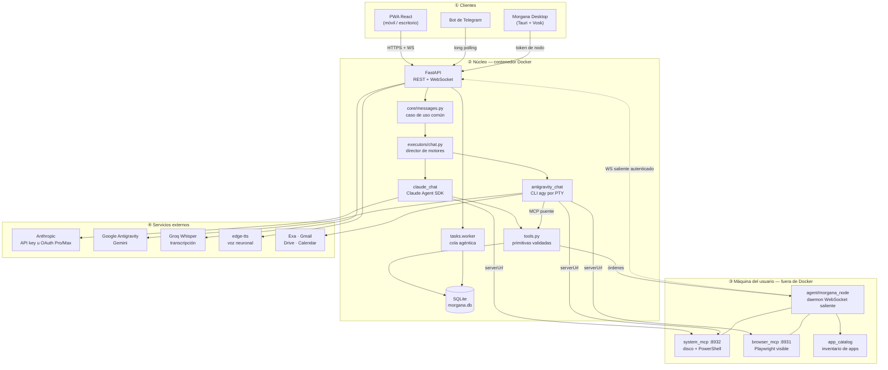
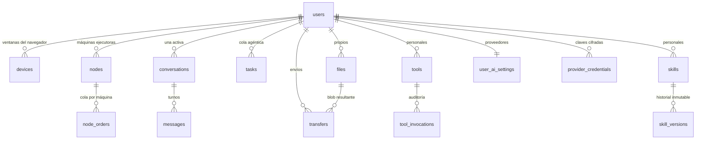
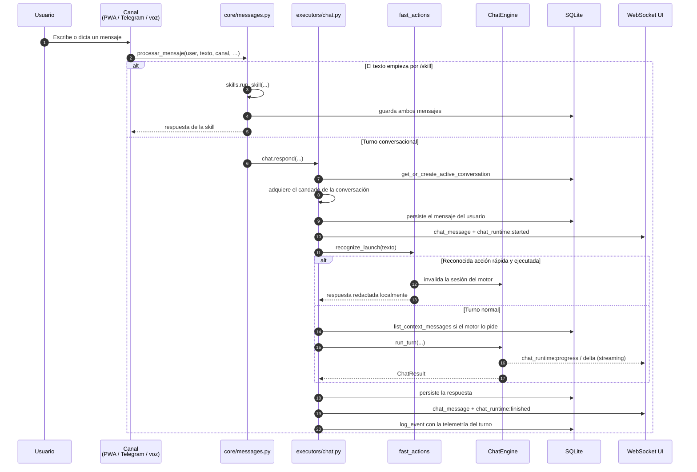
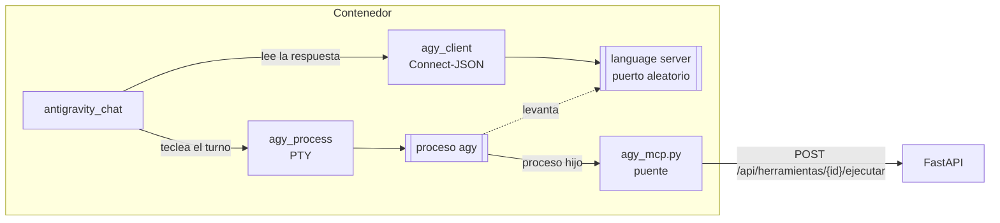
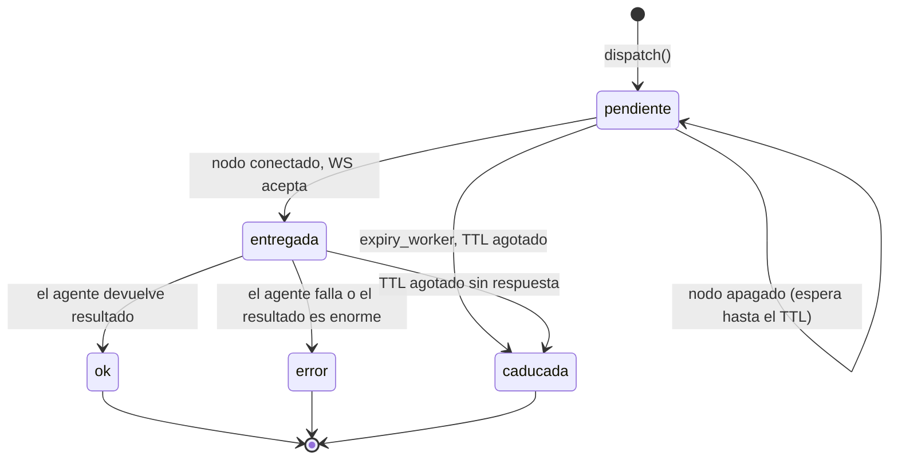
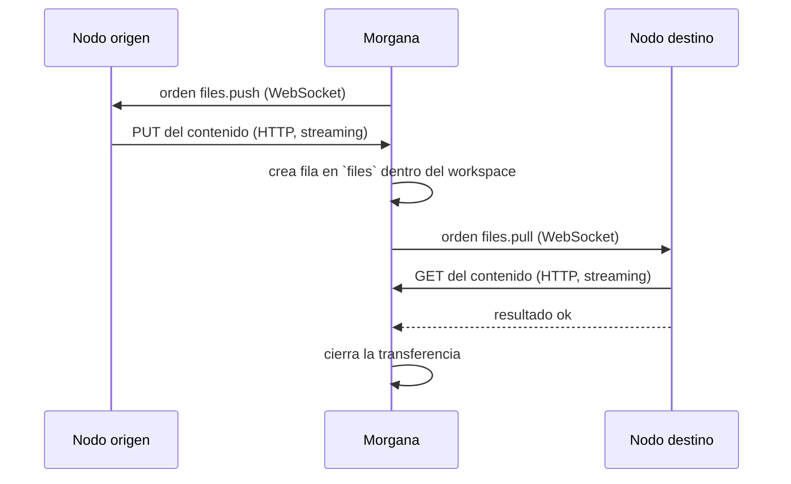
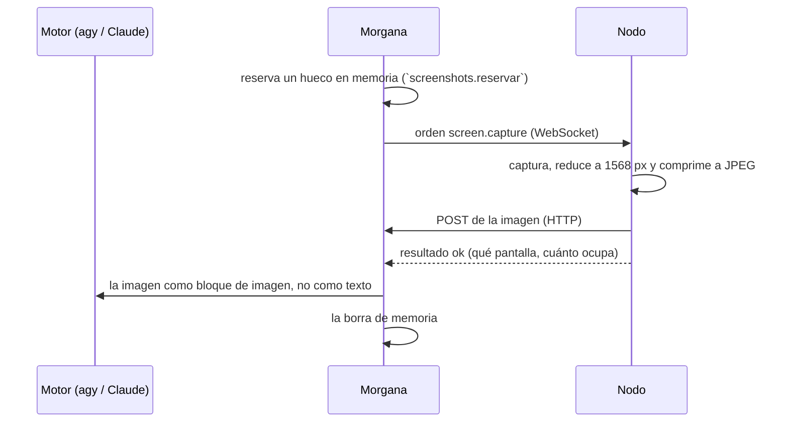
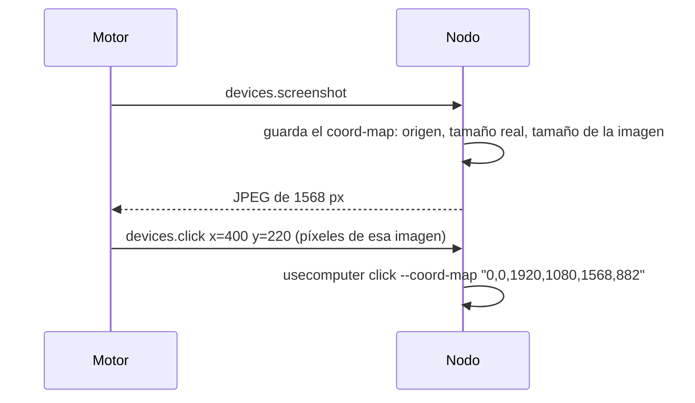
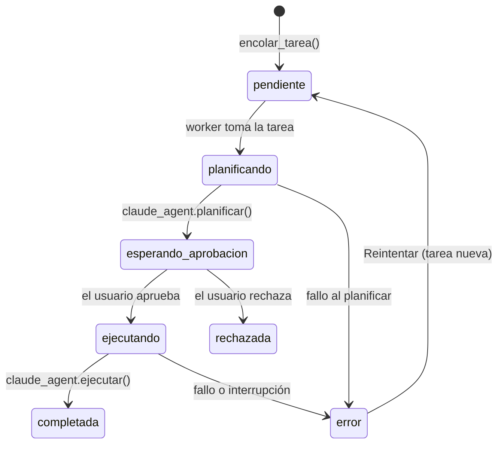

# Morgana — Arquitectura y flujo del sistema

> Documento de referencia técnica para la memoria de TFG.
> Elaborado por análisis directo del código fuente del repositorio (rama `master`,
> 10 de agosto de 2026, 24 commits, ~34.000 líneas entre backend, agente,
> frontend y pruebas).

---

## Índice

1. [Qué es Morgana](#1-qué-es-morgana)
2. [Vista general de la arquitectura](#2-vista-general-de-la-arquitectura)
3. [Stack tecnológico](#3-stack-tecnológico)
4. [Estructura del repositorio](#4-estructura-del-repositorio)
5. [Modelo de datos](#5-modelo-de-datos)
6. [El núcleo: FastAPI como proceso único](#6-el-núcleo-fastapi-como-proceso-único)
7. [Autenticación y modelo de identidades](#7-autenticación-y-modelo-de-identidades)
8. [Flujo conversacional: el camino de un mensaje](#8-flujo-conversacional-el-camino-de-un-mensaje)
9. [El contrato `ChatEngine` y sus dos implementaciones](#9-el-contrato-chatengine-y-sus-dos-implementaciones)
10. [El carril rápido sin modelo (`fast_actions`)](#10-el-carril-rápido-sin-modelo-fast_actions)
11. [Catálogo de herramientas y Skill Studio](#11-catálogo-de-herramientas-y-skill-studio)
12. [La malla de nodos: ejecución fuera del contenedor](#12-la-malla-de-nodos-ejecución-fuera-del-contenedor)
13. [Servidores MCP: el ordenador y el navegador reales](#13-servidores-mcp-el-ordenador-y-el-navegador-reales)
14. [Transferencia de archivos entre dispositivos](#14-transferencia-de-archivos-entre-dispositivos)
15. [Tareas agénticas: planificar, aprobar, ejecutar](#15-tareas-agénticas-planificar-aprobar-ejecutar)
16. [Canales de entrada](#16-canales-de-entrada)
17. [Tiempo real: WebSockets y streaming](#17-tiempo-real-websockets-y-streaming)
18. [El companion de escritorio (Tauri + Vosk)](#18-el-companion-de-escritorio-tauri--vosk)
19. [Modelo de seguridad](#19-modelo-de-seguridad)
20. [Observabilidad: log de eventos y telemetría](#20-observabilidad-log-de-eventos-y-telemetría)
21. [Despliegue](#21-despliegue)
22. [Estrategia de pruebas](#22-estrategia-de-pruebas)
23. [Decisiones de diseño relevantes](#23-decisiones-de-diseño-relevantes)
24. [Limitaciones conocidas y trabajo futuro](#24-limitaciones-conocidas-y-trabajo-futuro)

---

## 1. Qué es Morgana

Morgana es un **asistente personal multiusuario autoalojado** construido sobre
modelos de lenguaje agénticos. Su rasgo diferencial frente a un chatbot
convencional es que **actúa sobre el ordenador real del usuario**: sus archivos,
su terminal, su navegador y sus aplicaciones instaladas, no sobre un entorno
simulado ni sobre una copia en la nube.

El sistema se accede desde tres canales que comparten un mismo hilo de
conversación: una **PWA** (móvil y escritorio), un **bot de Telegram** y una
**interfaz de voz** con cara animada, disponible tanto en el navegador como en
una aplicación de escritorio para Windows con detección de palabra de activación.

Tres propiedades vertebran el diseño:

| Propiedad | Cómo se materializa |
|---|---|
| **Continuidad de contexto** | Una única conversación activa por usuario, persistida en SQLite y reanudable desde cualquier canal o dispositivo. |
| **Acción real, no simulada** | Un agente que corre fuera del contenedor, con el usuario del sistema, y expone disco, shell, navegador y catálogo de aplicaciones por MCP. |
| **Trazabilidad total** | Log de eventos append-only: cada mensaje, plan, orden, aprobación e invocación queda registrado y consultable. |

---

## 2. Vista general de la arquitectura

El sistema se distribuye en **cuatro planos de ejecución** que nunca se
confunden entre sí:



### La frontera que explica el diseño

El núcleo vive **dentro de un contenedor Docker**, y ahí dentro del ordenador
del usuario solo existe una carpeta: el workspace montado como volumen. Todo lo
demás —Descargas, repositorios, documentos, programas instalados, el navegador
con las sesiones iniciadas— es inalcanzable desde el contenedor por
construcción.

El **agente de nodo** es la otra mitad de la arquitectura y existe precisamente
para cruzar esa frontera de forma controlada. Corre fuera de Docker, con el
usuario del sistema, y **solo abre conexiones salientes**: se conecta él a
Morgana por WebSocket, nunca al revés. Esto elimina la necesidad de abrir
puertos en el router o atravesar NAT, y permite que las máquinas del usuario
estén en cualquier red.

Sobre esa conexión el agente hace dos cosas distintas:

1. **Ejecuta órdenes discretas** que le llegan por el WebSocket (`shell.run`,
   `apps.launch`, `files.push`…), definidas en un catálogo cerrado de
   capacidades.
2. **Levanta servidores MCP locales** —el disco y el intérprete de comandos
   (`system_mcp`), el navegador Playwright (`browser_mcp`)— a los que el motor
   conversacional se conecta directamente por red. Aquí el agente solo actúa de
   lanzador; el diálogo posterior es entre el modelo y el servidor.

---

## 3. Stack tecnológico

### Backend (`app/`, `agent/`)

| Componente | Tecnología | Versión mínima |
|---|---|---|
| Framework web | FastAPI | ≥ 0.115 |
| Servidor ASGI | uvicorn[standard] | ≥ 0.30 |
| Configuración | pydantic-settings | ≥ 2.4 |
| Persistencia | SQLite (`sqlite3` estándar) | — |
| Hash de contraseñas | bcrypt | ≥ 4.2 |
| Tokens | PyJWT (HS256) | ≥ 2.9 |
| Cifrado de credenciales | cryptography (Fernet) | ≥ 43.0 |
| Motor agéntico principal | claude-agent-sdk | ≥ 0.1 |
| Cliente Anthropic | anthropic | ≥ 0.40 |
| Transcripción y modelo rápido | groq | ≥ 0.11 |
| Síntesis de voz | edge-tts | ≥ 7.0 |
| Canal de mensajería | python-telegram-bot | ≥ 21.6 |
| Extracción de texto | pypdf, python-docx | ≥ 5.0 / ≥ 1.1 |
| Pseudoterminal | pywinpty (Windows) / ptyprocess (POSIX) | ≥ 3.0 / ≥ 0.7 |
| Servidor MCP del nodo | `mcp.server.fastmcp` (FastMCP) | — |

### Frontend (`frontend/`)

| Componente | Tecnología |
|---|---|
| Librería de UI | React 19 |
| Lenguaje | TypeScript 6 |
| Empaquetador | Vite 8 |
| Estado servidor | TanStack Query 5 |
| Enrutado | React Router 7 |
| Estilos | Tailwind CSS 4 + CSS propio |
| Render 3D de la cara | three.js 0.169 |
| Markdown | react-markdown + remark-gfm |
| PWA | vite-plugin-pwa |
| Pruebas | Vitest + Testing Library + jsdom |
| Escritorio | Tauri 2 (Rust) + plugins autostart y notification |
| Palabra de activación | Vosk (modelo español pequeño, ~39 MB) + sounddevice |

---

## 4. Estructura del repositorio

```
morgana/
├── app/                          # Núcleo — se ejecuta dentro del contenedor
│   ├── main.py                   # Composición: FastAPI + worker + bot, un proceso
│   ├── config.py                 # Settings desde .env (pydantic-settings)
│   ├── db.py                     # Esquema SQLite y todo el acceso a datos (2.078 líneas)
│   ├── auth.py                   # bcrypt + JWT, compartido por HTTP y WebSocket
│   ├── api.py                    # Endpoints REST (1.229 líneas)
│   ├── events.py                 # WebSocket de la UI y difusión por usuario
│   ├── nodes.py                  # Malla de máquinas: alta, presencia, órdenes, riesgo
│   ├── transfers.py              # Archivos viajando entre dispositivos
│   ├── tools.py                  # Catálogo de primitivas y ejecución auditada
│   ├── skills.py                 # Manifiestos versionados y runner seguro
│   ├── fast_actions.py           # Reconocedor estricto del carril local sin modelo
│   ├── turn_telemetry.py         # Tiempos monotónicos por etapas, sin contenido
│   ├── taint.py                  # Procedencia del contexto (anti prompt-injection)
│   ├── tasks.py                  # Orquestador de tareas agénticas
│   ├── files.py                  # Archivos personales confinados por usuario
│   ├── projects.py               # Clonado de repositorios confinado
│   ├── activity.py               # Proyección segura del log de eventos
│   ├── ai_providers.py           # Proveedores y credenciales por usuario
│   ├── router.py                 # Clasificador rápida/agéntica (legado, ver §8)
│   ├── web.py                    # Estáticos y fallback del router de React
│   ├── core/messages.py          # Caso de uso común a todos los canales
│   ├── channels/telegram.py      # Canal Telegram (sin lógica de negocio)
│   └── executors/
│       ├── chat.py               # Director: qué motor contesta y qué es común
│       ├── chat_engine.py        # El contrato `ChatEngine` (Protocol)
│       ├── claude_chat.py        # Motor Claude Code (Agent SDK)
│       ├── antigravity_chat.py   # Motor Gemini vía CLI `agy` (1.095 líneas)
│       ├── agy_process.py        # El proceso `agy` vivo en un pseudoterminal
│       ├── agy_client.py         # Cliente del language server de `agy`
│       ├── agy_mcp.py            # Puente MCP: expone las tools de Morgana a `agy`
│       ├── agy_mcp_config.py     # Qué servidores MCP ve `agy` y con qué credenciales
│       ├── system_link.py        # Levanta el MCP del ordenador y compone su URL
│       ├── claude_agent.py       # Tareas agénticas (planificar / ejecutar)
│       ├── groq_speech.py        # Voz a texto con Groq Whisper
│       └── edge_speech.py        # Texto a voz neuronal
│
├── agent/morgana_node/           # Daemon — se ejecuta FUERA del contenedor
│   ├── __main__.py               # CLI: `registrar` y ejecución del daemon
│   ├── client.py                 # WebSocket saliente con reconexión y backoff
│   ├── capabilities.py           # Catálogo cerrado de lo que el nodo sabe hacer
│   ├── system_mcp.py             # Servidor MCP del disco y la shell (puerto 8932)
│   ├── system_fs.py              # Operaciones de archivos con alcance controlado
│   ├── system_shell.py           # Ejecución síncrona y trabajos en segundo plano
│   ├── fs_scope.py               # Exclusiones (~/.ssh, ~/.aws, *.pem…)
│   ├── browser_mcp.py            # Lanzador del MCP oficial de Playwright (8931)
│   ├── app_catalog.py            # Inventario inmutable de aplicaciones Windows
│   └── media.py                  # Control de reproducción y "qué suena ahora"
│
├── frontend/
│   ├── src/pages/                # Consola, Actividad, Archivos, Proyectos, Skills,
│   │                             # Herramientas, Ajustes, Cara, Login, Detalle
│   ├── src/components/           # AppShell, ChatPanel, MorganaFace, CompanionApp…
│   ├── src/lib/                  # api, auth, useEvents, voice, face3d, eventBus…
│   ├── src-tauri/                # Aplicación de escritorio en Rust
│   └── src-tauri/wake/           # Detector Vosk de la palabra «Morgana»
│
├── tests/                        # 34 módulos de prueba, 6.870 líneas
├── docs/superpowers/             # Especificaciones y planes de cada iteración
├── Dockerfile                    # Multi-stage: build del frontend + runtime Python
└── docker-compose.yml            # Servicio, volúmenes y publicación en loopback
```

**Métricas de tamaño**: ~16.600 líneas de Python de producción, ~10.400 de
TypeScript/TSX y ~6.900 de pruebas Python.

---

## 5. Modelo de datos

Toda la persistencia vive en un único fichero SQLite (`db_path`, por defecto
`./data/morgana.db`), con `PRAGMA foreign_keys = ON` en cada conexión y acceso
mediante un *context manager* que garantiza transacción y cierre
(`app/db.py:20-30`). El esquema se crea de forma idempotente en `init_db()` y
las migraciones se aplican comprobando `PRAGMA table_info` sobre cada tabla.



### Tablas y su papel

| Tabla | Papel |
|---|---|
| `users` | Identidad. Incluye `telegram_chat_id`, `password_hash` y un hueco `linux_user` previsto para el aislamiento por UID de la fase siguiente. |
| `devices` | Una **ventana del navegador** o cliente conectado (`movil`, `pc`, `kiosko`, `telegram`). No es una máquina. |
| `nodes` | Una **máquina** con el agente instalado. Tiene token propio hasheado, lista de capacidades declaradas y un interruptor `shell_habilitado`. |
| `node_orders` | Cola de órdenes por nodo, con estado (`pendiente`→`entregada`→`ok`/`error`/`caducada`), riesgo, aprobación y caducidad. |
| `transfers` | Un archivo viajando entre dos extremos. Correlaciona las dos órdenes (subir en origen, bajar en destino) más el blob intermedio. |
| `tasks` | Tarea agéntica con su ciclo de vida de siete estados, plan generado, resultado y workspace. |
| `events` | **Log append-only** (`id`, `ts`, `user_id`, `tipo`, `payload` JSON). Base de la trazabilidad y del ángulo de investigación. |
| `conversations` | Hilo de conversación. Índice único parcial garantiza **una sola activa por usuario**. Guarda `claude_session_id` y `thinking_enabled`. |
| `messages` | Turnos con rol, contenido, origen (`pwa`/`telegram`/`cara`) y `client_ref` para correlacionar streaming. |
| `files` | Archivos propios en dos orígenes: `managed` (subidos) y `workspace` (indexados). Incluye `content_text` para búsqueda por contenido. |
| `tools` | Composiciones sobre primitivas, con `scope` (`personal`/`lab`) y `bound_arguments` preconfigurados. |
| `tool_invocations` | Auditoría de cada ejecución: estado, código de error y duración. **No guarda argumentos ni resultados.** |
| `skills` / `skill_versions` | Manifiestos declarativos y su historial inmutable versionado. |
| `user_ai_settings` | Proveedor y modelo elegidos por cada uno de los cuatro carriles: `chat`, `tools`, `speech`, `agent`. |
| `provider_credentials` | Claves de API por usuario, cifradas con Fernet derivado de `CREDENTIAL_ENCRYPTION_KEY` o `JWT_SECRET`. |

### Restricciones significativas

- `idx_conversations_one_active_user`: índice único parcial sobre
  `conversations(user_id) WHERE estado = 'activa'`. La invariante «una sola
  conversación activa» la garantiza la base de datos, no el código.
- `files` obliga por `CHECK` a que `managed` tenga `storage_key` y `workspace`
  tenga `relative_path`.
- `tools` y `skills` obligan a que `personal` tenga dueño y `lab` no lo tenga.
- Índices únicos parciales separan los *slugs* de skills personales (por dueño)
  de los del laboratorio (globales).

---

## 6. El núcleo: FastAPI como proceso único

`app/main.py` compone deliberadamente **tres subsistemas en un mismo proceso**:
la API HTTP con la PWA servida como estáticos, el worker de la cola agéntica y
el bot de Telegram por *long polling*. La razón es que el estado vivo —qué nodos
están conectados, qué WebSockets hay abiertos, qué sesiones de motor están
calientes— reside en memoria de uvicorn, y separarlo en procesos obligaría a
introducir un bus externo que este proyecto no necesita a su escala.

El ciclo de vida (`lifespan`) hace, en orden:

1. **Valida el secreto JWT** antes de nada: mínimo 32 caracteres y distinto del
   valor de ejemplo. Es un `RuntimeError` que impide arrancar, no un aviso.
2. Inicializa el esquema y **reencola las tareas pendientes** que quedaron a
   medias, marcando como error las que estaban `ejecutando` (la cola vive en
   memoria y no sobrevive a un reinicio).
3. Arranca tres tareas de fondo: el worker de tareas, el caducador de órdenes de
   nodo y el caducador de transferencias.
4. Arranca el bot de Telegram si hay token; si no, avisa y sigue solo con API.
5. **Precalienta Antigravity** en segundo plano si procede. Este paso es más
   sutil de lo que parece: antes de precalentar espera hasta 90 segundos a que
   algún nodo se conecte (`_esperar_algun_nodo`), porque lo que se decida al
   montar la sesión —si hay navegador, si hay ordenador— dura lo que dure el
   proceso de `agy`. Si el agente todavía no ha reconectado tras un despliegue,
   esa sesión se quedaría sin ordenador debajo durante una hora entera.

Al apagar, cierra las sesiones de todos los motores, cancela los trabajadores y
marca como interrumpidas las ejecuciones vivas.

### Middleware y política de errores

- **CORS** restringido a los orígenes de Tauri (`http://tauri.localhost` y
  `http://localhost:1420`), sin credenciales, solo `GET`/`POST`/`OPTIONS`.
- **Cabeceras de seguridad** en todas las respuestas: `X-Content-Type-Options`,
  `Referrer-Policy: no-referrer`, `X-Frame-Options: DENY` y una **CSP estricta**
  (`default-src 'self'`, `frame-ancestors 'none'`) con dos excepciones
  justificadas: `blob:` en `media-src` para el audio de TTS y `ws:`/`wss:` en
  `connect-src` para los eventos.
- Los errores bajo `/api` se serializan como `{"error": ...}` en JSON; el resto
  usa el manejador estándar para no romper el enrutado de React.
- Cualquier ruta `/api/*` no reconocida devuelve **404 solo tras autenticar**,
  para no revelar el mapa de endpoints a un cliente anónimo.

---

## 7. Autenticación y modelo de identidades

`app/auth.py` implementa contraseñas con **bcrypt** (rechazando explícitamente
contraseñas de más de 72 bytes, el límite del algoritmo) y sesiones con **JWT
HS256** de 30 días por defecto.

Lo relevante para la memoria es que conviven **tres credenciales distintas con
alcances distintos**, y esa separación es intencional:

| Credencial | Emisión | Alcance | Revocación |
|---|---|---|---|
| **JWT de usuario** | `POST /api/auth/login` con nombre y contraseña | Toda la API | Caducidad (30 días) |
| **Token de nodo** | `POST /api/auth/nodos`, formato `{node_id}.{secret}` | Solo voz y TTS (`current_voice_user`) más el WebSocket de órdenes | Instantánea, por nodo (`POST /api/nodos/{id}/revocar`) |
| **Secreto del MCP de sistema** | Generado por el agente en cada arranque | La ruta `/{token}/mcp` del servidor local | Al reiniciar el agente |

El razonamiento tras la segunda fila está documentado en el propio README: el
companion de escritorio guarda **dos** credenciales precisamente porque el token
de nodo vive en el disco de una máquina física. Si sirviera para toda la API,
quien lo robase podría aprobar las órdenes que él mismo solicita, y el mecanismo
de consentimiento dejaría de significar nada.

El token de nodo **nunca se almacena en claro**: se guarda `sha256(secret)` y se
compara con `hmac.compare_digest` para evitar filtrado por temporización
(`app/nodes.py:211-234`). El identificador del nodo viaja delante del secreto
para poder localizar la fila sin recorrer la tabla comparando hashes.

En ambos WebSockets —el de eventos y el de nodos— **el token viaja en el primer
frame, nunca en la URL**, porque las URLs acaban en los logs de cualquier proxy
intermedio.

---

## 8. Flujo conversacional: el camino de un mensaje

Este es el flujo central del sistema. Un mensaje entra por cualquiera de los
tres canales y converge en un único caso de uso.



### Puntos de diseño destacables

**Un candado por conversación.** `chat.respond` adquiere
`engine.conversation_lock(conversation_id)` antes de tocar nada. Serializa los
turnos de un mismo hilo aunque lleguen simultáneamente desde el móvil y desde el
escritorio.

**Detección de conversación cambiada.** El parámetro opcional
`conversation_id` permite al cliente decir *«mi turno pertenece a esta
conversación»*. Si mientras tanto otro dispositivo la ha reiniciado, se lanza
`ConversationChanged` y el endpoint devuelve **409**. Esto importa sobre todo en
voz, donde cada invocación abre un hilo nuevo: sin esta comprobación una
respuesta tardía se colaría en la conversación siguiente.

**El estado se refresca dentro del candado.** Tras adquirirlo se vuelve a leer
la conversación activa, porque el ajuste *Thinking* o el `claude_session_id`
pueden haber cambiado en otro dispositivo mientras se esperaba.

**Fallback entre motores** (`_run_with_fallback`). Si el motor elegido falla, el
turno lo contesta Claude en lugar de dejar al usuario sin respuesta. Tres
detalles cuidados:

- Se llama a `abandon_session`, **no** a `close_session`: cerrar conservaría
  recursos caros deliberadamente, y conservar un proceso `agy` colgado era
  exactamente lo que condenaba todos los turnos siguientes al mismo fallo.
- Como el motor caído no dejó nada en la conversación de Claude, se le
  reconstruye el historial aunque el motor original no lo hubiera pedido.
- Se relanza el motor caído en segundo plano (`precalentar_en_segundo_plano`)
  para que el turno siguiente ya lo encuentre sano. Sin esto, el usuario se
  quedaba en el motor de respaldo hasta reiniciar el servidor.
- **Por voz el aviso de fallo no se locuta.** La respuesta se dicta entera, y
  leerle el error en alto —corchetes incluidos— no ayuda a quien está
  escuchando; queda registrado en Actividad, que es donde se mira.

### Nota sobre `app/router.py`

El módulo `router.py` implementa un clasificador que decide con un modelo rápido
de Groq si un mensaje va por «vía rápida», «vía agéntica» o «herramienta».
**Hoy solo lo ejercitan las pruebas**: el flujo de producción sustituyó ese
enrutado por un chat conversacional donde el propio modelo escoge sus
herramientas, más el carril determinista de `fast_actions`. Se documenta aquí
por dos motivos: sigue siendo código presente en el repositorio y su historia
—de clasificar antes a dejar decidir al agente— es en sí misma una decisión de
arquitectura relevante para la memoria.

---

## 9. El contrato `ChatEngine` y sus dos implementaciones

`app/executors/chat_engine.py` define un `Protocol` que separa con precisión lo
que es común de lo que es específico de cada motor:

```python
class ChatEngine(Protocol):
    name: str
    display_name: str
    def conversation_lock(self, conversation_id: str) -> asyncio.Lock: ...
    def needs_history(self, conversation: dict) -> bool: ...
    async def run_turn(self, user, conversation, text, attached_tool_ids,
                       turn_id, bootstrap_history, voz, canal) -> ChatResult: ...
    async def close_session(self, conversation_id: str) -> None: ...
    async def invalidate_session(self, user, conversation_id) -> None: ...
    async def abandon_session(self, user, conversation_id, motivo) -> None: ...
    async def close_all_sessions(self) -> None: ...
```

Un motor **solo sabe producir la respuesta a un turno y gestionar sus sesiones
vivas**. La conversación activa, la persistencia, los eventos de la UI y la
telemetría son de `chat.py`. La distinción entre `close`, `invalidate` y
`abandon` no es redundante: `close` cierra ordenadamente, `invalidate` olvida
mientras quien llama ya posee el candado, y `abandon` tira lo que haya montado
porque es sospechoso tras un fallo.

### 9.1 Motor Claude Code (`claude_chat.py`)

Usa el **Claude Agent SDK** con `ClaudeSDKClient`, modelo `claude-haiku-4-5` y
esfuerzo `low` —medido: deja los turnos en ~1,2 s constantes frente a 1,2–3,0 s,
y evita reprocesar la caché de prompt en cada mensaje—.

**Sesiones vivas.** Un diccionario `_live_sessions` mantiene hasta 8 clientes
conectados, con expiración a los 15 minutos de inactividad. Cada sesión guarda
una *firma* (`_session_signature`) que combina el estado de *Thinking* y el
catálogo de herramientas con sus `updated_at`: si cambia cualquiera de las dos
cosas, la sesión se descarta y se reconstruye. Sin esto, editar una herramienta
no surtiría efecto hasta reiniciar.

**Reanudación resiliente.** Se pasa `resume=claude_session_id` al SDK. Si el
transcript ya no existe en disco —se limpió, o venía de otra máquina— la
conexión falla; en lugar de dejar la conversación rota para siempre, se arranca
una sesión nueva, se borra el identificador y se marca `needs_history=True` para
recuperar el hilo reinyectando el historial como texto.

**Herramientas.** El catálogo de Morgana se publica como un **servidor MCP
interno** creado con `create_sdk_mcp_server`, más ocho herramientas nativas
(`Read`, `Write`, `Edit`, `Glob`, `Grep`, `Bash`, `WebSearch`, `WebFetch`). Cada
primitiva se envuelve en un handler que llama a `tools.execute` —con lo que pasa
por la misma validación y auditoría que todo lo demás—, recorta el resultado a
60.000 caracteres y recolecta los artefactos descargables del turno.

**Construcción del prompt** (`_prompt_with_attachments`). Al texto del usuario se
le añaden, según el caso: el historial previo entre etiquetas
`<historial_previo>`, las herramientas que el usuario adjuntó explícitamente, un
bloque `<enrutamiento_morgana>` con reglas condicionales generadas según qué
capacidades estén disponibles, y —solo en voz— los bloques `BUSQUEDA_BREVE` y
`LOCUCION`.

El bloque de locución merece atención en la memoria: contiene reglas de
redacción para el oído (nada de markdown, cifras en palabras, prohibido el
apartado de fuentes, anunciar la herramienta antes de usarla) y va **en el
turno, no en el system prompt**, porque la sesión de Claude es la misma para
texto y voz.

**Streaming.** Con `include_partial_messages=True` se procesan eventos
`StreamEvent` y se emiten fragmentos a la UI con doble criterio de descarga: 96
caracteres acumulados o 75 ms transcurridos. Cuando empieza un bloque de
herramienta se emite un fragmento con `boundary=True`, que es lo que permite al
canal de voz locutar ya ese texto en vez de esperar a que la herramienta
termine.

### 9.2 Motor Antigravity (`antigravity_chat.py`)

El motor alternativo conversa con Gemini a través de la CLI `agy` de Google.
Es la pieza más elaborada del sistema y su diseño está guiado enteramente por
mediciones.



**Por qué un pseudoterminal.** `agy` comprueba que hay un terminal de verdad
antes de arrancar, así que se lanza dentro de un PTY (ConPTY vía `pywinpty` en
Windows, `ptyprocess` fuera). Pero **de ahí ya no se lee**: la respuesta se sigue
por el *language server* que el propio proceso levanta, lo que devuelve JSON con
streaming y un estado explícito de «terminado». El PTY queda solo para mantener
el proceso en pie y teclear el turno. Teclear en vez de usar
`SendUserCascadeMessage` no es pereza: esa llamada cuesta dos segundos fijos,
medidos, y el PTY hace falta igualmente.

**Por qué la personalidad no se teclea.** Teclear por el pseudoterminal cuesta
unos 7 ms por carácter. Mandar el bloque de reglas en cada turno costaba más de
diez segundos de reloj antes de que el modelo empezara siquiera a pensar. La
solución: la personalidad vive en un `GEMINI.md` dentro del workspace, que es de
donde `agy` carga sus reglas, y en el turno solo viaja una **marca de seis u once
caracteres** (`<voz>`, `<telegram>`) que activa el bloque correspondiente.

**Detección de salud honesta.** `agy` se cuelga sin cerrar su pseudoterminal, así
que `pty.isalive()` devuelve `True` mientras la interfaz ha dejado de aceptar lo
que se le teclea. Por eso `AgyProcess.healthy()` pregunta al *language server*,
que es quien sabe la verdad, con caché de un segundo para no duplicar viajes.
Antes de esto, un proceso enfermo se reutilizaba turno tras turno y la
conversación se quedaba en Claude hasta reiniciar el servidor.

**Doble timeout.** El turno tiene un tope absoluto de 180 s, pero además un
**timeout de silencio** de 25 s (60 s mientras hay herramientas corriendo).
Distinguirlos importa: cortar por «lleva mucho» estropea los turnos buenos;
cortar por «no dice nada» solo caza los rotos.

**El proceso es del usuario, no de la conversación.** Atarlo a la conversación
salía carísimo porque el canal de voz reinicia el hilo en cada invocación, y eso
mataba el proceso: el turno siguiente pagaba el arranque entero (13–42 s
medidos). La CLI sabe abrir conversación nueva con `/new` en un segundo. Por eso
el tiempo de inactividad es de **una hora** (`ANTIGRAVITY_IDLE_SECONDS`) frente a
los 15 minutos de Claude, que abre en un segundo.

**Las tools llegan por MCP, no por SDK** (`agy_mcp.py`). Y el puente **no ejecuta
nada por su cuenta**: `agy` lo lanza como proceso hijo, y ahí dentro no existe el
estado vivo del servidor —qué máquinas están conectadas y los WebSockets por los
que se les manda algo viven en memoria de uvicorn—. Ejecutando en local, todas
las tools de `devices` verían el mundo apagado. Por eso el puente llama a
`POST /api/herramientas/{id}/ejecutar` con un JWT del usuario, y el trabajo
ocurre bajo la misma validación, auditoría y régimen de aprobaciones que el de
Claude.

**Rendimiento medido**: con el proceso caliente y `gemini-3.6-flash-low`,
**1,2 s por turno** frente a 1,6 s de Haiku 4.5, y con menos varianza.

---

## 10. El carril rápido sin modelo (`fast_actions`)

Las órdenes completas `abre X`, `inicia X`, `lanza X` y `ejecuta X` pueden tomar
un camino local que **no invoca a ningún modelo de lenguaje**. Es el componente
con el diseño más conservador del sistema, y su valor para la memoria está en
cómo se acota:

El reconocedor (`recognize_launch`) acepta únicamente la frase entera y descarta
el atajo si detecta cualquiera de estas señales:

- una herramienta adjunta al mensaje;
- una conjunción o segunda acción (`y`, `e`, `después`, `luego`, `cuando`,
  `entonces`);
- una negación inicial (`no ...`);
- una URL (`://`), un carácter inseguro (`\ / ; & | < > \` $ " '`), un *flag*
  (`--x`) o una extensión de archivo conocida.

Si algo no encaja, el texto original se conserva íntegro y se manda al motor
conversacional. El reconocedor nunca reinterpreta ni recorta.

En el otro extremo, el agente Windows construye en segundo plano un **catálogo
inmutable** desde el menú Inicio, `App Paths` y las aplicaciones empaquetadas
(`Get-StartApps`). `apps.launch` solo resuelve un alias exacto y único o un
identificador opaco de esa foto. **El servidor nunca recibe el ejecutable y el
texto del usuario nunca se convierte en PowerShell ni en ninguna otra shell.**
Un resultado ambiguo devuelve como máximo cinco candidatas sin abrir ninguna.

Dos cuidados operativos: una apertura interactiva **no se encola** si el equipo
está apagado (`queue_if_offline=False`), y si el nodo aceptó la orden pero el
resultado llega tarde, Morgana **no reintenta** —evita abrir dos instancias—.

El turno rápido guarda tanto el mensaje del usuario como la respuesta, e invalida
la sesión del motor para que el turno siguiente reconstruya contexto desde SQLite
sin haber pagado el coste del modelo.

---

## 11. Catálogo de herramientas y Skill Studio

### Primitivas

`app/tools.py` define un diccionario cerrado `PRIMITIVES` con 21 capacidades.
Cada una es un `Primitive` inmutable con identificador, nombre, descripción,
modelo Pydantic de entrada, handler asíncrono y lista de efectos declarados:

| Familia | Primitivas |
|---|---|
| Sistema | `system.health` |
| Archivos | `files.search`, `files.read`, `files.prepare_download`, `files.create_note` |
| Trabajo | `tasks.list`, `projects.list`, `activity.recent` |
| Dispositivos | `devices.list`, `devices.ping`, `devices.projects`, `devices.shell`, `devices.open_url`, `devices.open_path`, `devices.launch_app`, `devices.files_search`, `devices.send_file`, `devices.screenshot` |
| Multimedia | `media.control`, `media.now_playing`, `media.play_youtube`, `media.play_channel_latest` |

La restricción arquitectónica clave: **los manifiestos guardados en SQLite solo
pueden enlazar primitivas incluidas explícitamente en este diccionario**. No
cargan módulos, ni shell, ni SQL, ni URLs, ni código generado. Crear una
primitiva nueva sigue exigiendo código revisado, pruebas y despliegue. Esto
permite que un agente prepare la implementación sin que se instale código
arbitrario en el servidor del laboratorio.

### Ejecución auditada

`tools.execute` es el único punto de entrada, y todos los caminos pasan por él:
Claude vía MCP interno, `agy` vía puente HTTP, la UI de Herramientas, el runner
de skills y `fast_actions`. Su secuencia es siempre la misma:

1. Resuelve la primitiva (directa o a través de una composición del usuario).
2. Fusiona `bound_arguments` de la composición con los argumentos runtime.
3. Abre una fila en `tool_invocations` (`running`).
4. Valida con el modelo Pydantic → si falla, cierra como `denied` con código
   `invalid_arguments`.
5. Ejecuta el handler → si lanza, cierra como `failed`.
6. Cierra como `succeeded` y registra el evento correspondiente.

La auditoría conserva **estado y duración, nunca argumentos, contenidos ni
resultados**.

### Skill Studio

Una *skill* combina instrucciones Markdown, ejemplos de petición y hasta cuatro
herramientas del catálogo visible. El sistema calcula una **puntuación de
preparación** (`_quality`) con errores y avisos, y solo permite activar una skill
cuando no hay errores. Cada edición crea una revisión inmutable en
`skill_versions` e incrementa `version`; editar una skill activa hasta dejarla
incompleta la devuelve automáticamente a borrador.

El runner **no abre un agente ni ejecuta código almacenado**: infiere un único
JSON por herramienta, lo valida con el esquema Pydantic existente y pasa por
`tools.execute`. No hay bucles, ni activación implícita, ni shell, ni carga de
módulos desde SQLite. Los resultados se recortan y se presentan al modelo como
**datos no confiables**.

Se invocan con `/skill <slug> <petición>` desde cualquier canal. Tras ejecutar
una skill se fuerza el cierre de la sesión del motor y se borra
`claude_session_id`, porque la ejecución externa no forma parte del transcript
nativo y el turno siguiente debe reconstruir el historial.

---

## 12. La malla de nodos: ejecución fuera del contenedor

`app/nodes.py` es el espejo de `events.py`, pero para máquinas en vez de para
ventanas del navegador: allí se difunde a todas las conexiones del usuario, aquí
se dirige una orden a un destinatario concreto y se espera su resultado.

### Ciclo de vida de una orden



**Órdenes que sobreviven a un equipo apagado.** Quedan `pendiente` en SQLite y
se entregan al reconectar (`claim_node_orders` al abrir el WebSocket). Si nadie
las recoge en `NODE_ORDER_TTL_SECONDS` (6 horas por defecto), caducan. **Nunca
se reintentan solas**: encender un portátil olvidado no debe disparar una tanda
de órdenes viejas.

**Espera con dos horizontes.** `dispatch` espera el resultado hasta
`node_result_timeout_seconds` (45 s, lo que aguanta una conversación). Si el nodo
contesta más tarde, el estado devuelto es `timeout` pero **la orden sigue viva** y
su resultado quedará registrado en Actividad.

**Validación cruzada de capacidades.** El servidor mantiene una tupla
`CAPABILITIES` de 14 entradas y el agente valida otra vez por su cuenta contra su
propio diccionario `HANDLERS`: **ninguna de las dos partes se fía de la lista de
la otra**. Además, si el nodo declaró capacidades al conectarse y la pedida no
está entre ellas, se rechaza al instante en lugar de encolar una orden que iba a
rebotar seis horas después.

**Resolución de nombres tolerante.** `resolve()` acepta identificador, nombre
exacto o coincidencia parcial única. Si el nombre encaja con más de un nodo lanza
`NodeAmbiguous` y **el modelo pregunta en vez de adivinar**.

**Límite de resultado.** Un nodo comprometido no puede llenar la base de datos ni
el contexto del modelo: por encima de `MAX_RESULT_BYTES` (200 KB) el resultado se
sustituye por un error.

### El agente (`agent/morgana_node/`)

El daemon abre el WebSocket, envía un saludo con su token y la lista ordenada de
capacidades que sabe atender, y espera. Las capacidades son síncronas y tocan
disco, así que se ejecutan con `asyncio.to_thread` para que el nodo siga
respondiendo mientras trabajan. La reconexión usa **backoff exponencial con
jitter** hasta un tope de 60 s.

Un fallo local nunca tumba el agente: se captura, se convierte en un resultado de
estado `error` y se devuelve al servidor.

> **Nota operativa relevante**: un solo agente por máquina. Si se abren dos, se
> expulsan mutuamente en bucle (`NodeConnectionManager.connect` cierra la
> conexión anterior con el código 4409 «Conexión sustituida») y el nodo aparece
> permanentemente desconectado.

---

## 13. Servidores MCP: el ordenador y el navegador reales

Aquí está la aportación más original de la arquitectura. En lugar de dar al
modelo herramientas que actúan sobre el contenedor, el agente **sirve la máquina
real por MCP** y el motor se conecta a ella con `serverUrl`.

### 13.1 El ordenador entero (`system_mcp`, puerto 8932)

Un servidor FastMCP que corre **dentro del proceso del agente, en un hilo**, y
expone once herramientas: `info`, `listar`, `leer`, `escribir`, `editar`,
`buscar`, `ejecutar`, `lanzar`, `progreso`, `parar_trabajo`, `trabajos`. Llegan
al modelo prefijadas como `pc_leer`, `pc_ejecutar`, etc., con **las rutas que el
usuario escribe** (`C:\Users\...`), no las del contenedor.

Decisiones de diseño documentadas en el propio módulo:

| Decisión | Razón |
|---|---|
| Corre en un hilo, no como proceso aparte | El servidor es propio y en Python; así el secreto vive en memoria y no hay que persistirlo. |
| **No sobrevive al agente** | Un servidor huérfano sirviendo el disco con un token que ya nadie recuerda es justo lo que no se quiere. (El navegador sí sobrevive: cerrarlo se llevaría por delante una ventana que el usuario está mirando.) |
| **Pide credencial** | Sirve el disco entero. El secreto va **en la ruta** (`/{token}/mcp`), no en una cabecera, porque `agy` declara servidores remotos con `serverUrl` a secas. Sin el secreto, todo es 404. |
| `stateless_http=True` | Un cliente que reconecte —y `agy` reconecta— tendría que reanudar una sesión que el servidor ya olvidó. |
| Escucha en `127.0.0.1` | `host.docker.internal` es una dirección virtual de Docker Desktop que el anfitrión no tiene en ningún adaptador: la conexión entra como local y el puerto queda fuera del alcance de la red. |
| `allowed_hosts` explícito | FastMCP protege localhost validando la cabecera `Host`. Docker llega por 127.0.0.1 pero conserva `host.docker.internal` en esa cabecera; sin declararlo, todos los clientes del contenedor reciben 421. Se amplía solo al alias virtual, nunca a un comodín. |
| **Un secreto nuevo en cada arranque** | Viaja al servidor por el WebSocket del nodo, que ya está autenticado, y ahí acaba su recorrido. No se escribe en disco. Reiniciar el agente lo invalida. |

**Errores como datos, no como excepciones** (`_resultado`). Un rechazo —una ruta
que no existe, un fragmento que aparece dos veces— es información que el modelo
necesita para corregir por su cuenta. Si saliera como error del transporte, lo
que vería es que la herramienta se ha roto.

**Trabajos largos.** `pc_ejecutar` espera a que el comando termine, pero
`pc_lanzar` vuelve al instante con un identificador y `pc_progreso` cuenta por
dónde va. Esto resuelve una limitación real: la ejecución remota previa
(`shell.run`) compite contra los 45 s que una conversación aguanta esperando, así
que un `npm install` no se podía ni pedir.

**Alcance de archivos** (`fs_scope.py`). Se excluyen `~/.ssh`, `~/.aws`,
`~/.gnupg`, `~/.gemini`, `~/.claude`, los `.env` y los `*.pem`, ampliable con
`MORGANA_FS_EXCLUIR`. El módulo es explícito en que **esto no es una barrera de
seguridad**: el shell del mismo nodo llega a todos esos sitios. Lo que evita es
el accidente —que un «busca en mi carpeta personal» arrastre una clave privada
al contexto—.

### 13.2 El navegador visible (`browser_mcp`, puerto 8931)

Es el **MCP oficial de Playwright**, lanzado por el agente en el escritorio del
usuario cuando Morgana monta una sesión de `agy`. La justificación es literal: un
navegador abierto dentro de Docker no lo vería nadie, y el sentido de esto es que
el usuario vea lo que se está haciendo.

A diferencia del anterior, **no pide credenciales**, y por eso escucha
exclusivamente en localhost: quien alcance ese puerto pilota el navegador con
todas las sesiones iniciadas del usuario. No abrirlo es mejor defensa que abrirlo
y taparlo con el cortafuegos. El perfil vive en `%LOCALAPPDATA%\morgana-playwright`,
aparte del Chrome de diario, porque dos instancias no pueden compartir directorio
de perfil.

### 13.3 Composición de la configuración MCP de `agy`

`agy_mcp_config.py` compone —y `antigravity_chat.escribir_configuracion_mcp`
escribe— la lista de servidores usando las tres formas que `agy` admite:

- `command`: el puente de Morgana y Exa, que viven en el contenedor.
- `serverUrl`: el navegador y el ordenador, que corren en la máquina del usuario.
- `serverUrl` + `oauth`: los MCP oficiales de Google (Gmail, Drive, Calendar),
  remotos, cuyo OAuth resuelve `agy` por su cuenta.

**La regla es la misma para todos: sin credencial no se declaran**, y lo que no
toca declarar **se borra** de la configuración en lugar de quedarse apuntando a
un sitio donde no se puede entrar. Un valor `None` significa «borra esta
entrada», no «déjala como está»: una entrada que sobrevive a su credencial hace
que `agy` gaste el arranque entero descubriéndolo.

Lo mismo aplica al prompt: los bloques de reglas del navegador, del ordenador y
de cada servidor externo **solo se añaden cuando ese servidor está realmente en
pie**. Prometerle al modelo una capacidad que no tiene no consigue que diga que
no puede: consigue que asegure haberla usado.

---

## 14. Transferencia de archivos entre dispositivos

Como el agente solo abre conexiones salientes, **dos máquinas nunca se hablan
directamente**: el origen sube, Morgana guarda, el destino baja.



Dos decisiones importantes:

- **El contenido viaja por HTTP, no por el WebSocket de órdenes.** Así hay
  streaming en los dos extremos, la memoria no crece con el tamaño del archivo y
  el canal de órdenes queda libre. Por el WebSocket solo van los metadatos.
- **Lo que se guarda no es un blob temporal** sino un archivo del usuario en toda
  regla, con su fila en `files` y su sitio en el workspace, para poder
  encontrarlo y leerlo después con las herramientas de siempre.

Existe un tope de guardia (`MAX_SUBIDA_SIN_DECLARAR`, 20 GB) contra un nodo
comprometido que intentara llenar el disco, y un margen del 10 % sobre el tamaño
declarado por `files.stat` para archivos que crecen entre la medición y la
subida. Los extremos que no son un nodo —Telegram, el propio Morgana— dejan su
columna a `NULL`.

### 14.1 Ver la pantalla (`devices.screenshot`)

Mirar lo que el usuario tiene delante usa el mismo reparto de canales que una
transferencia, pero por un motivo distinto y con un final opuesto.



- **La imagen no cabe en el canal de órdenes.** `MAX_RESULT_BYTES` descarta
  cualquier resultado por encima de 200 KB, y una captura ronda esa cifra. Sube
  por HTTP y por el WebSocket vuelve solo el recibo.
- **No se guarda.** A diferencia de una transferencia, aquí no hay fila en
  `files` ni nada en disco: una foto de tu pantalla no es un archivo tuyo, es lo
  que estabas mirando en un instante. Vive en memoria (`app/screenshots.py`) el
  tiempo que tarda el modelo en verla y se borra al entregarla; lo que nadie
  recoja caduca a los dos minutos.
- **Llega como imagen, no como base64 dentro del JSON.** Los dos motores sacan
  el campo `image` del resultado antes de serializarlo —`agy_mcp._separar_imagen`
  emite un `ImageContent` de MCP; `claude_chat._separar_imagen`, un bloque
  `image` del SDK—. Dejarlo dentro del texto habría gastado el contexto en una
  pared de caracteres ilegible y, de paso, habría reventado el recorte de
  `_tool_result_text`.
- **Cuenta como contenido ajeno.** En tu pantalla puede haber una web, un correo
  o el README de un repo de otro; que entre como imagen no cambia quién lo
  escribió, así que marca procedencia en `taint.py` igual que `files.read`.

Qué pantalla se coge lo decide `agent/morgana_node/screen.py`: por defecto la
que tenga el ratón, y si no, la que se le diga —«la principal», «la de la
derecha», un número, «todas»—. Traducir esa frase a un monitor se hace en
Python, una sola vez; medirlo y fotografiarlo, en el script nativo de cada
sistema.

### 14.2 Tocar la pantalla (`devices.click` y compañía)

Mirar sin poder actuar deja fuera todo lo que no tiene API: una aplicación
instalada, un diálogo del sistema, un instalador. La otra mitad la pone
`agent/morgana_node/computer.py`, que pilota la CLI
[`usecomputer`](https://github.com/remorses/usecomputer) —un binario Zig que
habla con SendInput en Windows, CGEvent en macOS y XTest en X11—.

Seis capacidades nuevas del nodo (`screen.click`, `screen.move`, `screen.drag`,
`screen.scroll`, `screen.type`, `screen.key`) y sus seis primitivas
(`devices.click`, `devices.move`, …). Las ven los dos motores sin trabajo extra,
porque las dos pasarelas —el puente MCP de `agy` y el servidor SDK de Claude—
publican el catálogo de `tools.PRIMITIVES` entero.

**Las coordenadas son las de la captura, no las del escritorio.** Es lo que hace
que esto funcione:



El modelo señala sobre lo que está viendo y `usecomputer` traduce con el mapa
que dejó la última captura (`screen.mapa_actual`). La alternativa —pedirle
coordenadas de escritorio— era pedirle que reescalara a ojo y acertara con el
origen de un monitor que puede estar en negativo. Como efecto secundario, sin
haber mirado antes no se puede tocar: la disciplina *captura → acción →
captura* no es un consejo del prompt, es lo que exige el código.

Clasificación de riesgo (`nodes.CAPACIDADES_ENTRADA`): mover el puntero es
`bajo`; pinchar y teclear son `medio`, y `alto` con el contexto contaminado,
porque un clic aterriza en «Eliminar» igual que en «Guardar» y un teclado que
escribe donde está el foco puede escribir en una terminal. Como todo lo demás,
informa pero no detiene (§19.2).

**Estado real en Windows (usecomputer 0.1.11).** El binario publicado se cae con
instrucción ilegal (`0xC000001D`) en todo lo que hace una espera interna: `click`,
`hover`, `mouse move`, `drag`, `scroll`, `window list`, `screenshot`, y también
en los flags que parecen inocuos —`--count 1` tumba un `press` que sin él
funciona, `--chunk-size` tumba un `--stdin` que sin él funciona—. De ahí dos
decisiones del módulo: no se le pide ninguna espera a la CLI (las repeticiones
de tecla se cuentan en Python, una invocación por pulsación) y la caída se
traduce a un mensaje que dice qué sí funciona, para que el modelo siga por
teclado en vez de rendirse. La captura de pantalla no depende de esto: la hace
`screen.py` con las APIs del sistema, no `usecomputer`.

---

## 15. Tareas agénticas: planificar, aprobar, ejecutar

Es el subsistema más antiguo y sigue un patrón de **aprobación humana explícita**
distinto del conversacional.



La cola es una `asyncio.Queue` en memoria y el worker procesa la planificación de
una en una. Las ejecuciones aprobadas se registran en `_ejecuciones` para poder
cancelarlas limpiamente durante el apagado.

**El canal no sabe de negocio y el core no sabe de canales.** `tasks.py` notifica
mediante callbacks registrados (`registrar_notificador`,
`registrar_observador_tareas`); Telegram añade los botones Aprobar/Rechazar y la
PWA renderiza el mismo estado desde el WebSocket. Ninguno de los dos contiene
lógica.

**Recuperación tras reinicio.** Al arrancar se reencolan las tareas `pendiente` y
`planificando`, y las que estaban `ejecutando` se marcan como error con el motivo
«reinicio»: la cola no sobrevive al proceso y dejarlas colgadas sería peor que
declararlas fallidas. `esperando_aprobacion` no necesita nada porque el plan ya
está en la base de datos.

**Reintentar nunca continúa a ciegas.** Desde el detalle de una tarea en error se
crea una **tarea nueva** con el mismo prompt, proyecto y modelo; el intento
anterior permanece intacto para diagnóstico y el nuevo vuelve a generar plan y a
requerir aprobación.

**Confinamiento de workspaces.** `directorio_usuario` y
`validar_workspace_usuario` resuelven rutas y comprueban que el resultado sea
subdirectorio **directo** del usuario, con `resolve()` para impedir escapes por
enlaces simbólicos. `listar_proyectos` verifica el `realpath` de cada entrada
antes de mostrarla.

---

## 16. Canales de entrada

Los tres canales convergen en `core/messages.py`, que es literalmente el mismo
código para todos. Lo que cambia es únicamente el valor de `canal`
(`pwa` / `telegram` / `cara`), y ese valor sí importa: determina el `origen` con
el que se persiste cada mensaje y modula el comportamiento del motor.

| Canal | Entrada | Particularidades |
|---|---|---|
| **PWA** | `POST /api/mensaje` con JWT | Adjuntar herramientas al turno, toggle de *Thinking*, streaming por WebSocket. |
| **Telegram** | Long polling del bot | Trocea a 3.900 caracteres; límites de la API (50 MB al enviar, 20 MB al descargar); botones inline para aprobar planes; un documento recibido marca procedencia. |
| **Voz / cara** | `POST /api/voz` con audio | Transcripción con Groq Whisper; el audio vive en memoria y **no se guarda en disco ni en SQLite**; la respuesta se locuta. |

**Cómo se le dice al modelo desde dónde escriben.** En Claude, el canal genera
una regla adicional de enrutamiento; en Antigravity, una marca de once
caracteres. En ambos casos la razón es la misma y está bien argumentada en el
código: quien escribe desde el móvil no está delante del ordenador donde vive
Morgana, así que una ruta del servidor o un enlace `file://` no le abren nada.
Ahí un archivo **se entrega, no se enlaza**.

### El ciclo de voz

```mermaid
sequenceDiagram
    participant U as Usuario
    participant F as Cliente (PWA o companion)
    participant A as API
    participant G as Groq Whisper
    participant E as Motor
    participant T as edge-tts

    U->>F: toca la cara / dice «Morgana»
    F->>A: POST /api/voz/abrir
    A->>A: reinicia la conversación (hilo nuevo)
    A->>E: precalienta la sesión en segundo plano
    A-->>F: conversation_id
    U->>F: habla; corte automático por silencio (800 ms)
    F->>A: POST /api/voz (audio + conversation_id)
    A->>G: transcribe
    G-->>A: texto
    A->>E: procesar_mensaje(canal="cara")
    E-->>F: fragmentos por WebSocket (con boundary)
    F->>A: POST /api/tts por fragmento
    A->>T: sintetiza
    T-->>F: MP3
    F->>U: locuta mientras el turno sigue
    U->>F: «adiós Morgana» o clic
    F->>A: POST /api/voz/cerrar
```

El detalle que hace utilizable el sistema: **el precalentado del motor ocurre en
`/api/voz/abrir`**, no al recibir la primera pregunta. Quien acaba de decir
«Morgana» todavía tiene que formular su frase y esperar la transcripción, y ese
hueco es exactamente lo que cuesta montar la sesión. Se aprovecha tiempo que ya
se estaba gastando.

El segundo detalle: los fragmentos marcados con `boundary=True` permiten locutar
el texto que precede a una herramienta sin esperar a que la herramienta termine.
Combinado con la regla del prompt que pide anunciar la herramienta en una frase
corta («Ahora te lo busco»), esto evita que el usuario se quede escuchando
silencio.

---

## 17. Tiempo real: WebSockets y streaming

Hay **dos WebSockets con propósitos distintos**:

| Endpoint | Quién se conecta | Modelo |
|---|---|---|
| `/api/eventos` | Ventanas del navegador (PWA, companion) | **Difusión**: todo lo del usuario va a todas sus conexiones. |
| `/api/nodos/ws` | Agentes de nodo | **Dirigido**: una conexión por nodo, una orden a un destinatario. |

El `ConnectionManager` de eventos mantiene `dict[user_id][device_id] → set[WebSocket]`
y serializa los envíos por usuario con un `asyncio.Lock`. Un envío fallido
desconecta ese socket sin afectar al resto.

`send_active_message` merece mención: antes de emitir un mensaje comprueba que la
conversación siga siendo la activa, y si no, lo descarta. Es lo que impide que
una respuesta tardía aparezca en un hilo que el usuario ya reinició.

### Tipos de evento emitidos

`chat_message`, `chat_runtime` (con subeventos `started`, `progress`, `delta`,
`finished`), `conversation_reset`, `tarea_actualizada`, `notificacion`,
`archivo_actualizado`, `archivo_eliminado`, `nodo_presencia`,
`nodo_orden_aprobacion`, `nodo_orden_resuelta`.

En el cliente, `useEvents.ts` aplica cada evento sobre la caché de TanStack Query
mediante `applyServerEvent`, lo que mantiene la UI coherente sin refetch. El
estado de un turno (`ChatRuntimeState`) tiene tres fases —`arranque`,
`herramienta`, `redactando`— que alimentan tanto el indicador textual como la
animación de la cara.

---

## 18. El companion de escritorio (Tauri + Vosk)

La aplicación de escritorio convierte el mismo PC servidor en una presencia
ambiental. Está escrita en Rust con Tauri 2 y coordina tres piezas:

1. **Detector de palabra de activación** (`wake_listener.py`, sidecar Python).
   Usa Vosk con el modelo español pequeño (~39 MB) **completamente en local**: no
   usa red, no guarda audio y habla JSONL por stdout con el proceso Rust,
   aceptando `pause`, `resume` y `quit` por stdin.

   El detector tiene una defensa interesante: la gramática restringida solo sabe
   decir «morgana» o «[unk]», así que empuja hacia «morgana» cualquier cosa que
   suene parecido —«manzana» llega a salir con confianza 1.00—. Por eso un
   candidato **se confirma después contra el vocabulario completo**, que sí tiene
   palabras reales entre las que elegir.

   Y una defensa operativa: PortAudio no siempre avisa de que un dispositivo ha
   desaparecido; el stream sigue «abierto» pero deja de entregar bloques. Ese
   silencio de 10 s es la señal de que hay que reabrir, con reintentos
   espaciados en lugar de morir.

2. **Ventana de la cara** (`CompanionApp.tsx`, three.js): sin bordes, flotante,
   con la conversación encadenada hasta despedirse.

3. **Segunda ventana de consola**: normal, redimensionable y con posición
   recordada, con permisos pendientes, bandeja de tareas y archivos —incluida
   subida arrastrando a la ventana—.

El proceso Rust supervisa el detector: si muere, lo relanza; si muere repetidas
veces sin llegar a los 60 s de vida sana (`HEALTHY_RUN`), lo declara caído y lo
refleja en el menú de bandeja. **Deja constancia en disco** porque una sordera
silenciosa es imposible de diagnosticar.

---

## 19. Modelo de seguridad

El sistema tiene un modelo de seguridad explícito, con decisiones tomadas a
sabiendas y documentadas. Para una memoria de TFG conviene presentarlo como lo
que es: un conjunto de compromisos razonados, no una lista de controles.

### 19.1 Procedencia del contexto (`app/taint.py`)

Es la contribución conceptual más interesante del proyecto. El razonamiento:

> La inyección de prompts no aparece de la nada. Entra por contenido que Morgana
> **lee**: un README con instrucciones escondidas, un resultado de búsqueda web,
> la salida de un comando en otra máquina. La voz del usuario diciendo «ponme
> música» no es un vector; el archivo que acaba de leer, sí.
>
> De ahí la idea: en vez de preguntarnos «¿este comando parece peligroso?»
> —indecidible, porque bash es un lenguaje completo— nos preguntamos «¿ha leído
> algo de fuera antes de querer ejecutar esto?», que sí se puede responder con
> certeza.

`RegistroProcedencia` mantiene por usuario una lista de marcas con ventana de
600 segundos. Las fuentes catalogadas incluyen archivos propios, búsquedas web,
salidas de comandos remotos, títulos de vídeo, documentos de Telegram y los MCP
de terceros (`agy.gmail`, `agy.drive`, `agy.exa`, `agy.pc`…).

Dos matices que denotan cuidado:

- Los MCP externos **no pasan por `tools.execute`**, así que no se marcan solos:
  los marca el motor al ver el paso en el stream del turno. Cuando el stream no
  dice qué servidor lo atendió, **se marca en genérico** (`agy.mcp`): se pregunta
  de más, nunca de menos.
- La lista `CAPACIDADES_CON_CONTENIDO_AJENO` existe para **no contaminar de
  más**: abrir una URL que hemos construido nosotros o pausar la música no traen
  de vuelta ni una palabra ajena, y marcarlas convertía poner dos canciones
  seguidas en dos diálogos de permiso.

Limitación reconocida en el propio módulo: la marca vive en memoria y se ata al
usuario, no al turno concreto, porque las primitivas reciben `user` y no la
conversación. Al reiniciar el servidor se olvida. **Los dos errores caen del
lado seguro.**

### 19.2 Clasificación de riesgo y consentimiento

`nodes.evaluar_riesgo` calcula tres niveles (`bajo`, `medio`, `alto`) cruzando la
capacidad con el estado de procedencia. El heurístico de comandos solo lectura
(`_comando_solo_lectura`) es deliberadamente conservador: la presencia de
cualquier metacarácter (`| > < ; & $ \` \n`) descarta el auto-aprobado sin mirar
nada más, y `git` a secas no vale porque `git push` y `git clean` viven en el
mismo binario.

> **Estado actual, importante para la memoria**: `clasificar_orden` devuelve
> siempre `requiere_aprobacion = False`. Las confirmaciones fueron **retiradas
> por decisión explícita del propietario el 2026-08-05**, tomada conociendo el
> coste: desaparece la única defensa real contra la inyección de prompts. Lo que
> queda son los privilegios del usuario del sistema y el interruptor por
> dispositivo (`shell_habilitado`), que sí sigue funcionando y apaga la ejecución
> remota de golpe.
>
> **El mecanismo completo sigue implementado** —tarjetas de aprobación, endpoints
> `aprobar`/`rechazar`, notificaciones, el campo `motivo`— y el propio código
> documenta cómo revertirlo: devolver `evaluar_riesgo(...) != "bajo"` y
> reconstruir el motivo desde `taint.registro.motivo(user_id)`, que se sigue
> manteniendo al día. El riesgo se calcula igualmente porque sirve para mirar
> atrás en Actividad.

Este es un caso didáctico útil: el sistema conserva la capacidad de exigir
consentimiento y la desactiva mediante un único punto de retorno, en lugar de
haberla arrancado del código.

### 19.3 Confinamiento por usuario

- **Archivos**: cada consulta se confina al `user_id` autenticado. Las rutas se
  validan contra `WORKSPACE_ROOT/<uuid>` y se rechaza cualquier resolución que
  salga de ahí (`UnsafeFilePath`). Existen cuotas
  (`FILE_MAX_BYTES`, `FILE_USER_QUOTA_BYTES`) y límites de indexado.
- **Actividad**: la API devuelve solo una **proyección allowlisted** de cada
  evento. No expone el payload interno, ni rutas absolutas, ni prompts completos,
  ni tokens, ni identificadores de Telegram.
- **Herramientas y skills**: `scope` distingue personal de laboratorio; una skill
  de laboratorio no puede depender de una herramienta personal, y si una
  herramienta dependiente se desactiva, la skill queda pausada.
- **Credenciales**: cifradas con Fernet; la clave se deriva por SHA-256 de
  `CREDENTIAL_ENCRYPTION_KEY` o, en su defecto, del `JWT_SECRET`.

### 19.4 Lo que deliberadamente no se hace

El proyecto es explícito sobre sus no-controles, y esto tiene valor para la
memoria porque las razones son técnicamente correctas:

- **No se filtran comandos por su contenido.** Bash es un lenguaje completo y
  toda lista negra se evade con `echo ... | sh`; filtrar solo daría una sensación
  de seguridad falsa. La lista `BINARIOS_SOLO_LECTURA` existe para comodidad —no
  preguntar por un `ls` cuarenta veces al día—, no como control.
- **No hay sandbox fuerte entre usuarios.** El agente corre con el usuario del
  sistema y puede hacer lo que haría su dueño desde una consola. El aislamiento
  real por UID está previsto (hueco `linux_user` en `users` desde el día 1) pero
  no implementado.
- **`--dangerously-skip-permissions` en `agy`.** Nadie lee el pseudoterminal, así
  que una pregunta de permiso esperaría una respuesta que nunca llega y el turno
  moriría de timeout. Es admisible **porque quien pone el límite es el contenedor
  de alrededor**, que solo ve el workspace. El propio código advierte: fuera de
  un contenedor, esto daría el disco entero.

---

## 20. Observabilidad: log de eventos y telemetría

### El log append-only

La tabla `events` recibe una fila por cada hecho relevante: mensajes, planes,
aprobaciones, resultados, altas y bajas de nodo, órdenes emitidas y resueltas,
invocaciones de herramienta, caídas de motor. `activity.py` la proyecta en seis
categorías visibles (tareas, conversación, archivos, proyectos, herramientas,
cuenta, más dispositivos) con títulos legibles y paginación por cursor estable.

Su propósito es doble: recuperación operativa —qué pasó y en qué orden— y
**material de investigación** sobre uso multiusuario, que era el ángulo académico
declarado del proyecto desde su primer diseño.

### Telemetría de turno

`turn_telemetry.py` implementa un acumulador que **solo acepta campos de una
lista blanca** y jamás payload arbitrario. Mide con reloj monotónico:

| Campo | Qué mide |
|---|---|
| `route_decision_ms` | Reconocimiento del carril rápido |
| `session_health_ms` | Comprobación de salud y montaje de la sesión |
| `stream_open_ms` | Apertura del stream del motor |
| `input_ack_ms` | Acuse de que la CLI aceptó lo tecleado |
| `time_to_first_text_ms` | Hasta el primer texto visible |
| `tool_running_ms` | Tiempo acumulado con herramientas en ejecución |
| `node_dispatch_ms` | Aceptación de la orden por el nodo |
| `node_execution_ms` | Ejecución en la máquina destino |
| `post_tool_ms` | Después de la última herramienta |
| `total_ms` | Turno completo |

Más la **ruta** tomada: `fast_action`, `agy` o `fallback`.

Las acciones rápidas se registran siempre como `turno_accion_rapida`; los turnos
de `agy` solo llegan a Actividad cuando superan el umbral de lentitud
(`turno_lento`, 8 s). Ningún campo contiene texto del usuario.

El README documenta además el **protocolo de validación** previsto: treinta
aperturas calientes de una aplicación ligera y otra pesada, exportando p50, p95 y
máximo, con objetivos de reconocimiento p95 < 2 ms y aceptación del nodo
p50 < 300 ms / p95 < 750 ms.

---

## 21. Despliegue

### Imagen

`Dockerfile` multi-etapa:

1. **`frontend-build`** (node:22-bookworm-slim): `npm ci` + `npm run build`.
2. **`runtime`** (python:3.12-slim): instala git, Node y `@anthropic-ai/claude-code`
   globalmente —para poder iniciar sesión con una cuenta Pro/Max además de usar
   una API key—, descarga el instalador oficial de la CLI `agy` y la mueve a
   `/usr/local/bin` (el proceso de uvicorn no hereda `~/.local/bin`), instala las
   dependencias Python y copia `app/`, `scripts/` y el `dist/` del frontend.

### Composición

`docker-compose.yml` publica el servicio **solo en loopback** por defecto
(`127.0.0.1:8000:8000`) y monta cuatro volúmenes:

| Volumen | Contenido |
|---|---|
| `./data` | SQLite y eventos |
| `WORKSPACE_HOST_PATH` | Proyectos sobre los que trabaja el agente |
| `claude-config` + `./claude-home/claude.json` | Login OAuth de Claude Pro/Max (el `.claude.json` vive fuera de `/root/.claude/`, y sin montarlo se pierde la sesión en cada recreación) |
| `agy-gemini` | Login, conversaciones e historial de la CLI de Antigravity |

### Acceso externo

La vía recomendada es **Tailscale** (`tailscale serve --bg http://127.0.0.1:8000`),
poniendo la URL HTTPS resultante en `PWA_BASE_URL`. `MORGANA_BIND_ADDRESS` solo
debe cambiarse si se quiere publicar el puerto directamente y ya se han resuelto
cortafuegos y TLS. El HTTPS no es opcional para la voz: Chrome no da acceso al
micrófono sin él.

### Modos de autenticación de Claude

`CLAUDE_AUTH_MODE` admite `auto` (API key si existe, si no el login persistido),
`api` (exige `ANTHROPIC_API_KEY` y factura en Claude Console) y `subscription`
(ignora la key y usa el login Pro/Max).

### Instalador de escritorio

Desde Windows: `npm install`, descarga del modelo Vosk, construcción del sidecar
y `npm run desktop:build`. Genera un instalador NSIS en
`frontend/src-tauri/target/release/bundle/nsis/`.

---

## 22. Estrategia de pruebas

**33 módulos de prueba Python** (6.870 líneas) más pruebas de componente en
Vitest para el frontend. La cobertura por áreas:

| Área | Módulos |
|---|---|
| API y autenticación | `test_api`, `test_auth`, `test_messages` |
| Motores de chat | `test_antigravity_chat` (832 líneas), `test_agy_client`, `test_agy_process`, `test_agy_mcp`, `test_agy_playwright`, `test_agy_hot_path`, `test_fast_chat` |
| Malla de nodos | `test_nodes`, `test_node_agent`, `test_node_media`, `test_system_mcp` |
| Aplicaciones y carril rápido | `test_app_catalog`, `test_app_launch`, `test_fast_actions`, `test_turn_telemetry` |
| Dominio | `test_files_tools`, `test_skills`, `test_projects`, `test_activity`, `test_events` |
| Voz | `test_voice_chat`, `test_voice_session`, `test_wake_listener`, `test_media_control` |
| Canales y proveedores | `test_telegram`, `test_telegram_core`, `test_groq_chat`, `test_groq_compound_role`, `test_ai_providers` |

En el frontend hay pruebas para `AppShell`, `AprobacionesPanel`, `CompanionApp`,
`CompanionPanel`, `MorganaFace`, `ProtectedRoute`, las bibliotecas (`api`,
`companionApi`, `face3d`, `tasks`, `useEvents`, `voice`) y las páginas
principales.

> **Nota de entorno**: la ejecución de la suite requiere Node en el `PATH`, y hay
> un conjunto conocido de fallos preexistentes ajenos a los cambios en curso.

---

## 23. Decisiones de diseño relevantes

Resumen de las decisiones con mayor impacto arquitectónico, cada una con su
justificación. Este apartado es probablemente el más aprovechable para la
defensa.

| # | Decisión | Justificación |
|---|---|---|
| 1 | **Un proceso, tres subsistemas** | El estado vivo (nodos conectados, sesiones calientes, WebSockets) reside en memoria de uvicorn. Separarlo exigiría un bus externo innecesario a esta escala. |
| 2 | **El agente solo abre conexiones salientes** | Sin puertos que abrir, sin NAT que atravesar. Las máquinas del usuario pueden estar en cualquier red. |
| 3 | **Nodos ≠ dispositivos** | Un nodo es una máquina que ejecuta; un dispositivo es una ventana del navegador. Tienen credenciales, ciclos de vida y modelos de riesgo distintos. La misma máquina puede ser ambas cosas. |
| 4 | **La máquina real se sirve por MCP, no se simula** | Un navegador dentro de Docker no lo ve nadie; una carpeta montada no es el ordenador del usuario. La única forma honesta de actuar sobre su equipo es servirlo desde donde está. |
| 5 | **Procedencia en vez de análisis de comandos** | «¿Es peligroso este comando?» es indecidible. «¿He leído algo de fuera antes de querer ejecutarlo?» tiene respuesta cierta. |
| 6 | **Las tools de `agy` van por HTTP al propio servidor** | El puente corre como proceso hijo de `agy` y no ve el estado vivo del servidor. Delegando, además hereda validación, auditoría y aprobaciones. |
| 7 | **La personalidad de `agy` se lee de un archivo** | 7 ms por carácter tecleado × 1.838 caracteres = más de diez segundos por invocación. Una marca de seis caracteres hace el mismo trabajo. |
| 8 | **Salud contra el language server, no contra el SO** | `agy` se cuelga con el proceso vivo. Preguntarle al sistema operativo devuelve la respuesta equivocada, y esa respuesta condenaba todos los turnos siguientes. |
| 9 | **Abandonar ≠ cerrar tras un fallo** | Conservar recursos caros entre conversaciones está bien cuando el cierre es ordenado; conservar lo que acaba de fallar propaga el fallo. |
| 10 | **Timeout de silencio distinto del timeout total** | Cortar por «lleva mucho» estropea los turnos buenos; cortar por «no dice nada» solo caza los rotos. |
| 11 | **Reglas del prompt condicionadas a capacidades reales** | Prometerle al modelo una capacidad que no tiene no le hace decir que no puede: le hace asegurar que ya la usó. |
| 12 | **Lo que no se declara se borra** | Una entrada MCP que sobrevive a su credencial hace que `agy` gaste el arranque entero descubriendo que no puede entrar. |
| 13 | **El catálogo de aplicaciones vive en el agente** | Ninguna ruta ejecutable cruza el WebSocket y ningún texto del usuario se convierte en línea de comandos. |
| 14 | **Reconocedor del carril rápido deliberadamente estrecho** | Ante la mínima señal de complejidad, el texto original va al motor conversacional intacto. Un falso negativo cuesta latencia; un falso positivo ejecuta lo que no era. |
| 15 | **Las órdenes nunca se reintentan solas** | Encender un portátil olvidado no debe disparar una tanda de órdenes viejas. |
| 16 | **El precalentado ocurre al despertar, no al preguntar** | Mueve un coste inevitable al hueco en que el usuario todavía está hablando. |
| 17 | **Token de nodo con alcance reducido** | Vive en el disco de una máquina física; si sirviera para todo, quien lo robara aprobaría las órdenes que él mismo pide. |
| 18 | **Los MCP locales escuchan solo en loopback** | `host.docker.internal` es virtual: el contenedor llega y la red no. No abrir un puerto es mejor defensa que abrirlo y taparlo. |
| 19 | **La auditoría no guarda contenidos** | Estado y duración bastan para diagnosticar; argumentos y resultados serían una copia paralela de datos sensibles. |
| 20 | **El canal no sabe de negocio; el core no sabe de canales** | Añadir un canal es implementar dos funciones, no reimplementar el sistema. |

---

## 24. Limitaciones conocidas y trabajo futuro

Declaradas en el propio repositorio, ordenadas por relevancia:

**Aislamiento entre usuarios.** No hay sandbox fuerte. Los agentes corren con los
mismos privilegios y el confinamiento es lógico (validación de rutas, filtrado
por `user_id`), no del sistema operativo. La fase prevista mapea cada usuario a
un usuario de Linux y lanza sus agentes con `sudo -u`; el hueco `linux_user`
existe en el esquema desde el primer día.

**Telegram sigue siendo de propietario único.** `TELEGRAM_OWNER_CHAT_ID` acepta
un solo chat, o el primero que ejecute `/start`. La vinculación por código está
en el roadmap.

**La configuración MCP de `agy` es global.** Hoy el servidor de Morgana se
declara con un único usuario dentro; con más de una cuenta conversando a la vez
habría que revisarlo.

**La marca de procedencia no sobrevive a un reinicio** y se ata al usuario en vez
de al turno, por la forma en que las primitivas reciben su contexto.

**Las confirmaciones están desactivadas** (§19.2). El mecanismo existe completo y
el punto de reversión es único.

**La cola de tareas vive en memoria.** Sobrevive por reencolado al arrancar, pero
las ejecuciones en curso se pierden y se marcan como error.

**Dependencia de formato interno no documentado.** El cliente del *language
server* de `agy` habla un protocolo interno de Google, y `agy` se actualiza solo.
Cuando cambie, las llamadas devolverán un error legible y el turno se irá a
Claude —el fallo está previsto, pero no evitado—.

**Roadmap declarado**: secretos por usuario, diffs ricos en la UI, importación y
catálogo remoto de skills MCP, executor CLI con suscripciones propias, y la
fase 3 —la cara física sobre Raspberry Pi Zero 2 W con pantalla circular, login
por voz y NFC, y memoria de dos niveles usuario/grupo—.

---

*Documento generado a partir del análisis del código fuente. Las citas entre
comillas y las cifras de latencia proceden de comentarios y mediciones
registrados en el propio repositorio.*
