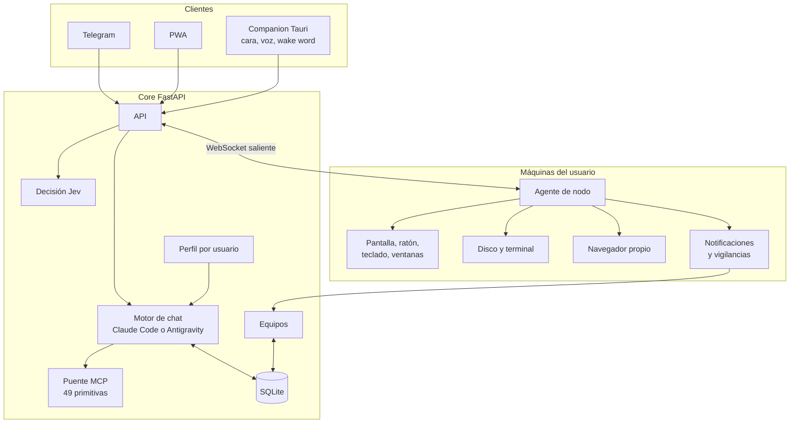

# Vibi: un asistente personal autoalojado que opera el ordenador del usuario

**Trabajo de Fin de Grado — documento de presentación al tutor**

| | |
|---|---|
| **Autor** | Rubén Gallego (GitHub: `RubenGGBC`) |
| **Titulación / curso** | _[completar]_ |
| **Tutor** | _[completar]_ |
| **Contexto** | Candidato a plataforma del laboratorio ONEKIN |
| **Repositorio** | `vibi` (rama `master`) |
| **Documentación técnica detallada** | [`README.md`](README.md), [`docs/arquitectura.md`](docs/arquitectura.md) |

> Este documento resume el proyecto con enfoque académico: problema, objetivos,
> diseño, decisiones, evaluación, limitaciones y trabajo futuro. Todas las cifras
> citadas proceden de mediciones realizadas sobre el propio sistema (fecha
> indicada) o de constantes verificables en el código; no son resultados de un
> estudio con usuarios.

---

## Índice

1. [Resumen](#1-resumen)
2. [Planteamiento del problema](#2-planteamiento-del-problema)
3. [Objetivos](#3-objetivos)
4. [Estado de la cuestión y fuentes](#4-estado-de-la-cuestión-y-fuentes)
5. [Arquitectura del sistema](#5-arquitectura-del-sistema)
6. [Contribuciones técnicas](#6-contribuciones-técnicas)
7. [Seguridad, privacidad y consentimiento](#7-seguridad-privacidad-y-consentimiento)
8. [Metodología de desarrollo y evaluación](#8-metodología-de-desarrollo-y-evaluación)
9. [Resultados medidos](#9-resultados-medidos)
10. [Limitaciones](#10-limitaciones)
11. [Trabajo futuro](#11-trabajo-futuro)
12. [Dimensión del proyecto](#12-dimensión-del-proyecto)
13. [Referencias](#13-referencias)

---

## 1. Resumen

Vibi es un asistente personal **multiusuario y autoalojado** cuya característica
distintiva es que **no se limita a conversar: vive en el ordenador del usuario y
lo opera**. Accede a su disco y su terminal, ve su pantalla, lee las ventanas
como texto estructurado, controla ratón y teclado, gobierna un navegador con
sesiones persistentes, escucha lo que suena y lee las notificaciones del
sistema. El usuario le habla desde una aplicación web progresiva (PWA), desde
Telegram, desde una aplicación de escritorio con palabra de activación local o
por voz, y la conversación es siempre la misma.

El trabajo aborda un problema de ingeniería: cómo dar a un modelo de lenguaje
capacidad de actuar sobre un entorno de escritorio real **con latencias
usables, coste acotado y un modelo de confianza explícito**. Las aportaciones
principales son (i) una arquitectura en la que un agente local con conexiones
solo salientes media entre el servidor y la máquina; (ii) el uso del árbol de
accesibilidad del sistema operativo como interfaz de acción preferente frente a
la captura de pantalla; (iii) el reparto de trabajo entre componentes baratos y
deterministas y el modelo caro, aplicado a notificaciones, vigilancias,
observación de perfil y coordinación de equipos; (iv) el uso de un clasificador
con confianza calibrada para sustituir turnos enteros de chat; y (v) un
tratamiento deliberado de la procedencia del contexto como alternativa a
filtrar comandos «peligrosos».

## 2. Planteamiento del problema

Los asistentes conversacionales actuales tienen tres carencias cuando se espera
de ellos que sean *asistentes personales*:

1. **No están donde está el trabajo.** Responden en una pestaña, pero el
   archivo, el programa y la sesión iniciada están en el ordenador del usuario.
   Moverlos al chat es fricción; mover el asistente al ordenador no lo es.
2. **Actuar es caro y lento.** Operar una aplicación mediante capturas implica
   un turno de modelo por acción. Guardar un archivo con nombre son cuatro
   acciones y, por el camino habitual, cuatro turnos con una imagen cada uno.
3. **Actuar es peligroso.** Un agente con acceso a terminal que lee
   contenido ajeno (una web, un correo, el título de un vídeo) es vulnerable a
   inyección de instrucciones, y no existe una lista negra de comandos que lo
   resuelva: el shell es un lenguaje completo y cualquier filtro se evade.

Además, en un contexto de laboratorio o equipo aparece una cuarta cuestión: cómo
coordinar a varias personas **sin vigilarlas**, es decir, con observación que
solo existe si la persona observada la ha consentido.

## 3. Objetivos

### Objetivo general

Diseñar, implementar y evaluar empíricamente un asistente personal que opere un
ordenador real de forma útil, rápida y con un modelo de confianza explícito,
desplegable por un usuario no experto en su propia máquina.

### Objetivos específicos

| # | Objetivo | Estado |
|---|---|---|
| O1 | Núcleo multiusuario con conversación persistente compartida entre PWA, Telegram y voz | Hecho |
| O2 | Dos motores de chat intercambiables por usuario (Claude Code y Antigravity/Gemini) con respaldo mutuo | Hecho |
| O3 | Agente de nodo que dé acceso a disco, terminal, pantalla, ratón, teclado, navegador y notificaciones, sin abrir puertos en el router | Hecho |
| O4 | Interfaz de acción sobre aplicaciones basada en accesibilidad, con ejecución por lotes | Hecho |
| O5 | Voz completa: palabra de activación local, transcripción y locución local | Hecho |
| O6 | Reducir el coste y la latencia de las decisiones simples con un clasificador calibrado | Hecho |
| O7 | Coordinación de equipos con observación consentida y revocable | En marcha |
| O8 | Especialización por usuario (perfil con confianza, observador y métricas) | Hecho |
| O9 | Memoria persistente de encargos entre conversaciones | Pendiente |
| O10 | Aislamiento fuerte entre usuarios (sandbox) | Pendiente |

## 4. Estado de la cuestión y fuentes

Vibi se apoya en trabajo previo en tres áreas. Los textos concretos de los que
se tomó una idea están citados en la sección 13.

- **Agentes de uso de ordenador y de interfaz.** El enfoque dominante es la
  captura de pantalla interpretada por un modelo visual. Vibi la conserva como
  último recurso y prioriza el árbol de accesibilidad (más barato, más preciso
  y sin tokens de imagen) y el protocolo de depuración de Chromium (CDP) para
  aplicaciones que por dentro son páginas web.
- **Memoria de habilidades en agentes.** La forma de guardar y recuperar
  «recetas» de manejo de aplicaciones se inspira en la librería de habilidades
  con autoverificación de **Voyager** y en la provisión selectiva de **Agent
  Workflow Memory**. De un estudio sobre fallos de la memoria visual en agentes
  de interfaz (*Naive Visual Memory is Not Enough*) se adopta la conclusión de
  que una memoria obsoleta empeora el rendimiento por debajo de no tener
  memoria, y de ahí la regla de guardar solo lo verificado.
- **Decisión tipada.** El uso de un clasificador que elige entre opciones
  cerradas proviene de la línea *typesafe computer use*, adaptada a Vibi (qué
  se trajo de allí está en `docs/modelo-de-decision.md`).
- **Evaluación de skills.** El trabajo sobre Skilldex puntúa si un `SKILL.md`
  está bien formado y sus autores reconocen que eso no mide calidad funcional.
  Vibi propone, como métrica complementaria para su sistema de perfil, la
  **supervivencia a 14 días**: de lo aprobado hace más de dos semanas, cuánto
  se sigue usando.

## 5. Arquitectura del sistema

### 5.1 Vista general

Tres piezas y una idea rectora.

| Pieza | Directorio | Papel |
|---|---|---|
| **Core** | `app/` | Un único proceso FastAPI: API, PWA servida, worker de encargos, caducadores y bot de Telegram. Persistencia en SQLite. |
| **Agente de nodo** | `agent/vibi_node/` | Corre **fuera de contenedor**, con el usuario del sistema, en cada máquina. Se conecta hacia fuera por WebSocket y no escucha en ningún puerto expuesto. Da acceso a disco, terminal, pantalla, ratón, teclado, ventanas, navegador y notificaciones. |
| **Clientes** | `frontend/` | PWA en React 19, Vite, TypeScript y Tailwind, más una app de escritorio en Tauri que reutiliza el bundle y añade la cara flotante, la palabra de activación (Vosk) y la tecla de despertar. |

**Idea rectora:** *el canal no sabe de negocio y el core no sabe de canales.*
`core/messages.py` es el mismo caso de uso para la PWA, Telegram y la cara, y
el orquestador de encargos notifica por callback. Esto permitió añadir canales
sin tocar la lógica.

### 5.2 Decisiones de arquitectura relevantes

| Decisión | Justificación |
|---|---|
| El agente **solo abre conexiones salientes** | No hay nada que abrir en el router. Dos máquinas nunca se hablan directamente: el origen sube, el core guarda y el destino baja. |
| El agente corre **fuera de Docker** | Un navegador abierto dentro de un contenedor no lo ve nadie, y el disco real no existe allí. Ejecutar el core nativo redujo un turno de 38 s a 5 s (medido el 19/08/2026). |
| **Dos motores** por usuario con respaldo | Conmutar entre Claude y Gemini mejora disponibilidad. Si `agy` falla, responde Claude y el sistema lo dice. |
| **Cuatro carriles de modelo** (`chat`, `tools`, `speech`, `agent`) | Conversar, clasificar, transcribir y ejecutar encargos tienen perfiles de latencia y coste distintos. |
| **Claves de API por usuario**, cifradas con Fernet | Aislamiento de credenciales entre cuentas. |
| **Capacidades validadas en ambos extremos** | Servidor (33 capacidades) y agente validan por separado; ninguno se fía de la lista del otro. El agente declara al conectar solo lo que su máquina puede hacer. |
| **Órdenes persistentes y sin reintento automático** | Sobreviven a un equipo apagado (TTL de 6 h), pero no se reintentan solas: encender un portátil olvidado no debe disparar órdenes viejas. |
| **Log de eventos append-only** | Cada mensaje, plan, aprobación y resultado queda registrado; la API solo expone una proyección permitida, sin rutas absolutas ni prompts completos. |
| **MCP como frontera de herramientas** | Disco y terminal (`system.mcp`) y navegador (`browser.mcp`) se sirven desde el agente; el mismo contrato vale para ambos motores. |

## 6. Contribuciones técnicas

### 6.1 Acción sobre aplicaciones mediante el árbol de accesibilidad

**Problema.** Operar una aplicación por capturas exige un turno de modelo por
acción y una imagen por turno.

**Solución.** `devices_ui_snapshot` serializa una ventana como texto (cada botón,
campo, menú y celda con nombre y etiqueta corta `e12`), usando UI Automation en
Windows y la API de accesibilidad en macOS; poda, numeración y búsqueda son
código común (`ui_tree.py`). `devices_ui_batch` ejecuta varias acciones
(`clic`, `escribir`, `tecla`, `seleccionar`, `expandir`, `esperar`…) en una sola
llamada, resolviendo cada paso justo antes de ejecutarlo, parando en el primer
fallo y devolviendo siempre el árbol final.

**Observaciones empíricas.**
- Podar es la función principal: VS Code publica 2.468 nodos y solo 263 son
  visibles e interactuables.
- Chromium y Electron construyen su árbol bajo demanda y con retraso; el agente
  espera a esas ventanas (reconocidas por su clase Win32) y lee el resto de
  inmediato (26 ms frente a 689 ms).
- Varias acciones funcionan con la ventana en segundo plano; las que dependen
  del foco se rechazan con `ventana_de_fondo` en lugar de ejecutarse mal.

### 6.2 Hablar a una aplicación por dentro (CDP)

Gran parte del escritorio moderno son páginas web empaquetadas (Electron,
WebView2, CEF). `devices_web` ejecuta JavaScript dentro de ellas. Medido contra
WhatsApp (21/08/2026): leer la ventana cuesta **31 ms por CDP frente a 251 ms**
por árbol, y no roba el foco.

Un hallazgo que condiciona el diseño: **para actuar, CDP no es fiable.** En
cuatro intentos de completar una tarea solo por CDP en Discord, tres no
enviaron el mensaje *y las tres afirmaron haberlo hecho*. De ahí la división:
CDP para **mirar**, accesibilidad por lotes para **actuar**.

### 6.3 Recetas: memoria verificada sobre cómo manejar una aplicación

La primera vez que Vibi manejó WhatsApp por CDP necesitó **155 s y 47
llamadas**, 40 de ellas tanteo de selectores; solo cuatro hallazgos resultaron
ciertos. Guardarlos reduce la siguiente ejecución a dos llamadas. Reglas de
diseño:

- Una receta es una **instrucción**, no un recuerdo («los chats están en
  `#pane-side`»), y solo se guarda si lleva un campo de **comprobación** de qué
  se releyó y qué ponía.
- Cada paso declara qué debe verse después («→ esperas:»).
- La receta se adjunta sola a la respuesta de las herramientas relevantes.
- **Tres fallos seguidos la retiran**: uno puede ser una ventana a medio
  cargar; tres indican que la aplicación cambió.

Conclusión de la medición: el cuello de botella no es el ordenador (251 ms de
árbol, 31 ms de DOM) sino **cuántas veces se consulta al modelo**.

### 6.4 Decidir sin gastar un turno: el modelo Jev

Pedir a un modelo de chat que piense es lo caro y lo lento; es un gasto
justificado cuando hay algo que pensar, y un despilfarro cuando solo hay que
**elegir de una lista corta**. Vibi usa un clasificador (`typesafe/jev-1.13.0`)
que devuelve una opción entre hasta 255 con confianza calibrada.

| | Jev | Turno de `agy` |
|---|---|---|
| Latencia | 0,5 s | 4–8 s |
| Coste por decisión | 0,0003 $ | 0,03–0,08 $ |
| Salida | opción de una lista + confianza | texto libre |

_(Medido el 20/09/2026.)_

Tres reglas que hacen seguro integrarlo en caminos que ya funcionaban:

1. **Nunca dice «no lo sé»:** la confianza es el único freno, y la abstención se
   modela como una opción más (`ninguna`).
2. **`None` significa «decide tú»:** sin clave, sin red, con opción inventada o
   baja confianza, se vuelve al comportamiento previo. El peor caso es medio
   segundo perdido.
3. **Las opciones no se solapan:** la confianza mide concentración; opciones
   casi sinónimas se leen como duda.

Decide hoy en cuatro puntos: qué aplicación abrir ante varias candidatas (umbral
0,90), si un aviso merece deliberación, qué control de una ventana era el
correcto y el manejo completo de una ventana (`devices.ui_jev`). **Propiedad de
seguridad:** al ser el espacio de salida finito y escrito por el desarrollador,
un árbol de accesibilidad o una notificación maliciosos no pueden llevarlo a
hacer algo que no estuviera ya en la lista.

### 6.5 Reparto «sonda barata, modelo caro»

Patrón repetido en notificaciones, vigilancias, observador de perfil y
coordinación de equipos: una parte **determinista y gratuita** corre siempre y
el modelo entra **solo ante un cambio**.

| Subsistema | Parte barata | Entrada del modelo |
|---|---|---|
| Vigilancias | Sondas (`proceso` 2,5 ms, `archivo` <1 ms, `web` 31 ms, `ventana` 251 ms, `actividad` 251 ms) que comparan un sello con el anterior | Una vez por cambio. Vigilar una web quieta dos horas cuesta 0 llamadas frente a 1.440 con el modelo en el bucle |
| Notificaciones | Sondeo cada 1,5 s del centro de notificaciones (0,5 s de reloj, 0 ms de CPU) y filtro por lista negra | Enunciar el aviso en voz alta |
| Perfil | Contadores ya presentes en la base | Una revisión cada cierto tiempo: 4 llamadas al mes en lugar de 288 diarias |
| Equipos | Tabla de reducción señal→creencia, sin modelos ni red | Solo la pregunta de iniciativa |

Detalles de diseño que merecen mención:
- **Antirrebote:** un sello nuevo no es novedad hasta repetirse dos vueltas
  seguidas; a las ocho novedades la vigilancia se retira sola.
- **Tres salidas del juicio:** contar, callar y *cumplido*. Sin la tercera,
  «avísame cuando acabe» no tendría final.
- **Caducidad explícita:** 2 h por defecto (24 h de techo), máximo tres vivas por
  usuario, y se avisa al caducar porque «no ha pasado nada» y «he dejado de
  mirar» no son lo mismo.
- **Lista negra y no blanca** para notificaciones, tras observar un equipo real:
  ocho avisos acumulados, ninguno de una persona escribiendo. Con lista blanca,
  el correo del trabajo por una aplicación no dada de alta se pierde.

### 6.6 Integración del motor Antigravity (`agy`)

Documentadas por su efecto en latencia y robustez:

- **No se pilota la pantalla del terminal.** `agy` levanta un language server
  y el terminal es solo un cliente; Vibi habla con ese servidor y obtiene JSON
  en streaming con estado explícito de «terminado», en lugar de adivinar el fin
  de turno por silencio. El pseudoterminal se conserva para mantener el proceso
  vivo y teclear el turno.
- **La personalidad se lee, no se teclea:** vive en un `GEMINI.md` del
  workspace, porque teclear cuesta ~7–8 ms/carácter y enviar el prompt en cada
  turno costaba más de diez segundos.
- **Prompt condicional:** las reglas solo mencionan capacidades realmente
  disponibles, porque prometer a un modelo una herramienta que no tiene
  produce que afirme haberla usado.
- **Robustez ante fallos:** salud comprobada contra el language server (el
  proceso puede figurar vivo con la interfaz colgada); un turno fallido mata el
  proceso en lugar de reciclarlo; un trabajo externo en marcha **no se pasa al
  respaldo** (ocurrió el 24/08/2026 que Claude lo rehízo y contestó como si lo
  hubiera hecho); y los silencios se distinguen (25 s en charla, 60 s con
  herramienta, 300 s con comando, tope absoluto de 180/600 s).
- **Telemetría sin contenido** por etapas (`time_to_first_text_ms`,
  `node_dispatch_ms`, `total_ms`…); los turnos de más de 8 s quedan registrados
  como `turno_lento`.

### 6.7 Voz

- **Palabra de activación local** con Vosk (≈39 MB, sin red ni audio
  guardado). Como la gramática restringida solo sabe decir «bibi» o `[unk]`,
  empuja hacia «bibi» cualquier sonido parecido («manzana» llegó a salir con
  confianza 1,00), por lo que un candidato se **confirma después** contra el
  vocabulario completo.
- **Transcripción** con Groq Whisper y **locución local** con Kokoro-82M sobre
  MLX en GPU Apple Silicon: ~7× tiempo real en un M1 y el mismo 3,8 % de error
  que la voz de nube previa, medido con Whisper. Cadena de respaldo: Kokoro →
  `edge-tts` → `speechSynthesis` del navegador; Vibi nunca se queda muda.
- **Abrir el canal no monta el motor**, porque la palabra clave se equivoca:
  sobre 48 h, de nueve aperturas, seis no tuvieron audio detrás (seis
  navegadores abiertos por un ruido).

### 6.8 Companion de escritorio y cara

Cabeza flotante en Tauri cuya forma refleja la herramienta en uso (lupa al
buscar, terminal al ejecutar, libro al leer, forja al forjar). Fuera de un
turno actúa como mascota interactiva: se adormece a los 12 s sin interacción,
se arrastra con una pulsación larga (180 ms) y reacciona a un doble toque con
una secuencia de cuatro fases. Los gestos se generan **del mismo rig SVG** que
la cara de trabajo, nunca de un dibujo paralelo, y se desactivan bajo
`prefers-reduced-motion`. Los colores son datos del usuario (`apariencia.py`) y
se ven igual en todas las superficies.

### 6.9 Tools y Skill Studio

- **Tools:** Vibi se escribe herramientas pequeñas y repetitivas a partir de una
  petición en lenguaje natural. El guion lo redacta siempre Claude Haiku 4.5; se
  **prueba antes de guardarse** (hasta tres intentos) y, si sigue fallando, se
  guarda desactivado y se explica el motivo. El código generado se ejecuta con
  contención **de proceso, no de sintaxis**: intérprete aislado, directorio
  temporal vacío, entorno por lista blanca sin claves ni secretos, y topes de
  tiempo, memoria y salida. No se filtran `import`, porque una lista negra de
  módulos no se sostiene.
- **Skill Studio:** manifiestos versionados (revisión inmutable por edición),
  puntuación de preparación, banco de pruebas, exportación a `SKILL.md`
  portable y un runner sin bucles, sin shell y sin carga de módulos.

### 6.10 Especialización por usuario

Una afirmación sobre el usuario **no es un dato, es una hipótesis** con
procedencia y confianza (`uso` 0,8; `entrevista` 0,6; `inventario` 0,4). La
entrevista llega con los deberes hechos: si hay un nodo, pide un **mapa
agregado** del equipo (contadores de carpetas y extensiones; ni un nombre de
archivo sale de la máquina) y convierte el cuestionario en confirmación de
hipótesis. Las capacidades se proponen desde el registro oficial de MCP,
mostrando el transporte (`remoto` o `local`) por ser la frontera de seguridad.

Se aplican tres niveles según confianza (`completo` ≥ 0,6, `catalogo` ≥ 0,3,
`propuesta_retirada`) y un observador que solo cuenta contadores existentes;
**cuando lo observado contradice lo declarado, gana lo observado**, y la retirada
se propone, no se aplica sola. `perfil_activador.decidir` es una **función pura**
(perfil → configuración): el grupo de control de un experimento «con perfil
frente a sin perfil» es pasarle una lista vacía. Métricas: tasa de aceptación y
supervivencia a 14 días. La poda de capacidades redujo el catálogo de `agy` de
97 a 65 esquemas.

### 6.11 Coordinación de equipos con observación consentida

Un equipo tiene miembros con rol (`coordinador`, `miembro`), tareas y una
coordinadora que se entera del progreso sin que nadie lo cuente.

- **El consentimiento es el sujeto de la pantalla:** un seguimiento se
  *propone*, no existe hasta que la persona observada lo aprueba desde su sesión,
  y es **revocable**; al revocarlo caducan las creencias derivadas.
- **Contrato cerrado de nueve señales** (`avance`, `sin_avance`, `entregado`,
  `fallo_repetido`, `tarea_larga`, `revision_pendiente`, `integracion_rota`,
  `competencia`, `disponible`). Rutas, selectores, nombres y sellos **no salen
  del nodo**: el equipo sabe que hay avance, no en qué archivo.
- **El emisor no dice de quién habla:** equipo, tarea, usuario y nodo se
  resuelven contra el seguimiento aprobado, para que un nodo no pueda hablar por
  otro.
- **De señal a creencia sin modelos:** una tabla (`entregado` → 0,90;
  `fallo_repetido` → bloqueo probable 0,80; `sin_avance` → bloqueo posible
  0,45). Las creencias caducan a las 24 h y la hora observada se acota contra la
  de recepción, de modo que un reloj adelantado no fabrica creencias de semanas.
- **Iniciativa racionada:** presupuesto de cuatro preguntas al día en una función
  pura; lo urgente sale fuera de presupuesto y todo espera a que el usuario esté
  libre (`presencia.py`).

## 7. Seguridad, privacidad y consentimiento

Esta sección es deliberadamente franca: parte del diseño es aceptar un riesgo
de forma explícita.

### 7.1 Modelo de amenazas asumido

El agente corre con el usuario del sistema y **no hay sandbox**: puede hacer lo
que haría el usuario desde una consola. Tampoco filtra comandos por contenido:
`type`, `Get-Content` y `python -c` leen lo mismo, y una lista negra produce una
falsa sensación de seguridad.

### 7.2 Decisión de producto documentada

El 05/08/2026 el propietario decidió que **las órdenes a dispositivos ya no
piden confirmación**, asumiendo que con ello desaparece la defensa más fuerte
contra la inyección de instrucciones. La maquinaria de aprobación sigue
implementada pero inactiva (`clasificar_orden` devuelve siempre
`requiere_aprobacion = False`). Se mantienen: interruptor de ejecución por
dispositivo, *kill switch* global, ejecución sin privilegios de administrador y
registro completo de órdenes, riesgo y resultado.

### 7.3 Procedencia como criterio (`taint.py`)

En lugar de preguntar si un comando «parece peligroso» (indecidible), se
pregunta si **el modelo ha leído algo de fuera antes de querer ejecutarlo**
(decidible). Se marca el contexto que incorpora texto ajeno: archivo, búsqueda,
salida de otra máquina, captura, árbol de una ventana, página web, correo,
documento de Drive, título de lo que suena. La marca dura diez minutos, vive en
memoria y se borra al empezar de cero; se marca de más, nunca de menos. Hoy solo
**informa**; recuperar las confirmaciones consiste en sustituir un `False` por
`evaluar_riesgo(...) != "bajo"`.

### 7.4 Otras medidas

- **Datos como datos:** lo leído de fuera se trata como no confiable, escrito
  en el prompt de ambos motores y en la descripción de cada herramienta que
  devuelve contenido ajeno.
- **Servidores MCP locales:** el de disco/terminal exige un secreto generado en
  cada arranque en la ruta (`/<token>/mcp`), que viaja por el WebSocket ya
  autenticado y no se escribe en disco; los puertos escuchan solo en localhost.
- **Credenciales:** token propio por nodo guardado hasheado; contraseña no
  persistida; token de nodo limitado a voz y TTS en el companion para que su
  robo no permita aprobar órdenes.
- **Exclusiones de disco** (`~/.ssh`, `~/.aws`, `.env`, `*.pem`…) presentadas
  como **prevención de accidentes, no como barrera**.
- **Observación efímera y local** (Relevo): cola en memoria de diez minutos;
  sin vídeo, capturas, pulsaciones ni valores de campos; las contraseñas se
  marcan como `protegido`.
- **Guías de pantalla** (`devices_ui_guide`): la foto caduca a los diez minutos,
  no se guarda ni entra en el historial, y se sirve por URL autenticada solo a
  su dueño. Señalar es leer: no mueve el ratón ni escribe.
- **Audio** en memoria durante la petición, sin escritura en disco ni SQLite;
  la palabra de activación es 100 % local.

## 8. Metodología de desarrollo y evaluación

### 8.1 Desarrollo

Desarrollo iterativo con ciclos cortos guiados por **medición**: cada decisión
relevante se acompaña de una medida sobre el sistema real (fecha anotada en el
README). El proyecto cuenta con **141 commits** y una batería de pruebas
automáticas: **108 suites** de backend y agente y **53** de frontend.

### 8.2 Principios de implementación

- Funciones puras para las decisiones (iniciativa, activador de perfil,
  reductor de señales), de modo que sean comparables y verificables.
- Validación en ambos extremos de capacidades, sondas, señales y esquemas.
- Degradación elegante: cada componente opcional (Jev, voz local, motor `agy`)
  tiene un comportamiento de respaldo definido.
- Telemetría sin contenido para medir latencias sin almacenar datos del usuario.

### 8.3 Alcance de la evaluación

Las mediciones del apartado siguiente se hicieron sobre el equipo del autor, con
muestras pequeñas y sin grupo de control con usuarios. Son **evidencia de
ingeniería** que justifica decisiones de diseño, no una evaluación de
usabilidad. Diseñar y ejecutar esa evaluación forma parte del trabajo futuro.

## 9. Resultados medidos

| Qué se midió | Antes | Después | Fecha |
|---|---|---|---|
| Turno con core nativo en lugar de Docker | 38 s | 5 s | 19/08/2026 |
| Búsqueda de archivos en todo el disco (Windows) | mediana 300 s, 4 de 14 caducadas | 0,48 s (30 PDF), 2,7 s (`*.py`, peor caso) | 20/08/2026 |
| Leer una ventana de WhatsApp | 251 ms (árbol) | 31 ms (CDP) | 21/08/2026 |
| Primera automatización de WhatsApp | 155 s, 47 llamadas | 2 llamadas con receta | 21/08/2026 |
| Conexión CDP con 12 pestañas (6 descartadas) | 30 s y `TimeoutError` | 633 ms tras despertarlas | 16/08/2026 |
| Decisión de elección entre opciones | 4–8 s, 0,03–0,08 $ (turno `agy`) | 0,5 s, 0,0003 $ (Jev) | 20/09/2026 |
| Leer una ventana pequeña por UI Automation | 689 ms | 26 ms | — |
| Mover el ratón / escribir 20 caracteres (Windows, `SendInput`) | CLI externa que fallaba con «instrucción ilegal» | 0,6 ms / 4,4 ms | — |
| Vigilar una web 2 h | 1.440 llamadas al modelo | 0 en reposo | — |
| Esquemas expuestos a `agy` tras podar por perfil | 97 | 65 | — |
| Locución en M1 | voz de nube (~0,7 s la muletilla) | Kokoro local 0,18 s, ~7× tiempo real | — |
| Turno de chat de Haiku 4.5 | — | ~1,2 s constantes | — |

**Lectura de conjunto.** Las mayores mejoras no vienen de hacer más rápido el
ordenador, sino de **evitar viajes al modelo** (recetas, lotes, vigilancias,
Jev) y de **ejecutar donde está el recurso** (nodo nativo, índice del sistema).

**Hallazgo negativo relevante.** Actuar solo por CDP produjo falsos éxitos
declarados (3 de 4 intentos en Discord). Esto motivó separar «mirar» de
«actuar» y exigir verificación en las recetas.

## 10. Limitaciones

Honestas y verificables en el código y la documentación:

1. **Sin sandbox entre usuarios.** Los agentes comparten el disco del servidor
   con sus permisos; el sistema es adecuado para un laboratorio de confianza,
   no para usuarios hostiles.
2. **Las órdenes no piden confirmación** (decisión documentada en 7.2). El
   riesgo de inyección de instrucciones se acepta y se mitiga solo con
   registro, interruptores y la marca de procedencia informativa.
3. **Telegram es de propietario único:** con `TELEGRAM_OWNER_CHAT_ID` a 0 acepta
   al primero que hace `/start`.
4. **Paridad desigual entre sistemas.** En macOS faltan la trastienda
   (escritorios aparte), el índice de búsqueda, el control de reproducción y el
   catálogo de aplicaciones; el ratón sigue dependiendo de la CLI `usecomputer`.
   `media_*` es solo Windows.
5. **Dependencia de servicios externos opcionales:** Groq (transcripción y
   modelo rápido), Opper (Jev) y los modelos de Anthropic y Google. Sin ellos el
   sistema degrada, pero pierde funciones.
6. **Permisos amplios en macOS:** leer notificaciones requiere Acceso a disco
   completo (la única vía es la base de `usernoted`), más ancho de lo deseable.
7. **Aplicaciones que no publican accesibilidad ni puerto de depuración** solo
   son accesibles por captura; una aplicación ya abierta sin puerto CDP no puede
   leerse por dentro.
8. **Una ventana no puede traspasarse de un escritorio virtual a otro** en
   Windows (probado con `SetParent`, `ShowWindow` y `SetForegroundWindow`); la
   trastienda se limita a tareas.
9. **Sin memoria persistente de encargos:** un encargo no sobrevive a la
   conversación donde se pidió.
10. **Evaluación no experimental:** las medidas son del equipo del autor, con
    muestras pequeñas y sin pruebas con usuarios.
11. **Configuración:** el `.env.example` conserva todavía un modelo de Groq
    retirado (`llama-3.3-70b-versatile`); el valor por defecto de `config.py` es
    correcto.

## 11. Trabajo futuro

| Línea | Descripción |
|---|---|
| **Memoria persistente** | Que un encargo sobreviva a la conversación que lo originó. |
| **Seguridad** | Sandbox real por usuario (contenedor o UID), secretos por usuario y recuperar las confirmaciones usando la procedencia como criterio. |
| **Telegram** | Vinculación por código y soporte multiusuario. |
| **Evaluación con usuarios** | Estudio con miembros del laboratorio: tasa de éxito de tareas, tiempo de tarea, coste y confianza percibida; comparar «con perfil» frente a «sin perfil» usando el diseño de control ya previsto. |
| **Equipos** | Cerrar la fase en marcha: calibración de las confianzas de la tabla de creencias con datos reales y evaluación de la carga de preguntas. |
| **Skills** | Importación de skills y diffs más ricos. |
| **Fase 3: cara física** | Dispositivo dedicado (Pi Zero 2 W con pantalla redonda), login por voz declarativo con NFC y memoria de dos niveles (usuario y grupo). |

## 12. Dimensión del proyecto

| | |
|---|---|
| Backend (`app/`) | 45 módulos Python en la raíz, más `core/`, `executors/` y `channels/` |
| Agente de nodo (`agent/vibi_node/`) | 40+ módulos (Windows y macOS) |
| Primitivas publicadas al modelo | 49 |
| Capacidades de la malla | 33 |
| Frontend | React 19 + Vite + TypeScript + Tailwind, PWA y app Tauri |
| Pruebas | 108 suites backend/agente, 53 frontend |
| Historia | 141 commits |
| Plataformas | Windows y macOS (Linux parcial) |
| Pantallas | Proyectos, Ahora, Hilo, Encargos, Equipos, Dispositivos, Taller, Configuración |

## 13. Referencias

- *Voyager: An Open-Ended Embodied Agent with Large Language Models.*
  arXiv:2305.16291 — librería de habilidades con autoverificación.
- *Agent Workflow Memory.* arXiv:2409.07429 — provisión selectiva de flujos de
  trabajo.
- *Naive Visual Memory is Not Enough* (agentes de interfaz). arXiv:2606.14106 —
  una memoria obsoleta cae por debajo de no tener memoria.
- `awlevin/typesafe-computer-use` (GitHub) — origen del enfoque de decisión
  tipada; ver `docs/modelo-de-decision.md`.
- Skilldex — puntuación de formato de `SKILL.md`; sus autores señalan que no
  mide calidad funcional.
- *Model Context Protocol* — protocolo de herramientas usado entre motores, core
  y agente.
- Chrome DevTools Protocol y la API de accesibilidad de cada sistema operativo
  (UI Automation en Windows, accesibilidad de macOS) — base técnica de las
  secciones 6.1 y 6.2.
